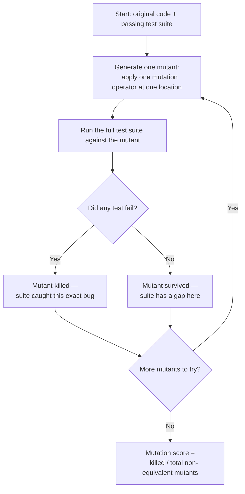

import LevelIntro from "../../../components/LevelIntro.astro";
import Checkpoint from "../../../components/Checkpoint.astro";

L1 established the gap: a line can run during a test (coverage) without
any test checking what value it produced (verification). This level
builds the actual mechanism mutation testing uses to find that gap
automatically, instead of relying on a human to spot it by inspection.

<LevelIntro
  items={[
    "The mutate → run tests → kill-or-survive loop",
    "The common mutation operators, with before/after code",
    "Mutation score, and why teams run this selectively, not on every commit",
  ]}
/>

## What actually happens when a mutation-testing tool runs

**Given a function and a passing test suite, what does a tool like
Stryker (JavaScript/TypeScript), PIT (Java), or mutmut (Python) actually
do differently from just running the tests once?**

It runs the tests _many times_ — once per mutant — against a slightly
different version of the code each time:



Every mutant is a hypothesis: "if the code had this exact one-character
bug, would the suite notice?" A tool doesn't ask this once — it asks it
once per plausible small mistake, across every risky line in the file.

<Checkpoint question="A mutant survives. Does that mean the original code is buggy?">

No — a surviving mutant says nothing about whether the _original_ code
is correct. The original code is never mutated when the "real" test
suite runs against it; the mutant is a separate, deliberately-broken
copy used only to probe the suite. A survivor means the test suite
_would not have noticed_ if that exact bug were introduced — it's a
statement about test quality, not about the current correctness of the
code under test.

</Checkpoint>

## Common mutation operators

A **mutation operator** is a rule for generating one specific kind of
small, plausible bug. Tools ship a fixed catalog of these — they're
modeled on real, common programmer mistakes, not random code corruption.

| Operator                        | Before             | After                        | Models the real-world mistake of...              |
| ------------------------------- | ------------------ | ---------------------------- | ------------------------------------------------ |
| Conditional boundary            | `if (weight > 20)` | `if (weight >= 20)`          | An off-by-one at a threshold                     |
| Arithmetic operator replacement | `fee + surcharge`  | `fee - surcharge`            | A sign/operator typo                             |
| Statement removal / negation    | `fee += 10;`       | _(line deleted)_             | A forgotten line, or dead code after a merge     |
| Return-value mutation           | `return fee;`      | `return 0;` / `return -fee;` | A function that returns the wrong thing entirely |

Each row is a distinct, narrow question about the suite. "Conditional
boundary" specifically asks: does any test sit exactly on this
threshold? "Statement removal" specifically asks: does any test notice
this line is missing at all? A suite can kill every arithmetic mutant
and still let every boundary mutant survive — the operators are
independent probes, not one aggregate pass/fail.

<Checkpoint question="A suite kills 9 out of 10 mutants generated by 'arithmetic operator replacement', but 0 out of 6 generated by 'conditional boundary'. Does the arithmetic result tell you anything about the boundary result?">

No. Each operator is testing a different kind of mistake at different
locations in the code, so a strong result on one operator says nothing
about another. A suite can be excellent at catching sign/operator typos
while having zero tests that land exactly on a threshold value —
exactly the pattern L3's worked example walks through. The mutation
score should be read per-operator or per-mutant when diagnosing gaps,
not just as one blended percentage.

</Checkpoint>

## Mutation score

```
mutation score = (mutants killed / total non-equivalent mutants) × 100%
```

"Non-equivalent" matters: some mutants can never be killed by any test,
because the mutation doesn't actually change observable behavior (an
**equivalent mutant** — L3 works through a real example). Those get
excluded from the denominator, or flagged for a human to dismiss —
otherwise the score understates the suite unfairly.

## The practical workflow: why not run this on every commit?

Mutation testing multiplies cost: generating _N_ mutants means running
the _entire_ test suite _N_ times. A suite that takes 2 minutes and a
file that generates 300 mutants is a 10-hour run, not a 2-minute one.
That's the real trade-off driving how teams actually use it:

- **Not on every commit.** Too slow to sit in the inner dev loop or
  block a pull request the way unit tests do.
- **Scoped to critical modules**, not the whole codebase — pricing
  logic, auth checks, anything where a silent logic bug is expensive,
  rather than UI glue code where a bug is cheap to notice and fix.
- **Run periodically** — a nightly or weekly CI job — and the result
  (mutation score, list of survivors) reviewed as a signal to _write
  more tests_, not as a merge-blocking gate the way `lint` or `typecheck`
  are.
- Used **diagnostically**: a survivor doesn't mean "add a test," it
  means "here is the exact line and exact kind of bug your current tests
  can't see" — the tool points at the gap directly instead of a human
  guessing where coverage numbers might be hiding one.
