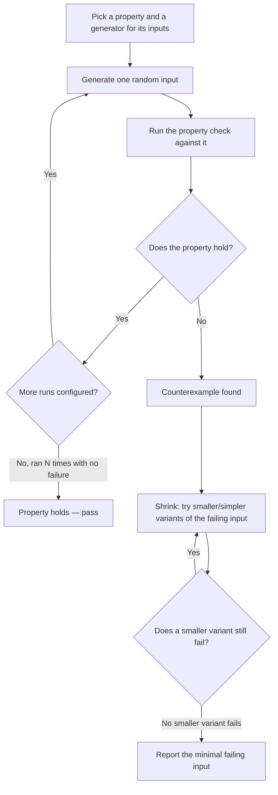

import LevelIntro from "../../../components/LevelIntro.astro";
import Checkpoint from "../../../components/Checkpoint.astro";

L1 established the gap: a hand-picked set of examples only tests the
inputs someone thought to write, and the empty array nobody thought of
was exactly where the bug lived. This level builds the actual machinery
that finds inputs like that automatically, instead of relying on a human
to eventually think of them.

<LevelIntro
  items={[
    "What makes a good property (and common property patterns)",
    "How a generator produces inputs, biased toward edge cases",
    "The generate → check → shrink loop that finds a minimal counterexample",
  ]}
/>

## What makes something a property, not just an assertion?

**Every example test technically has an assertion — so what's actually
different about a property?** An example test's assertion is tied to one
specific input chosen in advance: `expect(decode(encode(42))).toBe(42)`
only ever runs on `42`. A property's assertion is written in terms of a
_variable_ input the test itself never picks: `expect(decode(encode(x))).toEqual(x)`
for **any** `x` the generator hands it. The code inside the assertion can
look identical — what changes is who chooses `x`, and how many times the
check runs.

A good property is a **true, checkable invariant** — something you can
state confidently holds for every valid input, and that you can actually
verify in code without re-implementing the function under test. Four
patterns cover most of what shows up in practice:

| Pattern                        | Plain-English rule                                                                 | Example                                                         |
| ------------------------------ | ---------------------------------------------------------------------------------- | --------------------------------------------------------------- |
| Round-trip / inverse           | Doing A then undoing A returns the original                                        | `decode(encode(x))` equals `x`                                  |
| Idempotence                    | Doing it twice has the same effect as doing it once                                | `sort(sort(list))` equals `sort(list)`                          |
| Invariant under transformation | Some property of the output never changes, even though the output itself does      | `sort(list)` has the same length and same elements as `list`    |
| Oracle comparison              | The output matches a simpler, obviously-correct (if slow) reference implementation | Your fast custom sort matches `[...list].sort()` on every input |

<Checkpoint question="Is 'the function never throws an error' a good property to check on its own, with no other condition attached?">

Usually not, by itself — it's too weak to catch most real bugs. A
function that always returns the wrong answer without throwing would
pass a "never throws" check every time, so that property alone gives
almost no confidence. It's still useful paired with a real invariant
(e.g. "never throws, **and** the round-trip property holds"), but as the
only property being checked, it mainly catches crashes, not incorrect
results — the property has to say something about the actual output, not
just about whether execution completed.

</Checkpoint>

## Where do the inputs come from?

A **generator** is the piece that produces the `x` values a property is
tested against. A naive generator for numbers might just call `Math.random()`
and scale it — but a good one is deliberately biased toward the values
most likely to break something: `0`, negative numbers, the empty
string, the empty array, very large numbers, duplicate entries,
deeply nested structures. These are exactly the values a human writing
six examples by hand tends to skip, because they don't feel like
"normal" inputs — which is precisely why generators are built to try
them disproportionately often, not just uniformly at random.

Generators compose: a generator for `{ name: string, age: number }`
is built from a string generator and a number generator, the same way
the type itself is built from a string field and a number field. This is
what lets a property-testing library generate meaningfully-structured
random objects instead of unstructured noise.

## The full loop: generate, run, shrink

By default a property-testing tool runs the check many times (often 100
by default, configurable — L1's example used 500) with a fresh generated
input each run. If every run passes, the property is treated as holding
— not proven for all possible inputs, but checked against far more cases
than a human would ever hand-write.

<Checkpoint question="If a property test runs 100 times and all 100 pass, has the property been mathematically proven true for every possible input?">

No — and this matters for how much confidence to place in a pass. A
property test is a strong, automated search for a counterexample, not a
proof. 100 random passes mean the generator didn't happen to produce a
failing case in those 100 tries; a rare edge case (say, one input in
10,000) could still exist and simply not have come up. This is different
from a mathematical proof, which would need to cover every possible
input, not a large random sample of them. More runs raise confidence:
they don't remove the gap entirely.

</Checkpoint>

## Shrinking: why "the failure" isn't the same as "the useful bug report"

The generator that found L1's bug didn't stop at the first failing
input — it might have found the bug on a random array with 12 nested
objects and 40 keys, not on the clean `[]` L1's Scenario showed. **If the
first failure found is that messy, why does L1's Scenario read as if the
bug was found on a clean empty array?**

Because a raw counterexample is rarely the most useful thing to hand a
developer — a 40-key nested object that fails tells you _something_
broke, but not _what_ about it broke. **Shrinking** takes the first
failing input and automatically tries smaller, simpler variants of it —
removing an element, replacing a nested object with a plain value,
truncating a string — re-checking the property against each simplified
version. If a simpler version still fails, that becomes the new
candidate to shrink further; the process repeats until no smaller
variant still fails. What's left is the **minimal counterexample** — the
smallest input that still reproduces the bug, which is exactly why L1's
Scenario could point at `[]` specifically: that's what shrinking reduced
the original messy failure down to.

Without shrinking, property-based testing would still find bugs — but
debugging a random 40-key failure is far harder than debugging `[]`.
Shrinking is what turns "the tool found a failure somewhere" into "the
tool found the exact minimal reproduction," which is the practical
difference between a property test being merely a bug-finder and being a
genuinely useful one.
