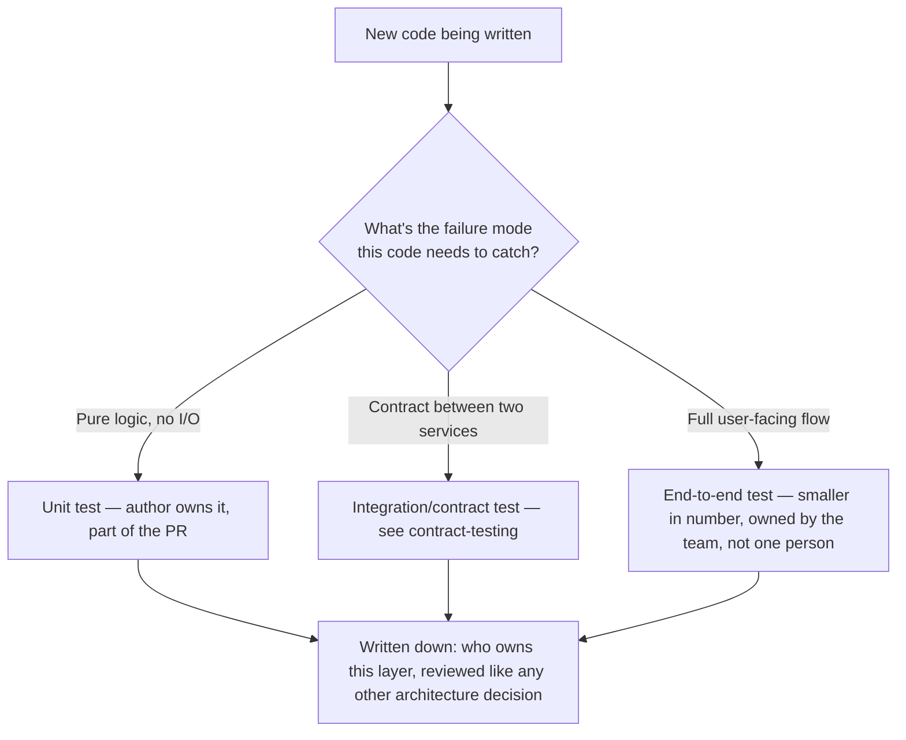

import LevelIntro from "../../../components/LevelIntro.astro";
import Checkpoint from "../../../components/Checkpoint.astro";

L1 showed a team whose real defect rate turned out to depend on one
person being in the building. This level names why that happens even
on a team of genuinely careful, well-intentioned engineers, and what a
staff engineer — someone with influence but rarely direct authority
over other engineers — can actually do about it.

<LevelIntro
  items={[
    "Why a QA gate is a moral-hazard problem, not a competence problem",
    "What 'testing strategy as an architectural decision' means concretely",
    "The four levers a staff engineer has without direct authority",
  ]}
/>

## Why does a downstream gate change upstream behavior, even for careful engineers?

The team in L1 wasn't careless. So **why did the defect rate move at
all once QA stepped away — what exactly changed in how people wrote
code?**

Nothing about any individual's skill changed. What changed is the
_local incentive_ each engineer faced while writing a test. With QA in
place, an engineer deciding how much time to spend hardening a tricky
edge case is weighing "my time now" against "a small chance QA catches
it later, at roughly the same cost either way." That trade often
favors moving on. Remove the downstream gate, and the same trade-off
changes completely — but nobody re-derives it consciously, because the
habit of moving on was never really a decision, it was the path of
least resistance the system had been rewarding for a year.

| Under a QA gate                                                 | Under distributed ownership                                                    |
| --------------------------------------------------------------- | ------------------------------------------------------------------------------ |
| "If I miss something, QA probably catches it before release"    | "If I miss something, it ships — there's no separate downstream catcher"       |
| Thin test = locally rational, low personal cost when it's wrong | Thin test = directly visible cost to the person who wrote it                   |
| Quality is a role (QA's job)                                    | Quality is a property of the merged code, owned by whoever wrote it            |
| Catching a bug late (in QA) is normal and expected              | Catching a bug late (in production) is treated as a real incident, not routine |

This is a **moral hazard**: the person best positioned to prevent a
problem cheaply (the author, while writing the code) isn't the one who
pays if it goes wrong (QA, or nobody, if QA happens to miss it too).
Economics has a name for this exact shape in insurance — someone
insured against a loss takes more risks than someone who'd bear the
loss directly — and it applies just as cleanly to a pull request as to
a policy. The fix in both cases is the same: move the cost of the risk
back onto the person deciding how much of it to take.

<Checkpoint question="A team removes their dedicated QA role entirely, with no other change, expecting engineers to 'step up' and write better tests. Based on the moral-hazard framing above, is that alone likely to work?">

Not reliably. Removing the gate does change the incentive — there's no
longer a downstream catcher to lean on — but the framing above is
about what the _system_ rewards, not what people are told to do.
Without something concrete replacing the gate (a blocking CI suite
that makes thin tests visibly fail, a clear ownership model, a habit
of treating regressions seriously), engineers are just as likely to
ship the same thin tests and let bugs reach production directly,
because nothing in their day-to-day workflow actually changed except
the safety net disappearing. The lesson from L1 isn't "delete QA" —
it's "don't let a downstream gate be the _only_ thing standing between
a thin test and a shipped bug."

</Checkpoint>

## What does "testing strategy as an architectural decision" actually mean?

Most teams have a testing strategy, in the sense that tests exist —
but almost nobody actually _decided_ it. It accreted: whoever wrote
the first module picked a pattern, the next person copied it, and five
years later nobody could say, if asked directly, **who owns writing
tests for a given piece of code, or what level (unit, integration,
end-to-end) a given behavior is supposed to be caught at.**

Treating it as an architectural decision means the same three things
a team already does for its data model or its service boundaries:

1. **It's decided deliberately.** Someone looks at a given piece of
   code or a given failure mode and asks, explicitly, "what level
   should this be tested at, and by whom" — the same question asked
   about where a piece of logic belongs in the service graph.
2. **It's written down and visible.** Not buried in one senior
   engineer's head — a short, shared document any engineer can check
   before writing a test, the same way an architecture decision record
   documents _why_ a boundary was drawn where it was.
3. **It's revisited, not fossilized.** As the system grows, the
   strategy gets reviewed the same way any architecture gets
   reviewed — not treated as permanent just because it was written
   down once.

A **testing strategy table** — the kind of artifact a staff engineer
actually writes and shares, not a hypothetical — makes this concrete
instead of implicit:

| Layer                           | What it catches                                                          | Who owns it                              | Blocking?                     |
| ------------------------------- | ------------------------------------------------------------------------ | ---------------------------------------- | ----------------------------- |
| Unit tests                      | Logic errors in a single function/module                                 | The engineer writing the code, in the PR | Yes                           |
| Integration / contract tests    | A service breaking its contract with a consumer (see `contract-testing`) | The team that owns the producing service | Yes                           |
| End-to-end tests                | A full user-facing flow breaking across services                         | Shared, reviewed in a dedicated channel  | Yes, on a smaller curated set |
| Manual QA pass (if kept at all) | Exploratory, judgment-based issues automation misses                     | QA, as a _complement_, not the only net  | No — informational            |

The last row is the point: manual QA doesn't disappear, but its job
changes from "the only thing standing between a bug and production" to
"exploratory judgment on top of a suite that already catches the
mechanical stuff" — which is a fundamentally different, much smaller
job than what L1's team had actually been leaning on it for.

## What can a staff engineer actually do, without authority over anyone?

A staff engineer usually can't order another engineer to write better
tests. **So what actually moves a team's habits, if not instructions?**
Four concrete levers, none of which require managing anyone:

1. **Make the trusted, blocking gate the path of least resistance.** A
   CI suite that's fast and trusted enough to actually block a merge
   (built on `test-suite-architecture`'s foundation) removes the need
   to ask anyone to care more — a broken test simply stops the PR from
   landing, for everyone, automatically, regardless of who wrote it.
2. **Make broken-test ownership fast and visible.** A test that's been
   red for three days with nobody assigned teaches the same lesson as
   no test at all: that red doesn't really matter. Visible, fast
   triage (who owns this, by when) keeps the gate's _credibility_
   intact — this is `test-suite-architecture`'s quarantine discipline,
   applied to the team's trust in the gate itself, not just to one
   flaky test.
3. **Lead by example on the hardest-to-test code.** Nothing erodes "quality is
   everyone's job" faster than the person saying it skipping tests on
   their own gnarliest change. A staff engineer writing real,
   thorough tests for the ugliest code they personally own is a much
   stronger signal than any announcement.
4. **Treat a quality regression as a real incident.** A production bug
   that a decent test would have caught deserves the same seriousness
   as an outage — a real retro (see `incident-response`), asking what
   about the testing strategy let it through, not a quiet fix-and-move-on.
   Silence here is itself a signal: it tells the team the gate isn't
   really trusted.

<Checkpoint question="A staff engineer wants to shift a team toward distributed test ownership but has no authority to require anything from other engineers. Of the four levers above, which one works even if literally nobody else changes their behavior voluntarily?">

Making the CI gate itself blocking and trusted. The other three levers
(fast triage, leading by example, treating regressions as incidents)
all depend on other people noticing and following along over time —
they're genuine culture-shifting moves, but they take voluntary buy-in
to compound. A blocking gate doesn't: once a broken or missing test
actually prevents a merge, every engineer runs into the same
constraint automatically, regardless of whether they've bought into
the philosophy yet. That's why it's usually the first lever pulled —
it doesn't wait for anyone's mind to change, and it makes the _other_
three levers easier to land once the mechanical floor is already in
place.

</Checkpoint>

## Why these connect: architecture and culture are the same problem

A testing strategy nobody decided is exactly as fragile as a system
architecture nobody decided — both drift toward whatever's locally
convenient, and both quietly concentrate risk in whoever happens to be
paying attention that week. L1's QA-dependent team had, without ever
choosing to, built a testing "architecture" with a single point of
failure: one person's presence. Making the decision explicit — and
backing it with a gate that doesn't depend on anyone's daily
discipline — is what turns "quality is everyone's job" from a wish
into something actually true of the system. L3 follows one staff
engineer doing exactly this, including the part any real change
includes: someone pushing back.
