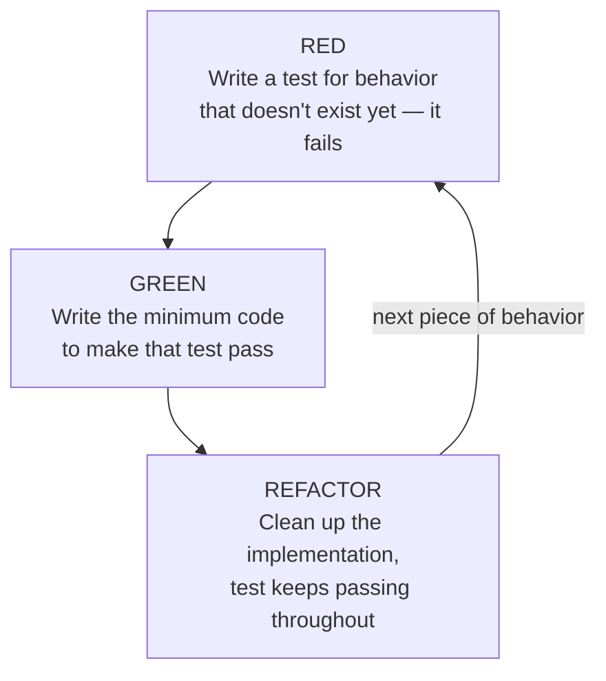

## The loop, precisely

**Is TDD just "write tests"?** Not quite — the order matters, and so
does the loop's shape. TDD runs a specific three-step cycle, repeated
for each small piece of behavior:

**Why does "red" have to come first, deliberately?** A test that passes
the moment it's written hasn't proven anything — it might be passing
because the assertion is trivially true, not because the code under
test actually works. Watching the test fail first confirms the test is
actually capable of failing, which is the only way to trust it later
when it passes.

## Why "minimum code to pass" is a deliberate constraint, not laziness

**If the eventual goal is a fully-working feature, why deliberately
write less than that at each green step?** Because any code written
beyond what the current test requires has no test proving it's correct
or even needed — it's a guess about a future requirement, made without
the pressure of a real, specific assertion to satisfy. Writing only
enough to pass keeps every line of implementation traceable to a
specific test that demanded it.

| Step     | What happens                                    | What it guards against                                        |
| -------- | ----------------------------------------------- | ------------------------------------------------------------- |
| Red      | A test fails because the behavior doesn't exist | A test that can't actually fail proves nothing when it passes |
| Green    | Just enough code to pass, nothing more          | Untested code — guesses about behavior nothing verified       |
| Refactor | Clean up structure, behavior unchanged          | Design decay, guarded by the tests already passing            |

## The actual design pressure

**How does writing the assertion first change the shape of the code
being tested, specifically?** Writing `expect(checkPassword("x")).toEqual(...)`
forces a decision immediately: `checkPassword` has to _return_ something
assertable — a value, an object, something `toEqual` can compare. A
version that instead calls `console.warn("weak password")` has nothing
for an assertion to grab onto; the design that's easiest to test (a
pure function returning structured data) and the design that's easiest
to reuse elsewhere (in a UI, in an API response, in a different check)
turn out to be the same design. Writing implementation first doesn't
forbid landing on that same design — it just removes the immediate
pressure that makes an untestable shape uncomfortable _before_ it's
built, not after.

## What refactor actually protects

**Once the code passes, why is a separate refactor step still needed
instead of just moving on?** The green step's whole job was making the
test pass with minimum effort — that often leaves duplication or
awkward structure that was fine as a shortcut but isn't fine to keep
long-term. Refactor is where that gets cleaned up, and the reason it's
safe to do aggressively is that the tests already written keep passing
throughout — any refactor that breaks behavior shows up immediately as
a newly failing test, not as a bug discovered later.

## The generalizable lesson

**Does TDD guarantee good design?** No — it's possible to write
technically-passing tests against a bad interface and never notice,
especially if the tests are loosely written. What TDD actually
provides is a specific, early moment where an awkward interface has to
be confronted, because an assertion has to be written against it right
then. Whether that moment gets used to actually improve the design, or
just worked around, is still a judgment call every red-green-refactor
cycle presents — not something the loop enforces automatically.
