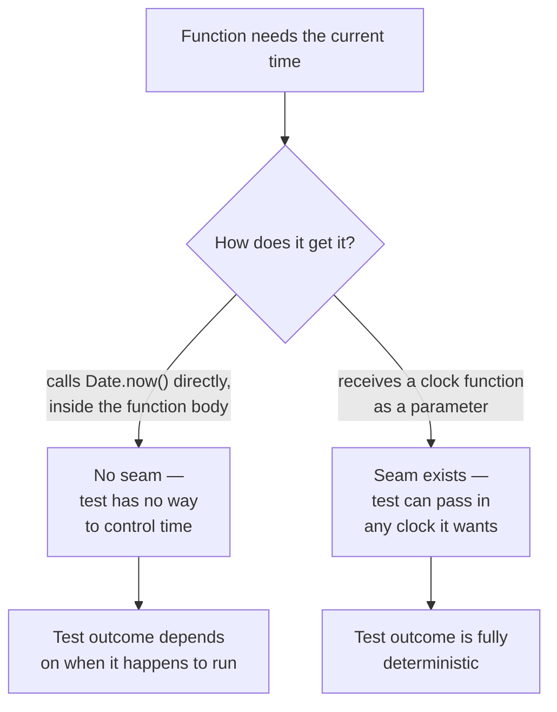

## Where the dependency gets grabbed matters more than what it is

**If `Date.now()` and a real payment API call are both "external"
things a function depends on, why does one function become easy to
test and another stays hard, even though both depend on something
external?** The difference isn't what's being depended on — it's
_where_ the dependency gets obtained:

Both versions of the function do the same thing in production — call
something that returns the current time. The only difference is
whether that call happens _inside_ the function (no seam) or is
_handed to_ the function from outside (a seam). That single structural
choice is what determines whether the function can be tested
deterministically at all.

## Three test doubles, three different questions

**Once a seam exists, what actually gets substituted through it, and
why are there multiple kinds?** Because "replace the real thing with
something else for testing" isn't one question — it splits into
several, and each kind of test double answers a different one:

| Test double | Question it answers                                                          | What it actually does                                                                                                    |
| ----------- | ---------------------------------------------------------------------------- | ------------------------------------------------------------------------------------------------------------------------ |
| Stub        | "What happens if this dependency returns X?"                                 | Returns a fixed, predetermined value — no real logic, no memory of how it was called                                     |
| Fake        | "Does my code work against something that behaves like the real dependency?" | A real, working, simplified implementation (e.g. an in-memory array instead of a real database)                          |
| Mock        | "Did my code call the dependency correctly?"                                 | Records every call (arguments, order, count) so the test can assert on the interaction itself, not just the final result |

A stub and a fake can look similar in simple cases (both return data
when called) — the difference is that a fake has enough real behavior
to keep working consistently across multiple calls (a fake in-memory
store actually stores what you put into it), while a stub just hands
back whatever canned value it was told to return, with no real state
underneath.

## Why mocks test something stubs and fakes can't

**If a stub can already stand in for a payment gateway during a
test, why would anyone need a mock instead?** Because a stub only
helps verify the _result_ of calling the code under test — it can't
tell you whether the code under test actually called the payment
gateway with the right arguments, the right number of times, or in
the right order. A mock's whole purpose is to capture and expose that
interaction so a test can assert on it directly — this matters
specifically when the _fact that a call happened correctly_ is itself
the thing worth testing (e.g., "the refund was called with exactly
one charge ID, not zero and not two").

## Failure modes at this level

- **Treating "hard to test" as a property of the dependency instead
  of the code.** `Date.now()` isn't inherently untestable — code that
  calls it directly, with no seam, is what's untestable. The fix is
  almost always adding a seam, not avoiding the dependency altogether.
- **Reaching for a mock when a stub or fake would answer the actual
  question.** If the test only cares about the function's return
  value given some input, a stub is enough — mocking adds complexity
  (asserting on internal call details) that isn't needed unless the
  interaction itself is what's being tested.
- **Building an elaborate fake when a stub would do.** A fake's extra
  realism (actually storing and retrieving data) costs more to build
  and maintain — reach for it when tests actually exercise that
  stateful behavior across multiple calls, not by default.
