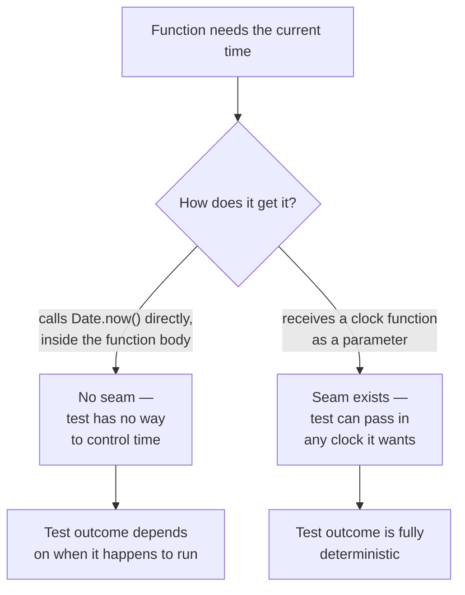

import LevelIntro from "../../../components/LevelIntro.astro";
import Checkpoint from "../../../components/Checkpoint.astro";

L1 named the three kinds of test doubles and the term "seam" without yet
showing why a seam is what makes any of them possible in the first place.
L2 works out where seams come from and which double answers which question.

<LevelIntro
  items={[
    "Why a seam's location, not the dependency itself, decides testability",
    "The question each of stub / fake / spy is built to answer",
    "When reaching for a spy is overkill versus necessary",
  ]}
/>

## Where the dependency gets grabbed matters more than what it is

**If `Date.now()` and a real payment API call are both "external"
things a function depends on, why does one function become easy to
test and another stays hard, even though both depend on something
external?** The difference isn't what's being depended on — it's
_where_ the dependency gets obtained:

Both versions of the function do the same thing in production — call
something that returns the current time. The only difference is
whether that call happens _inside_ the function (no seam) or is
_handed to_ the function from outside (a seam). That single structural
choice is what determines whether the function can be tested
deterministically at all.

<Checkpoint question="A teammate says 'we can't unit test this function, it depends on the database.' Based on what just landed, what's the first thing worth checking before agreeing the function is untestable?">

Whether the database access is a seam or not — specifically, whether the
function receives its database dependency from outside (a parameter, an
injected client) or reaches out and grabs a real database connection
itself, inside its own body. The dependency being a database doesn't make
the function untestable by itself; plenty of database-dependent functions
are tested easily once a database-shaped seam exists to substitute a fake
or stub through. The actual blocker to check for is the missing seam, not
the nature of the dependency — "it depends on X" and "it's hard to test"
are two different claims that only look like the same claim when no seam
separates them.

</Checkpoint>

## Three test doubles, three different questions

**Once a seam exists, what actually gets substituted through it, and
why are there multiple kinds?** Because "replace the real thing with
something else for testing" isn't one question — it splits into
several, and each kind of test double answers a different one:

| Test double | Question it answers                                                          | What it actually does                                                                                                    |
| ----------- | ---------------------------------------------------------------------------- | ------------------------------------------------------------------------------------------------------------------------ |
| Stub        | "What happens if this dependency returns X?"                                 | Returns a fixed, predetermined value — no real logic, no memory of how it was called                                     |
| Fake        | "Does my code work against something that behaves like the real dependency?" | A real, working, simplified implementation (e.g. an in-memory array instead of a real database)                          |
| Spy         | "Did my code call the dependency correctly?"                                 | Records every call (arguments, order, count) so the test can assert on the interaction itself, not just the final result |

A stub and a fake can look similar in simple cases (both return data
when called) — the difference is that a fake has enough real behavior
to keep working consistently across multiple calls (a fake in-memory
store actually stores what you put into it), while a stub just hands
back whatever canned value it was told to return, with no real state
underneath.

## Spy vs. mock: a conflation worth noticing

**If a spy already records every call so a test can check it
afterward, what's left for a stricter "mock" to do?** The two get
used interchangeably in casual conversation — and in several popular
testing libraries — but they check the interaction at different
_times_, relative to the call itself:

| Double        | When it checks correctness                | How it checks                                                                                                       |
| ------------- | ----------------------------------------- | ------------------------------------------------------------------------------------------------------------------- |
| Stub          | Never — it has no opinion on calls at all | Just returns a canned value                                                                                         |
| Spy           | After the call, in the test's own code    | The test reads the spy's recorded calls (e.g. `gatewaySpy.calls`) and asserts on them                               |
| Mock (strict) | During the call itself                    | The double is pre-programmed with expectations and fails itself if they're unmet (typically via a `.verify()` step) |

In other words: a spy is a passive recorder — the _test_ does the
asserting, after the fact. A strict mock is an active participant —
it enforces its own expectations in real time and can fail the test
from inside the call. Both answer "did my code call the dependency
correctly?", which is exactly why they get lumped together — but a
test using a spy and a test using a strict mock are structured
differently, and a failure from a strict mock often points more
precisely at _which_ expectation broke, since it surfaces the moment
the unexpected call happens rather than at an assertion written
afterward.

This isn't a pedantic distinction to memorize and forget — it's worth
naming explicitly because popular tools blur it on purpose. Jest's
`jest.fn()`, for instance, is a spy in this strict sense (it records
calls for `expect(...).toHaveBeenCalledWith(...)` to check
afterward), yet it's universally called a "mock function." That's a
defensible, widely-used convention, not a mistake — just one worth
recognizing for what it actually does, rather than assuming the name
tells you the mechanism.

## Why spies test something stubs and fakes can't

**If a stub can already stand in for a payment gateway during a
test, why would anyone need a spy instead?** Because a stub only
helps verify the _result_ of calling the code under test — it can't
tell you whether the code under test actually called the payment
gateway with the right arguments, the right number of times, or in
the right order. A spy's whole purpose is to capture and expose that
interaction so a test can assert on it directly — this matters
specifically when the _fact that a call happened correctly_ is itself
the thing worth testing (e.g., "the refund was called with exactly
one charge ID, not zero and not two").

<Checkpoint question="A test only needs to check that isTrialExpired(user) returns true for an expired user and false for an active one. Should it use a stub clock or a spy clock, and why?">

A stub clock. The test only cares about the function's return value given
a controlled input — it never needs to assert anything about how the
clock itself was called (how many times, with what arguments, in what
order). Reaching for a spy here would add an assertion on interaction
details that nobody actually needs, which is exactly the "mocking out of
habit" failure mode (the colloquial name sticks even once you know the
mechanism is really a spy): it makes the test more brittle to harmless
internal refactors without buying any additional guarantee. A spy earns
its complexity only when the fact of the call itself — not just the
result it produces — is what the test is meant to verify.

</Checkpoint>

## Failure modes at this level

- **Treating "hard to test" as a property of the dependency instead
  of the code.** `Date.now()` isn't inherently untestable — code that
  calls it directly, with no seam, is what's untestable. The fix is
  almost always adding a seam, not avoiding the dependency altogether.
- **Reaching for a spy (or mock) when a stub or fake would answer the
  actual question.** If the test only cares about the function's
  return value given some input, a stub is enough — recording or
  pre-expecting calls adds complexity (asserting on internal call
  details) that isn't needed unless the interaction itself is what's
  being tested.
- **Building an elaborate fake when a stub would do.** A fake's extra
  realism (actually storing and retrieving data) costs more to build
  and maintain — reach for it when tests actually exercise that
  stateful behavior across multiple calls, not by default.
