import Scenario from "../../../components/Scenario.astro";
import LevelIntro from "../../../components/LevelIntro.astro";

<Scenario label="The 47-minute suite that still ships bugs">
  <Fragment slot="facts">
    

      
🧩 <strong>20 unit tests</strong> — run in 2 seconds total

      
🔗 <strong>30 integration tests</strong> — run in 90 seconds total

      
🌐 <strong>450 e2e tests</strong> — run in 45 minutes total

    

    

      

        
CI runtime

        47 minutes
      

      

        
Flake rate

        Fails ~1 run in 5, no code change
      

      

        
Last week

        Shipped a discount-math bug anyway
      

    

  </Fragment>

A team's CI suite has 500 tests and "great coverage" — almost all of it
end-to-end, driving a real browser through the whole app. It takes 47
minutes to run, fails for unrelated reasons about one run in five, and
still let a broken discount calculation ship last week, because the one
e2e test that happened to touch checkout used a discount code that
canceled out the bug. More tests didn't mean more confidence — it meant
a slow, unreliable suite that still missed the thing a two-line unit
test would have caught instantly.

**The fix isn't "write more tests" or "write fewer tests" — it's putting
each test at the level that actually matches what it's supposed to catch.**

</Scenario>

<LevelIntro
  items={[
    "Unit, integration, and e2e tests, defined",
    "Why the pyramid has that shape",
    "The inverted pyramid (ice cream cone) mistake",
  ]}
/>

- Not every test belongs at the same level. **Unit tests** check one function/module in isolation (fast, cheap, precise about what broke). **Integration tests** check that multiple real components work together correctly (slower, catch wiring/contract problems units can't see). **End-to-end (e2e) tests** drive the whole system like a real user would (slowest, most realistic, most fragile).
- **The test pyramid** is a shape, not a rule: many fast unit tests at the base, fewer integration tests in the middle, a small number of e2e tests at the top — the shape reflects a real cost/confidence trade-off, not an arbitrary convention.

```mermaid
xychart-beta
    title "Where the 500 tests above actually went, vs. where they should have"
    x-axis ["Unit", "Integration", "E2E"]
    y-axis "Number of tests" 0 --> 500
    bar [20, 30, 450]
    bar [350, 120, 30]
```

The first bar is what the team above actually had — an inverted pyramid.
The second is roughly what a healthy suite covering the same features
would look like: most of the volume cheap and fast, e2e reserved for a
small number of critical flows.

- **Speed and confidence trade against each other in a specific, predictable way**: a unit test runs in milliseconds and tells you almost nothing about whether the whole system actually works together; an e2e test takes seconds-to-minutes and tells you the most about real-world correctness, but a failure gives the least specific information about _what_ broke.
- **A common, expensive mistake is the inverted pyramid** ("ice cream cone"): mostly e2e tests, few unit tests. It feels thorough, but it's slow to run, slow to diagnose (an e2e failure often requires real investigation to find the actual broken component), and flaky (e2e tests depend on more moving parts, so they fail for reasons unrelated to the actual bug more often).
- The right level for a given test is determined by **what specifically needs verifying**: pure logic (a calculation, a parsing function) belongs in a unit test; whether two real components' contracts actually match (does the API call really return what the frontend expects) belongs in an integration test; whether a critical user flow works end to end (can a user actually complete checkout) belongs in a small number of e2e tests, reserved for the flows that matter most.

| Level       | What it actually verifies                 | Where it belongs in the team's 500  |
| ----------- | ----------------------------------------- | ----------------------------------- |
| Unit        | One function's logic, in isolation        | The bulk — hundreds, run in seconds |
| Integration | Real components' contracts actually match | A meaningful slice — dozens         |
| E2E         | A critical, whole user-facing flow works  | A small, deliberate handful         |

- This unit builds directly on `testing-quality/case-automated-testing`'s general argument for testing — this unit is specifically about _which level_ a given test belongs at, not whether to write it at all.
- The practical skill: before writing a test, ask what specifically would make it fail — an isolated logic error, a real integration mismatch, or a broken end-to-end flow — and let that answer determine the level, rather than defaulting to whichever level is most familiar or easiest to write.
