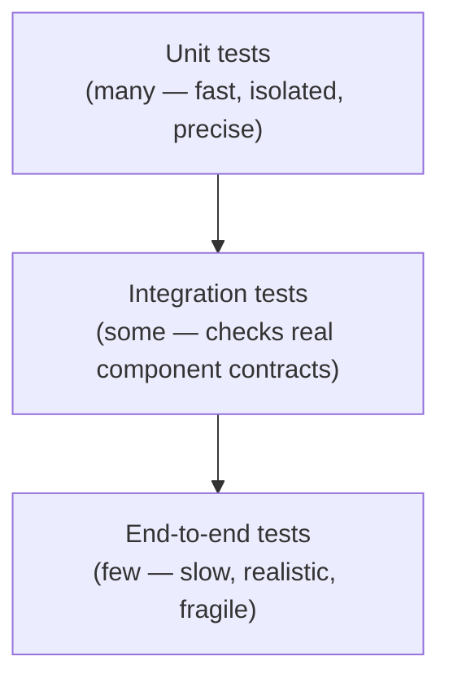
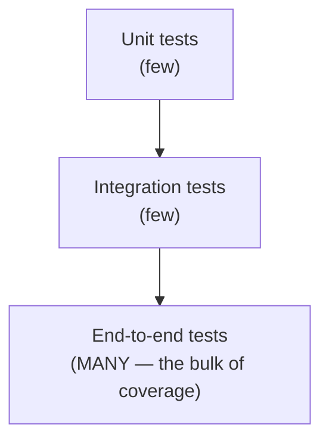
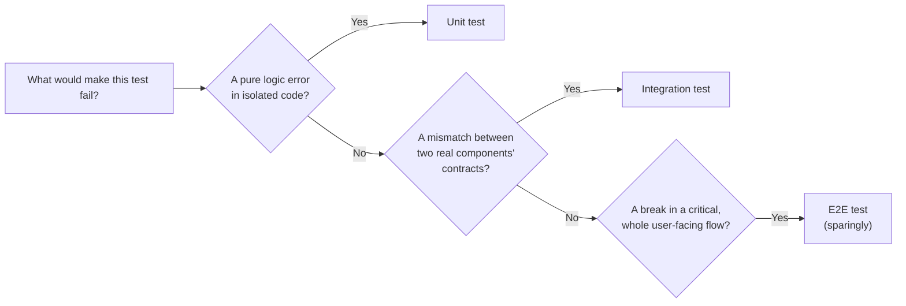

## The pyramid, and why its shape isn't arbitrary

The pyramid's shape encodes a specific claim: most bugs are cheapest to catch and diagnose at the unit level, a smaller number of real problems only show up when components actually interact (integration), and the smallest number of tests should be reserved for validating whole critical flows (e2e), specifically because that layer is the most expensive per test to write, run, and maintain.

## Three properties, compared directly

| Property                                | Unit                                       | Integration                                                            | E2E                                                                     |
| --------------------------------------- | ------------------------------------------ | ---------------------------------------------------------------------- | ----------------------------------------------------------------------- |
| Speed                                   | Milliseconds                               | Seconds                                                                | Seconds to minutes                                                      |
| What it actually verifies               | One function/module's logic, in isolation  | Real components working together (a real DB call, a real API contract) | The whole system, driven like a real user                               |
| Failure specificity                     | Very high — points at exactly one function | Moderate — points at a component boundary                              | Low — "checkout is broken," real investigation needed to find where     |
| Fragility (fails for unrelated reasons) | Low — isolated, few moving parts           | Moderate                                                               | High — depends on the most moving parts (network, timing, UI rendering) |

Every row is a real, distinct cost or benefit — there's no single "best" level, only the level that matches what's actually being verified. A pure calculation function tested end-to-end pays all of e2e's costs (slow, fragile, imprecise on failure) for zero benefit the unit-level test wouldn't already provide.

## The inverted pyramid, and why it's expensive rather than just "more thorough"

This looks thorough — lots of tests, driving real user flows — but it inherits e2e's costs at scale: a full suite takes much longer to run (slowing feedback for every change), individual failures are expensive to diagnose (which of the many moving parts actually broke), and the suite as a whole becomes flaky (more moving parts per test means more chances for an unrelated timing or environment issue to fail a test that has nothing to do with the actual bug being introduced). The inverted shape doesn't catch more real bugs than a well-shaped pyramid with equivalent coverage — it just costs more to run and trust.

## Choosing a level: what specifically needs verifying

This is the practical decision procedure: identify what specifically would cause the test to fail, and let that determine the level — not habit, not "e2e feels more thorough," not "unit tests are what I already know how to write."
