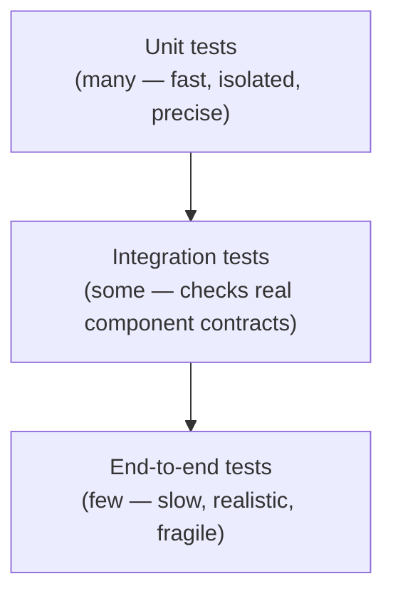
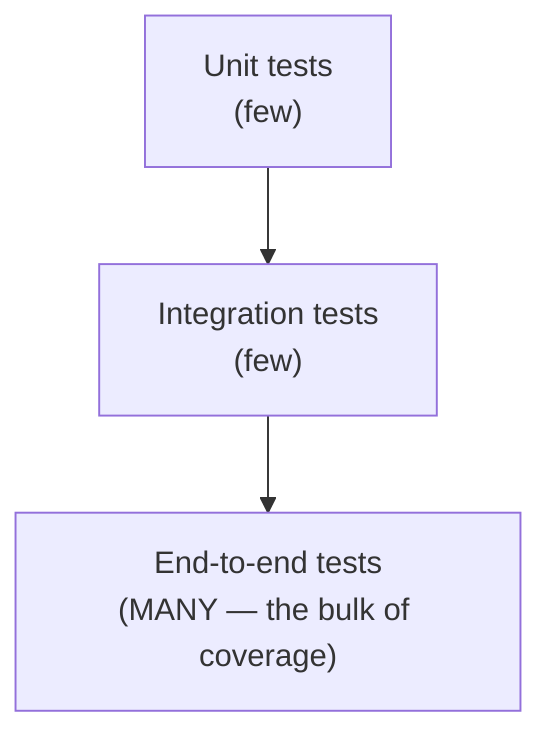
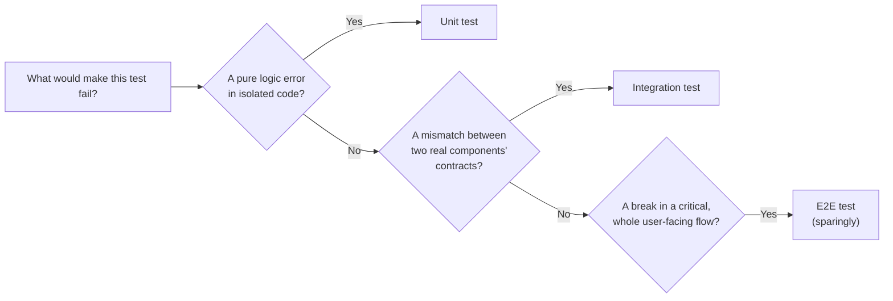

import Scenario from "../../../components/Scenario.astro";
import LevelIntro from "../../../components/LevelIntro.astro";
import Checkpoint from "../../../components/Checkpoint.astro";

<Scenario label="Same bug, three places it could have been caught">
  <Fragment slot="facts">
    

      
🧮 The bug: a discount over 100% produces a negative total

      
🧩 A unit test on the math function would fail in <strong>2ms</strong>

      
🌐 Instead it was only caught by an e2e test, after <strong>6 minutes</strong> of browser setup, page loads, and checkout steps

    

    

      The bug lived in one pure function. The test that caught it drove an
      entire browser session to get there.
    

  </Fragment>

Both tests would have failed on the same bug. One took 2 milliseconds and
pointed at the exact broken line. The other took 6 minutes, and the
failure message just said "checkout total assertion failed" — someone
still had to go find out why.

**If both tests catch the same bug, what actually determines which level
is the right one to write it at?**

</Scenario>

<LevelIntro
  items={[
    "Why the pyramid's shape isn't arbitrary",
    "Speed, precision, and fragility compared across levels",
    "A decision procedure for picking a test's level",
  ]}
/>

## The pyramid, and why its shape isn't arbitrary

The pyramid's shape encodes a specific claim: most bugs are cheapest to catch and diagnose at the unit level, a smaller number of real problems only show up when components actually interact (integration), and the smallest number of tests should be reserved for validating whole critical flows (e2e), specifically because that layer is the most expensive per test to write, run, and maintain.

## Three properties, compared directly

**Why did the scenario's 2ms test and 6-minute test disagree so much on cost, if they caught the same bug?** Because "catches the bug" is only one property of a test — speed, diagnostic precision, and fragility are three separate axes, and a test's level determines all three at once, not just one.

| Property                                | Unit                                       | Integration                                                            | E2E                                                                     |
| --------------------------------------- | ------------------------------------------ | ---------------------------------------------------------------------- | ----------------------------------------------------------------------- |
| Speed                                   | Milliseconds                               | Seconds                                                                | Seconds to minutes                                                      |
| What it actually verifies               | One function/module's logic, in isolation  | Real components working together (a real DB call, a real API contract) | The whole system, driven like a real user                               |
| Failure specificity                     | Very high — points at exactly one function | Moderate — points at a component boundary                              | Low — "checkout is broken," real investigation needed to find where     |
| Fragility (fails for unrelated reasons) | Low — isolated, few moving parts           | Moderate                                                               | High — depends on the most moving parts (network, timing, UI rendering) |

Every row is a real, distinct cost or benefit — there's no single "best" level, only the level that matches what's actually being verified. A pure calculation function tested end-to-end pays all of e2e's costs (slow, fragile, imprecise on failure) for zero benefit the unit-level test wouldn't already provide.

<Checkpoint question="A test verifies a pure calculation function with no I/O and no dependencies. Based on the properties table above, what would you lose by writing it as an e2e test instead of a unit test, given that both would eventually catch the same bug?">

Speed and diagnostic precision, for nothing in return. The e2e version
would take seconds-to-minutes instead of milliseconds, and a failure
would only say something like "checkout total assertion failed" instead
of pointing at the exact broken line — worse on both axes, while
verifying the exact same pure logic a unit test already covers
completely. None of e2e's real strengths (catching a broken component
contract, or a break in the actual user-facing flow) are relevant here,
because there's no contract and no flow involved — just a function and
its inputs.

</Checkpoint>

## The inverted pyramid, and why it's expensive rather than just "more thorough"

**The team from L1's opening scenario had 500 tests and 47 minutes of CI time. What would the same coverage have cost, shaped the other way around?**

| Shape                     | Runtime | Flake rate                    | Bugs caught   |
| ------------------------- | ------- | ----------------------------- | ------------- |
| Inverted (mostly e2e)     | ~47 min | ~1 run in 5, unrelated causes | Same coverage |
| Well-shaped (mostly unit) | ~4 min  | Near-zero                     | Same coverage |

This looks thorough — lots of tests, driving real user flows — but it inherits e2e's costs at scale: a full suite takes much longer to run (slowing feedback for every change), individual failures are expensive to diagnose (which of the many moving parts actually broke), and the suite as a whole becomes flaky (more moving parts per test means more chances for an unrelated timing or environment issue to fail a test that has nothing to do with the actual bug being introduced). The inverted shape doesn't catch more real bugs than a well-shaped pyramid with equivalent coverage — it just costs more to run and trust, exactly as the table above shows: identical coverage, wildly different bill.

<Checkpoint question="The inverted-pyramid team and the well-shaped team in the table above cover exactly the same features with exactly the same number of tests. Why doesn't the inverted team's suite catch any more real bugs, despite being far slower and more fragile to run?">

Because how many tests you have, and what level they're written at, are
separate questions from how much real behavior they cover. Moving the
same coverage from unit level up to e2e level doesn't add new bugs it
can detect — a discount-math edge case is just as catchable by a 2ms
unit test as by a 6-minute e2e test that happens to route through it.
What changes is only the cost of running and diagnosing that coverage:
more moving parts per test means more runtime and more unrelated
failures, not more bugs caught. Thoroughness comes from covering the
right behaviors, not from testing them at the most expensive level
available.

</Checkpoint>

## Choosing a level: what specifically needs verifying

**Given a new test to write, how do you actually decide — without just defaulting to whichever level is most familiar?** Ask what would make it fail, and let the answer pick the level:

This is the practical decision procedure: identify what specifically would cause the test to fail, and let that determine the level — not habit, not "e2e feels more thorough," not "unit tests are what I already know how to write." Applied to the scenario at the top: the discount-over-100% bug is a pure logic error in an isolated calculation, which the flowchart routes straight to "unit test" — exactly the 2ms test that was skipped in favor of the 6-minute one.
