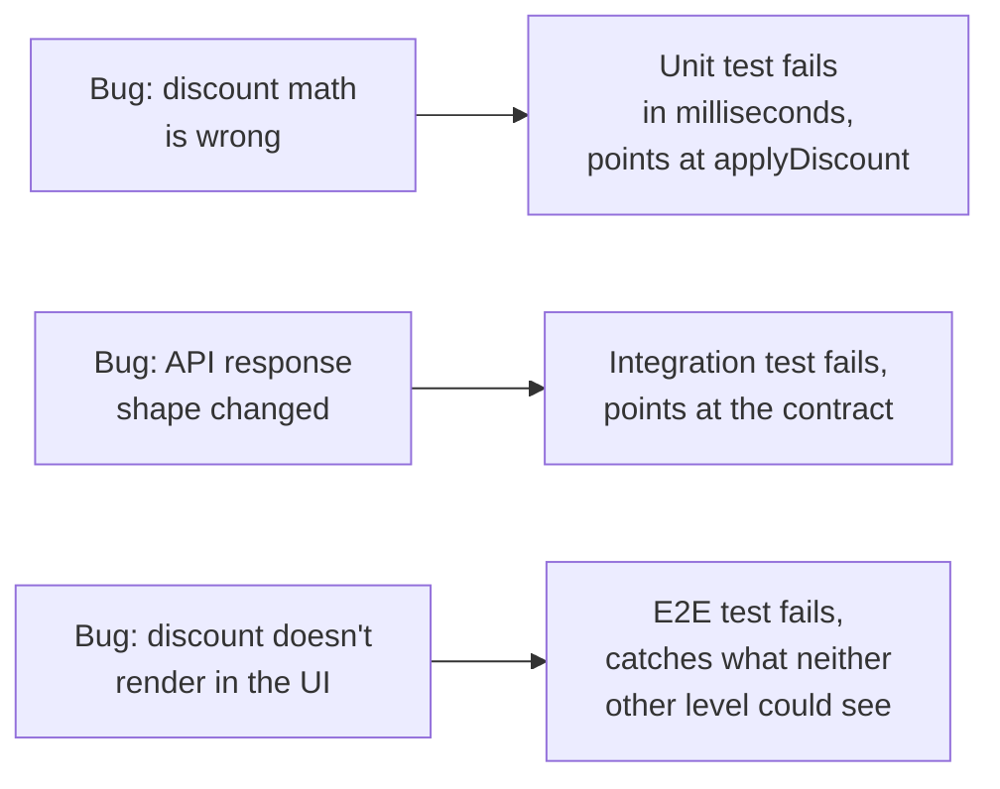
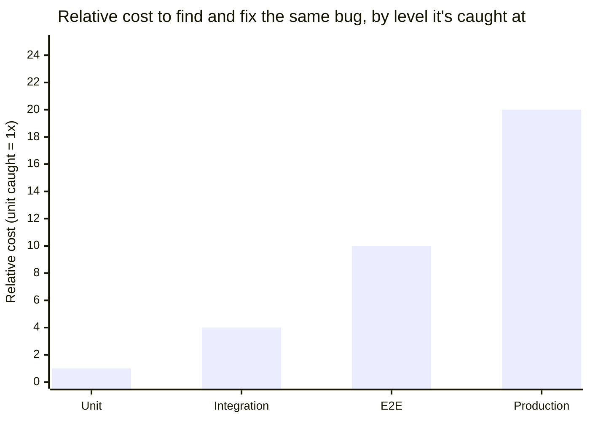

import Scenario from "../../../components/Scenario.astro";

<Scenario label="Applying a discount code at checkout — three real behaviors, one feature">
  <Fragment slot="facts">
    <div class="not-prose flex flex-col gap-1.5 text-sm text-slate-700 dark:text-slate-300">
      <div class="flex items-center gap-1.5"><span>🧮</span> <strong>Pure calculation</strong> — does the discount math work?</div>
      <div class="flex items-center gap-1.5"><span>🔗</span> <strong>Real integration</strong> — does the code API return what the frontend expects?</div>
      <div class="flex items-center gap-1.5"><span>🌐</span> <strong>Whole user flow</strong> — can a real user apply a code and check out?</div>
    </div>
    <div class="not-prose mt-3 rounded border border-amber-300 bg-amber-50 p-1.5 text-xs dark:border-amber-800 dark:bg-amber-950">
      Each row needs a different level of test. Testing all three the same
      way either wastes effort or misses the actual risk.
    </div>

  </Fragment>

Three real pieces of behavior are involved in "apply a discount code at
checkout": a pure calculation, a real integration, and a whole user flow.
Each belongs at a different level, and testing it at the wrong level
either wastes effort or misses the actual risk.

**Before looking at the three implementations below: which of the three
would you expect to be the fastest to write and run, and which would you
expect to catch the widest range of bugs? Are those the same test?**

</Scenario>

## Unit level: the pure calculation

```js
// discount.mjs — pure logic, no I/O, no dependencies
function applyDiscount(subtotal, discountPercent) {
  if (discountPercent < 0 || discountPercent > 100) {
    throw new RangeError(
      `discountPercent must be within [0, 100], got ${discountPercent}`,
    );
  }
  return subtotal - subtotal * (discountPercent / 100);
}

module.exports = { applyDiscount };
```

```js
// discount.test.mjs
import { describe, it, expect } from "some-test-runner";
import { applyDiscount } from "./discount.mjs";

describe("applyDiscount", () => {
  it("applies a percentage discount correctly", () => {
    expect(applyDiscount(100, 20)).toBe(80);
  });
  it("handles 0% discount", () => {
    expect(applyDiscount(50, 0)).toBe(50);
  });
  it("rejects a discount over 100%", () => {
    expect(() => applyDiscount(50, 150)).toThrow(RangeError);
  });
});
```

This runs in milliseconds, requires no server, no database, no network — exactly right for verifying pure math, and exactly the wrong tool for verifying whether the _real_ discount-code API actually returns a valid percentage for a given code, which is a completely different question this test can't and shouldn't try to answer.

## Integration level: the real API contract

```js
// checkout-api.integration.test.mjs — hits a REAL test database and a
// REAL running instance of the discount service, not a mock of either.
import { describe, it, expect } from "some-test-runner";
import { validateDiscountCode } from "./discount-api-client.mjs";
import { startTestDiscountService, seedTestCode } from "./test-helpers.mjs";

describe("discount code API integration", () => {
  let service;
  beforeAll(async () => {
    service = await startTestDiscountService();
  });
  afterAll(async () => {
    await service.stop();
  });

  it("returns the actual discount percent for a valid, seeded code", async () => {
    await seedTestCode(service, "SAVE20", 20);
    const result = await validateDiscountCode("SAVE20");
    expect(result).toEqual({ valid: true, percent: 20 });
  });

  it("returns invalid for an unrecognized code", async () => {
    const result = await validateDiscountCode("NOT-A-REAL-CODE");
    expect(result).toEqual({ valid: false, percent: null });
  });
});
```

This is slower (a real service has to actually start) and tests something a unit test structurally can't: whether the frontend's expectation of the API's response shape (`{ valid, percent }`) actually matches what the real service returns — exactly the class of bug that a mocked-out unit test would never catch, because the mock would just return whatever shape was assumed when the mock was written.

## E2E level: the whole flow, sparingly

```js
// checkout.e2e.test.mjs — drives a real browser against a real
// (staging) deployment, illustrative of the shape (not runnable in
// this sandbox, which has no real browser to drive).
test("a user can apply a discount code and complete checkout", async ({
  page,
}) => {
  await page.goto("/cart");
  await page.fill("[data-testid=discount-code]", "SAVE20");
  await page.click("[data-testid=apply-code]");
  await expect(page.locator("[data-testid=total]")).toHaveText("$80.00");
  await page.click("[data-testid=complete-checkout]");
  await expect(page).toHaveURL(/\/order-confirmation/);
});
```

This is the slowest and most fragile of the three (a real browser, a real page render, real network calls) — deliberately reserved for confirming the _whole_ flow works, the way a real user experiences it, rather than trying to enumerate every discount-math edge case here (that's what the unit tests are for) or every API response shape (that's the integration tests' job).

## What this division actually buys



If the discount math has a bug, the unit test fails immediately, in milliseconds, pointing at the exact broken function. If the API's response shape changes without the frontend being updated, the integration test fails, pointing at the actual contract mismatch. If either passes but the browser can't render the applied discount because of an unrelated CSS or state-management bug, the e2e test is what catches that — and only that layer needs to catch it, because the other two would happily pass while that specific class of bug ships.

## How the same bug's cost changes depending on where it's caught



This is the concrete argument for putting each behavior at its correct level rather than "testing everything at the highest level to be safe": a bug caught by the unit test costs a few milliseconds of CI time and a precise stack trace; the same underlying bug, if it slips past a mis-shaped suite into production, costs an incident.

## Failure modes

- **Writing an e2e test for something a unit test could verify.** A discount-math edge case (negative subtotal, discount over 100%) tested only via a full e2e checkout flow inherits all of e2e's cost (slow, fragile) for a question that has nothing to do with browsers, networks, or real services.
- **Mocking so heavily in an "integration" test that it stops testing any real integration.** A test that mocks out the discount service entirely and just checks that the frontend calls a function with the right arguments is a unit test wearing an integration test's name — it can't catch a real contract mismatch, because nothing real is actually being contacted.
- **Treating a flaky e2e test as evidence of a real bug without investigating.** Per L2, e2e tests have the highest fragility — a failure needs actual triage (was this a real regression, or a timing/environment flake) before treating it as equivalent in confidence to a failing unit test, which almost never fails for reasons unrelated to the code it's testing.
- **Skipping integration tests because "we have unit tests and e2e tests, that should cover it."** The middle layer specifically catches contract mismatches between real components that neither extreme catches well — unit tests can't see across a real boundary (they mock it away), and e2e tests catch a broken contract but bury the specific cause under everything else the full flow also exercises.

## Beyond checkout: the same reasoning, a harder case

The discount-code feature is one worked example — a case, not the whole
territory. **What changes if the feature isn't "apply a discount code"
but "process a refund that touches three services: payments, inventory,
and email notifications"?** The pure-calculation slice is still a unit
test (does the refund math round correctly). But now there are three
separate integration boundaries instead of one, each with its own
contract to verify independently — and the temptation to write a single
sprawling e2e test that exercises all three at once is exactly the
inverted-pyramid trap from L2: it would "work," but a failure would say
almost nothing about which of the three services actually broke. The
right shape is still many small, precise tests near the base and a
small number of whole-flow tests at the top — the number of integration
boundaries just grew from one to three, and each still deserves its own
focused integration test rather than being folded into one giant e2e
check.
