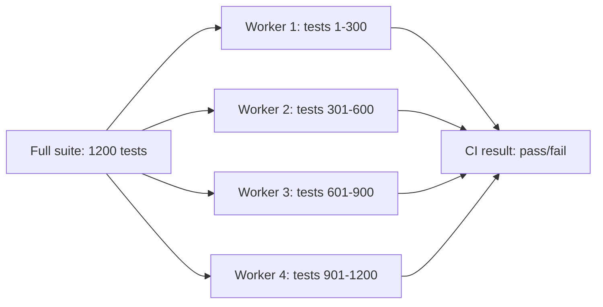

import LevelIntro from "../../../components/LevelIntro.astro";
import Checkpoint from "../../../components/Checkpoint.astro";

L1 established two separate-but-connected problems: a suite that grew
serially from 4 minutes to 38, and a suite noisy enough that "just
rerun it" hid a real bug for twelve cycles. This level builds the
actual mechanism behind each fix — sharding for the first, quarantine
for the second — and what each one requires to actually work rather
than just look like it's working.

<LevelIntro
  items={[
    "How sharding keeps wall-clock time flat as tests grow",
    "The concrete ways parallel-safe tests break",
    "Quarantine as a tracked, time-boxed track — not a shelf",
  ]}
/>

## Why does adding tests make the suite slower, and what actually fixes that?

Run serially, a suite's wall-clock time is just the sum of every
test's time. Add tests, the sum grows — there's no way around that
running one process, one test at a time. **What changes if the same
tests run at the same time instead of one after another?**

Splitting 1200 tests across 4 workers doesn't make any individual test
faster — it makes the wall-clock time close to what the _slowest
worker_ takes, not the sum of all four. As the suite keeps growing,
adding more workers (or more machines) keeps that number close to flat
instead of climbing in a straight line with test count. This is
**sharding**: dividing the suite into disjoint slices ("shards") that
run concurrently, then merging their pass/fail results into one CI
verdict.

Sharding has a cost, though: splitting work up and reporting back has
overhead — spinning up a worker, distributing test files, collecting
results. Doubling shard count doesn't halve runtime forever; past a
certain point the fixed overhead per shard starts to dominate, and one
genuinely slow 90-second test still takes 90 seconds no matter how
many workers exist. L3 works through that ceiling with real numbers.

<Checkpoint question="A team doubles their CI runners from 4 to 8, expecting suite runtime to roughly halve. It only drops by about 15%. What's the most likely explanation, given what sharding actually does?">

Sharding speeds things up by spreading tests across workers, but the
wall-clock time is bounded below by whatever the _slowest_ shard takes
— including fixed per-shard overhead (spinning up, distributing files,
collecting results) that doesn't shrink just because there are more
shards. If one shard happens to contain a handful of unusually slow
tests, or the suite has a single very slow test that can't be split
further, adding more workers around it doesn't touch that bottleneck.
Doubling workers only pays off close to linearly when the suite's time
is dominated by many roughly-equal-sized tests with little per-shard
overhead — which is often not true in practice.

</Checkpoint>

## What actually breaks when tests run in parallel?

Sharding only works if a test's outcome doesn't depend on any other
test running at the same time. **What kinds of tests silently assume
they're alone, even when nobody wrote that assumption down?**

| Hazard                                                                | What goes wrong under parallel execution                                                                     | Fix pattern                                                                                             |
| --------------------------------------------------------------------- | ------------------------------------------------------------------------------------------------------------ | ------------------------------------------------------------------------------------------------------- |
| Shared mutable state (module-level variable, in-memory cache/counter) | Two tests read-modify-write the same object concurrently, producing whichever order happened to run          | Give each test its own fresh instance/fixture; never share mutable module state across tests            |
| Hardcoded port or fixed resource name                                 | Two workers both try to bind the same port or file, one fails with "already in use"                          | Assign the port/resource dynamically per worker or per test, not a fixed literal                        |
| Shared test database with overlapping keys/rows                       | Two tests insert/update the same row id at once; one test's cleanup deletes data another test is still using | Isolate data per test (transaction rollback, unique namespaced keys, separate schemas)                  |
| Shared filesystem paths (a fixed temp file/directory name)            | Two tests write to the same path, one clobbers or reads the other's half-written file                        | Use a unique temp path per test (test id or worker id in the path)                                      |
| Global singletons/caches not reset between tests                      | A cache populated by one test leaks into another's assertions, making results depend on run order            | Reset or reconstruct shared singletons per test, or avoid module-level singletons in test code entirely |

Every row shares the same underlying shape: something that exists
**once**, shared by multiple tests, that a test writes to or depends
on. Serially, this often goes unnoticed for years — tests never
actually overlap in time, so the shared thing never gets touched by
two tests at once. Parallelizing doesn't create these bugs; it exposes
ones that were always structurally possible and just never had the
chance to happen.

<Checkpoint question="A suite has run serially, with zero flakiness, for two years. The team enables 4-way parallel sharding and immediately sees random failures in tests that have never failed before. Did parallelization introduce a new bug?">

No — it exposed a pre-existing one. A test whose outcome depends on
shared mutable state, a fixed port, or overlapping database rows was
never actually safe to run concurrently with another test touching the
same thing; it simply never got the chance to, because serial
execution guarantees only one test runs at a time. The bug (a missing
isolation boundary) was there the whole two years. Parallel execution
didn't write it — it's the first thing that ever ran two tests at
once and gave the pre-existing hazard a chance to collide.

</Checkpoint>

## Quarantine: a tracked exit, not a place tests go to die

`flaky-tests` covers _why_ a test becomes non-deterministic — shared
state, real timing, real randomness, unresolved async work. This unit
picks up after that diagnosis, at the operational question: **once a
test is confirmed flaky, what do you do with it while the real fix is
still pending?**

Leaving it in the main, merge-blocking suite has a cost either way:

- Leave it blocking merges as-is, and every red build from that test
  either gets investigated for real (slow, and usually a false alarm)
  or gets rerun-and-ignored (fast, but this is exactly the habit that
  hid L1's real race condition for twelve cycles).
- Delete or comment it out, and the coverage it provided — whatever
  real bug it was checking for — is just gone, with nothing tracking
  that it needs to come back.

**Quarantine** is the middle path: move the confirmed-flaky test out
of the suite that blocks merges/deploys, into a separate, clearly
labeled, non-blocking track that still runs (so its results are
visible) but can't fail a build. Crucially, quarantine only works as
an escape valve — not a graveyard — if it comes with three things
attached at the moment a test enters it:

- **An owner** — a specific person or team responsible for it, not
  "someone should look at this eventually."
- **A reason** — why it's flaky, or what's currently known/suspected
  about the cause, captured while it's fresh.
- **A revisit-by date** — a concrete point at which the test either
  gets fixed and returns to the blocking suite, or gets a real decision
  made about it (extend, rewrite, or genuinely delete if it's no
  longer testing anything that matters).

Without that third piece, quarantine just becomes a second, slower
version of the exact same trust problem from L1 — a shadow suite of
tests nobody trusts and nobody looks at, except now it's invisible
instead of blocking, which is arguably worse. L3 builds the tagging
mechanism and the ticket pattern that makes this concrete.

## Both problems are really one problem: keeping the suite worth trusting

Sharding protects **speed**; quarantine protects **signal**. They
target different symptoms from L1's Scenario, but the underlying risk
is the same: a suite that's slow enough to skip, or noisy enough to
rerun-without-reading, stops functioning as a safety net regardless of
how correct its individual tests are. A team that only fixes runtime
(parallelize everything) without fixing trust (quarantine the flaky
tests) just gets a _fast_ suite people still ignore — parallelizing a
suite full of unisolated, flaky tests doesn't fix flakiness, it makes
failures appear faster and more often, which L3 shows directly.
