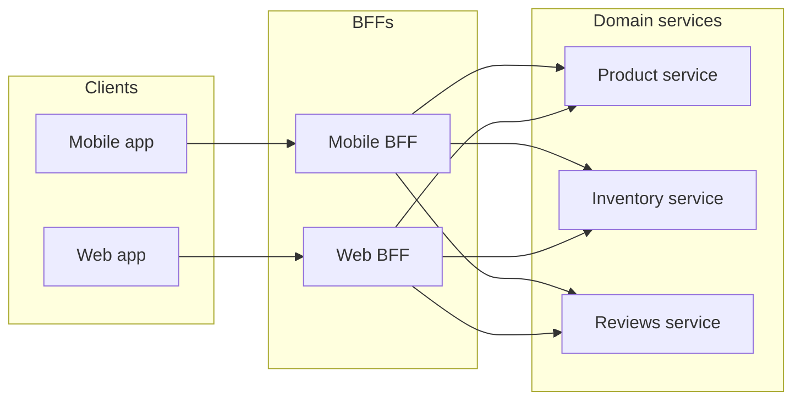

import Scenario from "../../../components/Scenario.astro";
import LevelIntro from "../../../components/LevelIntro.astro";

<Scenario label="The problem">
  <Fragment slot="facts">
    

      
📱 <strong>Mobile</strong> — needs a slim payload, 4 sequential calls over cellular, ~880ms before the screen can render

      
🖥️ <strong>Web</strong> — wants the full nested object in one call, filed against the same shared endpoint

      
🛠️ <strong>Backend</strong> — one shared API, two frontends pulling its shape in opposite directions

    

    

      Every shape change now needs sign-off from both frontend teams before backend can ship it.
    

  </Fragment>

The mobile team is shipping a redesigned product page. It needs a price, an
inventory count, a reviews summary, and recommended items — four different
resources. The shared REST API returns one resource per endpoint, so the
mobile app fires four sequential requests over a cellular connection before
it can paint anything: roughly 220ms each, ~880ms total, before the user
sees a price.

The web team, meanwhile, is asking the same backend team for the opposite
thing: one endpoint that returns everything nested together, because a
desktop page renders it all at once and extra round trips barely matter on
wifi. Now every change to that shared endpoint's shape needs sign-off from
both frontend teams, and the backend team — who don't render either
screen — become the bottleneck deciding whose shape wins.

| Team    | What it actually needs from the API       | What it's stuck with today                   |
| ------- | ----------------------------------------- | -------------------------------------------- |
| Mobile  | Slim, pre-aggregated, minimal round trips | 4 raw resource calls per screen              |
| Web     | One full nested payload                   | The same 4 raw resource calls, or none fused |
| Backend | To ship changes without a two-team review | Gridlock on every shape change               |

**Both frontends are hitting the exact same backend API. Why does giving one of them what it needs mean breaking the other?**

</Scenario>

Because a single shared, general-purpose API endpoint can only have one
shape at a time — and "one shape" is exactly what two different clients
with two different rendering needs can't agree on.

<LevelIntro
  items={[
    "What a BFF is and why it exists",
    "How a BFF differs from an API gateway",
    "Why contract testing lets frontend and backend deploy independently",
  ]}
/>

## The BFF pattern in one sentence

A **Backend For Frontend (BFF)** is a thin server-side layer, owned by (or
built for) a specific frontend, that sits between that frontend and the
company's backend services — calling several of them, combining and
reshaping the results into exactly what that one frontend needs, and
nothing else.

Instead of one shared API trying to serve every client, each client type
gets its own tailored layer:

- **Mobile BFF** — aggregates price + inventory + reviews-summary +
  recommendations into a single slim response, in one round trip.
- **Web BFF** — aggregates the same underlying data, but shaped and sized
  differently for a desktop render.
- Both BFFs call the same underlying backend **domain services**
  (product-service, inventory-service, reviews-service) — the aggregation
  logic lives in the BFF, not in the shared services themselves.

- A BFF is **client-specific** — one per frontend "shape" (native mobile,
  web, sometimes a partner API), not one-size-fits-all.
- A BFF **aggregates and reshapes**, replacing several chatty client-side
  round trips with one call the BFF fans out from server-side, where
  network latency between services is far cheaper than over a cellular
  connection.
- A BFF is typically **owned by (or close to) the frontend team** that
  consumes it — so a screen redesign no longer requires a cross-team
  negotiation over a shared endpoint's shape.

## BFF vs. API gateway — not the same thing

An **API gateway** is a different, complementary piece: a single
client-agnostic entry point in front of all backend services, handling
cross-cutting concerns that have nothing to do with any one client's
screen — authentication, rate limiting, TLS termination, routing requests
to the right service. It doesn't know or care what a mobile product page
looks like.

| Concern                                       | API gateway                     | BFF                          |
| --------------------------------------------- | ------------------------------- | ---------------------------- |
| Client-aware?                                 | No — same behavior for everyone | Yes — one per frontend type  |
| Combines multiple services into one response? | Usually not                     | Yes — that's its main job    |
| Owns auth, rate limiting, TLS?                | Yes                             | No — sits behind the gateway |
| Who typically owns it?                        | Platform / infra team           | The frontend team it serves  |

A real system often has both: the gateway is the front door for every
request, and traffic bound for a specific client is routed on to that
client's BFF, which does the aggregation.

## Contract testing: the piece that makes independent deploys safe

Splitting into BFFs and domain services solves the "whose shape wins"
problem, but introduces a new one: now there are several independently
deployable services calling each other. How does the reviews-service team
know that changing a field name won't silently break the mobile BFF in
production, without both teams re-running a slow, flaky, full end-to-end
test suite before every deploy?

**Contract testing** answers this by writing a much smaller, much faster
check: the consumer (the BFF) records what it actually expects from the
provider (the domain service) — which fields, which shapes — as a
lightweight "contract" file. The provider's own CI pipeline then verifies
its real responses still satisfy that contract, on every commit, without
either service needing the other one actually running.

- Key terms: BFF, API gateway, aggregation/orchestration layer, chatty API,
  fan-out, domain service, consumer-driven contract, provider verification,
  schema versioning.
- The point of all three pieces together — BFF, gateway, contract
  testing — is the same: let frontend and backend teams change their own
  code and deploy on their own schedule, without a shared bottleneck
  endpoint or a slow, fragile integration-test gate between them.
