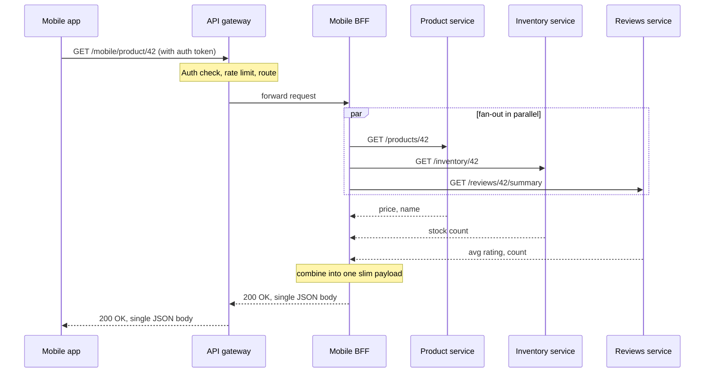
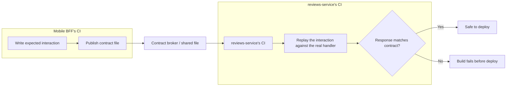

import LevelIntro from "../../../components/LevelIntro.astro";
import Checkpoint from "../../../components/Checkpoint.astro";

L1 established that a BFF is a client-specific aggregation layer, distinct
from an API gateway, and that contract testing is what lets the services
behind it deploy independently. L2 puts those pieces together into one
architecture, and works through the two questions that decide whether a BFF
actually solves the problem or just moves it: where does the fan-out
happen, and what exactly does a contract test check?

<LevelIntro
  items={[
    "Where a request boundary sits in a BFF architecture",
    "What a consumer-driven contract actually checks",
    "Why gateway-only or BFF-only both leave a gap",
  ]}
/>

## Would an API gateway alone have fixed the mobile team's problem?

No — and seeing why sharpens the boundary between the two. An API gateway
sitting in front of `product-service`, `inventory-service`, and
`reviews-service` can route `/products/42` to the right service and reject
unauthenticated calls, but it still returns each service's response as-is.
The mobile client still has to make three or four separate calls through
the gateway and assemble them itself — the gateway moved _where_ the
request lands, not _how many_ requests the client has to make. Fan-out
reduction requires something that combines responses, and a gateway's job
is deliberately client-agnostic; teaching it to know what a mobile product
page needs would make every other client's traffic pay for mobile-specific
logic it doesn't want.

The gateway is the front door that every request passes through once,
handling concerns that don't vary per client. The BFF is the layer that
actually does the fan-out shown above — three calls out, one call back —
and it's specific to what a mobile product screen needs, which is exactly
why a web BFF, hitting the same three domain services, would ask for and
combine different fields.

<Checkpoint question="If a fifth domain service (a promotions-service) launches and mobile's product page now needs to show an active discount, which layer changes: the API gateway, the mobile BFF, or both?">

Only the mobile BFF. The gateway's job — auth, rate limiting, routing — has
nothing to do with which domain services a given screen's data comes from,
so it doesn't need to know promotions-service exists. The mobile BFF is
exactly where "which services does this screen's response get assembled
from" lives, so it's the only place that needs a new outbound call and a
new field in its combined response. This is the same reason the BFF was
worth splitting out from the gateway in the first place: screen-specific
change should cost a screen-specific team a screen-specific edit, not a
shared piece of infrastructure everyone depends on.

</Checkpoint>

## What does "consumer-driven" mean in a contract test?

L1 said contract testing avoids a slow, flaky end-to-end suite. The
mechanism is that the **consumer** (here, the mobile BFF) writes down what
it actually uses from the **provider** (reviews-service) — not the
provider's full response shape, only the fields the consumer reads — as a
contract file. That contract is then two things at once: a test the
provider runs in its own CI against its real handler, and documentation of
exactly what would break the consumer if changed.

Concretely, the contract for the mobile BFF's call to reviews-service might
say: "a GET to `/reviews/42/summary` returns a body with a numeric
`averageRating` and an integer `reviewCount`." It says nothing about
whether reviews-service also returns a `topReviewIds` array the mobile BFF
never reads — the contract only covers what the consumer actually
consumes, which is exactly what makes it lighter than a full schema
match and safe for the provider to extend without breaking anything.

| Check                                            | Full end-to-end test                     | Consumer-driven contract test                      |
| ------------------------------------------------ | ---------------------------------------- | -------------------------------------------------- |
| What runs                                        | Every real service, wired together       | The provider alone, against a recorded expectation |
| Speed                                            | Slow — spins up the whole system         | Fast — one service, one HTTP call                  |
| Catches "field the consumer never reads changed" | Yes, unnecessarily                       | No — and that's intentional                        |
| Catches "field the consumer reads got renamed"   | Yes                                      | Yes                                                |
| Runs in whose CI                                 | A shared, often-owned-by-nobody pipeline | The provider's own CI, on every commit             |

<Checkpoint question="reviews-service renames averageRating to avgRating in its response, but nobody updates the mobile BFF's contract file. What happens when reviews-service's CI runs?">

The contract test fails, and the deploy is blocked — before the change
ever reaches a shared environment or a real mobile user. The provider's CI
replays the mobile BFF's recorded expectation ("a field named
`averageRating` exists") against the real, renamed response, and that
expectation no longer holds. This is the entire point of consumer-driven
contracts: the check that would have needed a live mobile client hitting a
live reviews-service to discover, in an end-to-end suite, instead runs as
a fast, isolated assertion inside reviews-service's own pipeline, days
before either service would otherwise have been deployed together.

</Checkpoint>

## What actually changes for the two teams from L1's scenario

Put back against the opening scenario: mobile's screen now costs one round
trip (to the mobile BFF) instead of four, because the fan-out moved
server-side where inter-service latency is far cheaper than a cellular
round trip. Web keeps its own BFF with its own shape, so it never has to
negotiate with mobile over what the shared endpoint should return, because
there no longer is one shared endpoint — there's a domain service per
concern, and a BFF per client, connected by contracts each provider checks
on its own schedule. The domain services (product, inventory, reviews) can
change their internals freely, deploy on their own cadence, and only have
to hold up their end of the specific contracts published against them.

The relationship worth building intuition for next is what "moved
server-side" actually buys — and costs — once the BFF is fanning out to
several services on every request. That's L3.
