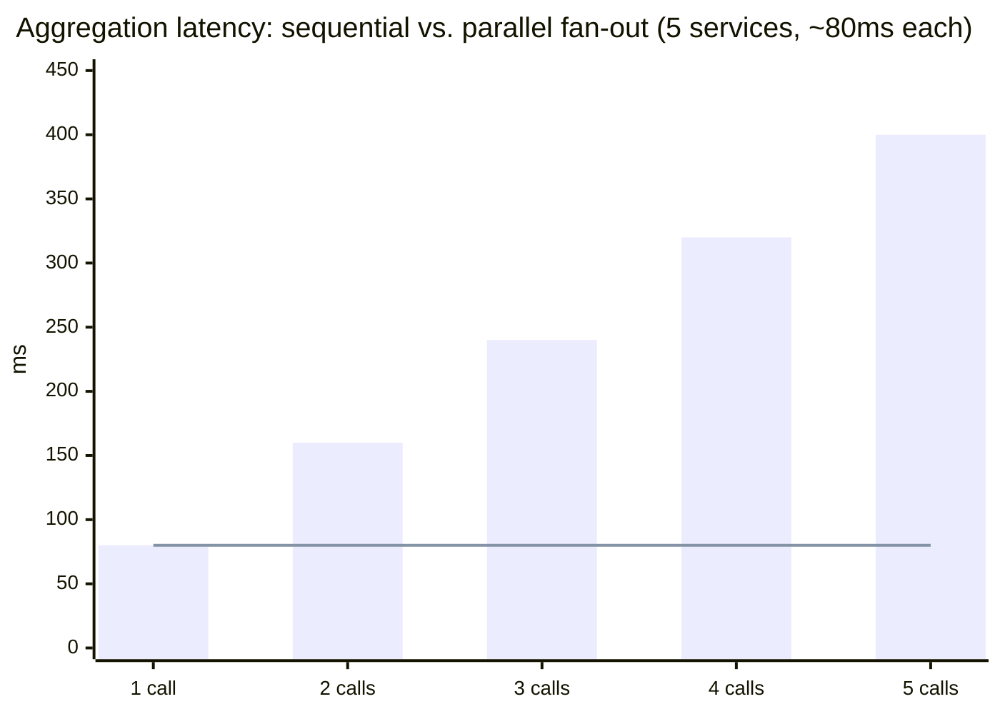

import Scenario from "../../../components/Scenario.astro";
import LevelIntro from "../../../components/LevelIntro.astro";
import Checkpoint from "../../../components/Checkpoint.astro";

<Scenario label="The problem">
  <Fragment slot="facts">
    <div class="not-prose flex flex-col gap-2 text-sm text-slate-700 dark:text-slate-300">
      <div class="flex items-center gap-1.5"><span>✅</span> <strong>reviews-service down</strong> — mobile BFF still returns price + stock, marks reviews as unavailable</div>
      <div class="flex items-center gap-1.5"><span>💥</span> <strong>Naive BFF</strong> — one <code>await</code> failing throws, whole product page 500s</div>
    </div>
    <div class="not-prose mt-3 rounded border border-rose-300 bg-rose-50 p-2 text-xs dark:border-rose-800 dark:bg-rose-950">
      A BFF that fans out to N services has N new ways to fail on every single request it serves.
    </div>

  </Fragment>

The mobile BFF from L2 fans out to three services on every product-page
request. Reviews-service has a bad deploy and starts timing out. A BFF
written with three plain `await` calls in sequence doesn't just lose
reviews — the unhandled rejection takes down the whole response, so price
and stock, which were both available the entire time, never reach the
user either.

**The BFF made mobile's page one round trip instead of four. Did it also make the page's availability worse — dependent on three services all being up instead of whichever one the user's next tap needs?**

</Scenario>

Only if it's built naively. A BFF that treats "fan out to three services"
as "if any of them fails, the whole request fails" has traded a chattiness
problem for a fragility problem. The fix is architectural, not exotic: fan
out in parallel, bound every call with a timeout, and decide per-field
whether a failure degrades gracefully or fails the whole request.

<LevelIntro
  items={[
    "A real aggregation endpoint with partial-failure handling",
    "A runnable consumer-driven contract test",
    "Fan-out latency: parallel vs. sequential, and where it breaks",
  ]}
/>

## Building the aggregation endpoint

Here's a mobile BFF endpoint in TypeScript (Node/Bun, no framework beyond
the runtime's `fetch`) that aggregates product, inventory, and reviews.
Price and stock are load-bearing for the page — if either fails, the
request should fail loudly. Reviews are enhancement — if it fails, the
page should render without it rather than not at all.

```ts
// mobile-bff/product-page.ts

interface ProductResult {
  status: "ok" | "error";
  name?: string;
  price?: number;
}
interface InventoryResult {
  status: "ok" | "error";
  inStock?: boolean;
}
interface ReviewsResult {
  status: "ok" | "unavailable";
  averageRating?: number;
  reviewCount?: number;
}

interface ProductPageResponse {
  name: string;
  price: number;
  inStock: boolean;
  reviews:
    { averageRating: number; reviewCount: number } | { unavailable: true };
}

const TIMEOUT_MS = 800;

async function fetchWithTimeout(
  url: string,
  timeoutMs: number,
): Promise<Response> {
  const controller = new AbortController();
  const timer = setTimeout(() => controller.abort(), timeoutMs);
  try {
    return await fetch(url, { signal: controller.signal });
  } finally {
    clearTimeout(timer);
  }
}

async function getProduct(productId: string): Promise<ProductResult> {
  try {
    const res = await fetchWithTimeout(
      `http://product-service/products/${productId}`,
      TIMEOUT_MS,
    );
    if (!res.ok) return { status: "error" };
    const body = await res.json();
    return { status: "ok", name: body.name, price: body.price };
  } catch {
    return { status: "error" };
  }
}

async function getInventory(productId: string): Promise<InventoryResult> {
  try {
    const res = await fetchWithTimeout(
      `http://inventory-service/inventory/${productId}`,
      TIMEOUT_MS,
    );
    if (!res.ok) return { status: "error" };
    const body = await res.json();
    return { status: "ok", inStock: body.stockCount > 0 };
  } catch {
    return { status: "error" };
  }
}

async function getReviews(productId: string): Promise<ReviewsResult> {
  try {
    const res = await fetchWithTimeout(
      `http://reviews-service/reviews/${productId}/summary`,
      TIMEOUT_MS,
    );
    if (!res.ok) return { status: "unavailable" };
    const body = await res.json();
    return {
      status: "ok",
      averageRating: body.averageRating,
      reviewCount: body.reviewCount,
    };
  } catch {
    // reviews-service down or slow: degrade, don't fail the page for it.
    return { status: "unavailable" };
  }
}

export async function buildProductPage(
  productId: string,
): Promise<ProductPageResponse> {
  // Fan out in parallel — none of these three calls depends on another's
  // result, so awaiting them sequentially would only add latency for no
  // benefit (see the fan-out demo below).
  const [product, inventory, reviews] = await Promise.all([
    getProduct(productId),
    getInventory(productId),
    getReviews(productId),
  ]);

  // Price and stock are load-bearing for the page: if either failed, this
  // request should fail loudly rather than render a broken/misleading page.
  if (product.status === "error" || inventory.status === "error") {
    throw new Error(`product page aggregation failed for ${productId}`);
  }

  return {
    name: product.name!,
    price: product.price!,
    inStock: inventory.inStock!,
    reviews:
      reviews.status === "ok"
        ? {
            averageRating: reviews.averageRating!,
            reviewCount: reviews.reviewCount!,
          }
        : { unavailable: true },
  };
}
```

Three things are load-bearing in this design, not incidental style
choices:

- **`Promise.all`, not three sequential `await`s.** The calls are
  independent, so running them in parallel bounds total latency by the
  _slowest_ call instead of the _sum_ of all three — this is quantified in
  the interactive demo below.
- **A timeout on every outbound call.** Without `AbortController` cutting
  a call off, one slow service can hold the whole aggregation open
  indefinitely — a caller blocked on `fetch` with no timeout has no way to
  decide "this took too long, give up," and neither does anything
  downstream waiting on it.
- **Per-field failure policy, decided explicitly.** `reviews` degrades to
  `{ unavailable: true }`; `product`/`inventory` throw. That split isn't
  automatic — an author has to decide, per field, whether its absence
  means "render a worse page" or "don't render a page."

<Checkpoint question="If getReviews above used await directly (getProduct(); then getInventory(); then getReviews();) instead of Promise.all, and each call takes about 150ms, roughly how long would a successful request take end-to-end, and why?">

Roughly 450ms instead of roughly 150ms. Sequential `await` calls block one
after another, so the total is the _sum_ of all three calls (150 + 150 +
150ms); `Promise.all` starts all three at once, so the total is bounded by
the _slowest single call_ (~150ms), since none of them depends on another's
result. This is exactly the shape the interactive demo further down makes
draggable — the gap between sequential and parallel only grows as more
services get added to the fan-out.

</Checkpoint>

## Writing a runnable consumer-driven contract test

L2 described what a contract checks conceptually. Here's a real, runnable
version using [Pact](https://docs.pact.io/), the most widely used
consumer-driven contract testing tool, in its JS form. The **consumer
side** (mobile BFF's test suite) records the interaction it depends on:

```ts
// mobile-bff/reviews-service.contract.test.ts
import { PactV3, MatchersV3 } from "@pact-foundation/pact";
import { getReviewsSummary } from "./reviews-client";

const { like, integer, decimal } = MatchersV3;

const provider = new PactV3({
  consumer: "mobile-bff",
  provider: "reviews-service",
});

describe("mobile-bff -> reviews-service contract", () => {
  it("returns a review summary for an existing product", () => {
    provider
      .given("product 42 has reviews")
      .uponReceiving("a request for the review summary of product 42")
      .withRequest({ method: "GET", path: "/reviews/42/summary" })
      .willRespondWith({
        status: 200,
        headers: { "Content-Type": "application/json" },
        body: {
          averageRating: decimal(4.5),
          reviewCount: integer(128),
        },
      });

    return provider.executeTest(async (mockServer) => {
      const result = await getReviewsSummary(mockServer.url, "42");
      expect(result.averageRating).toBeCloseTo(4.5);
      expect(result.reviewCount).toBe(128);
    });
  });
});
```

Running this test does two things at once: it verifies the mobile BFF's
own client code (`getReviewsSummary`) parses the shape correctly, and it
writes a **contract file** (a JSON pact recording the interaction) that
gets published to a shared broker. The **provider side**
(reviews-service's own test suite, in its own repo, its own CI) then
replays every published contract against its real handler:

```ts
// reviews-service/pact-verification.test.ts
import { Verifier } from "@pact-foundation/pact";

describe("Pact verification: reviews-service as a provider", () => {
  it("satisfies every contract published against it", () => {
    return new Verifier({
      provider: "reviews-service",
      providerBaseUrl: "http://localhost:4000", // the real service, running locally in CI
      pactBrokerUrl: process.env.PACT_BROKER_URL,
      publishVerificationResult: true,
      providerVersion: process.env.GIT_SHA,
      stateHandlers: {
        "product 42 has reviews": async () => {
          // seed the test database so GET /reviews/42/summary returns real data
          await seedReviews(42, { averageRating: 4.5, reviewCount: 128 });
        },
      },
    }).verifyProvider();
  });
});
```

If reviews-service renames `averageRating` to `avgRating`, this
verification step fails — in reviews-service's own CI, against its own
real handler, with no mobile BFF, no mobile app, and no shared staging
environment involved. That's the mechanism behind the table in L2: same
bug caught, a fraction of the infrastructure and flakiness of an
end-to-end suite.

## What Promise.all doesn't fix: the timeout budget still has to be chosen deliberately

Parallel fan-out bounds latency by the slowest call — but "slowest call"
still has to have an upper bound, or one degraded upstream service turns
into an unbounded wait for every request touching it. The chart below
shows total aggregation time for the `buildProductPage` code above, for a
fan-out to `N` services with roughly equal typical latency, contrasting
sequential `await`s against `Promise.all`:



The bars (sequential) grow linearly with every service added; the line
(parallel) stays flat at roughly the slowest individual call — as long as
every call has a timeout. Without one, the flat line becomes a lie: a
single hung upstream call makes the "parallel" total just as unbounded as
a sequential chain waiting on its slowest link. Play with both the number
of upstream calls and their typical latency in the demo above the exercises
below to see exactly how much the gap widens as a BFF's fan-out grows.

## A worked extension: what if the page needed a fourth call?

The `buildProductPage` example fans out to three services with one clear
degrade/fail split. **What would change if a fourth call — say, a
personalized recommendations service — were added, and it was slower and
less reliable than the other three (typical 400ms, occasional 2s
timeouts)?** At minimum: recommendations would need its own, longer
timeout tuned separately from the 800ms used for product/inventory (or the
page would start timing out recommendations that were about to succeed);
it would very likely belong in the "degrade gracefully" bucket alongside
reviews rather than the "fail the whole page" bucket, since a product page
without recommendations is still a usable page; and the interactive
fan-out chart's story gets worse, not better — a fourth parallel call adds
one more thing that can be the slowest one setting the floor for
everyone else's response time, even though it never slows down the total
by itself.

| Field           | Load-bearing? | On failure                            |
| --------------- | ------------- | ------------------------------------- |
| price           | Yes           | Fail the whole request                |
| inStock         | Yes           | Fail the whole request                |
| reviews         | No            | Render page, mark reviews unavailable |
| recommendations | No            | Render page, omit the section         |

This worked example is one shape of BFF, not the whole territory — a BFF
whose page has no meaningful "degrade" option at all (say, a checkout
confirmation screen where every field is load-bearing) would reasonably
choose to fail the whole request on any upstream error, trading the
graceful-degradation benefit shown here for simplicity, because there's no
value in ever showing a "successful" page that's actually missing a price.
