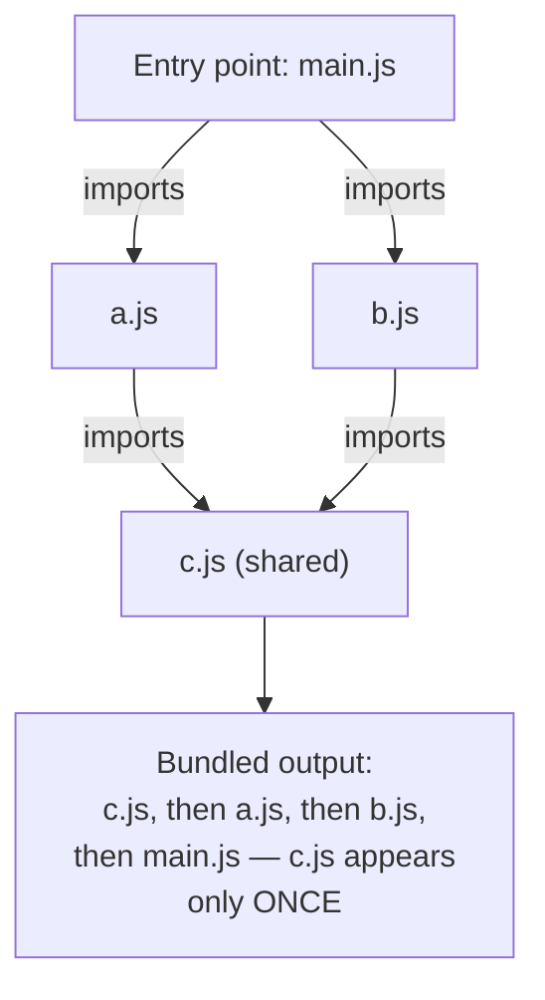

## From explicit imports to a graph

**If a script tag's order is the problem, why not just fix the order
once and be done with it?** Because "the order" isn't actually one
fixed thing — it's an emergent property of whatever dependencies
happen to exist at a given moment, and it changes every time a file's
dependencies change. A module system replaces implicit ordering with
an explicit declaration: every file states exactly what it needs
(`import`) and exactly what it provides (`export`). That turns
"figure out the right order" from a manual, error-prone task into a
mechanical one — a bundler can read every file's `import` statements,
build the full graph of what depends on what, and calculate a valid
order automatically.

Before the graph, separate three ideas that often get blurred:

| Shape              | What the developer writes                   | What the browser has to manage                                                                  |
| ------------------ | ------------------------------------------- | ----------------------------------------------------------------------------------------------- |
| Plain script tags  | Several files attached manually in HTML     | Load order and globals are manual bookkeeping                                                   |
| Browser ES modules | Files use `import`/`export` directly        | The browser can follow imports, but still downloads many files and only runs syntax it supports |
| Bundled output     | Source modules are analyzed before shipping | The browser receives fewer browser-ready files in a computed order                              |

A module system answers "who needs whom?" A bundler uses that answer before
the page loads to produce output that is easier and safer for the browser to
execute.

**Why does `c.js` only appear once in the output, even though both
`a.js` and `b.js` depend on it?** The bundler tracks which modules it's
already visited while walking the graph — once `c.js` has been
included, later requests for it are satisfied by the same single copy,
not a fresh one. This is exactly what a hand-maintained set of script
tags can't do on its own: nothing stops the same file from being
included twice, or omitted entirely, except careful manual bookkeeping.

## Transpilation: a separate problem bundling gets bundled with

**Is transpilation the same thing as bundling?** No — they solve
different problems and just happen to run in the same build step in
most modern toolchains. Bundling is about _combining_ files correctly;
transpilation is about _rewriting_ syntax a target environment can't
run natively into equivalent syntax it can (newer language features
down to older ones, or non-standard syntax like JSX into plain
JavaScript). A project can need one without the other — but most
real-world web projects need both, so build tools typically run them
together as one pipeline.

| Problem                                      | What solves it                         | What happens without it                                   |
| -------------------------------------------- | -------------------------------------- | --------------------------------------------------------- |
| Wrong script-tag order                       | Bundling (dependency-graph resolution) | Runtime "is not defined" errors                           |
| Same file duplicated by multiple script tags | Bundling (module deduplication)        | Wasted bytes, or worse, duplicate global state            |
| Newer syntax an old browser can't parse      | Transpilation                          | A syntax error before any code even runs                  |
| Too many small files, too many HTTP requests | Bundling (fewer output files)          | Slower page loads, especially on high-latency connections |

## So why a build step at all?

The build step exists because the source code shape that helps humans work is
not always the shape browsers should receive. It can compute a safe module
order, include shared dependencies once, rewrite syntax for target browsers,
split or combine output files, and remove code the graph proves is unused.
Those are all pre-browser decisions: by the time the user opens the page, the
browser gets files that are already organized for execution.

## Tree-shaking: removing what nothing actually uses

**If a shared utility file exports ten functions but a project only
uses three of them, does the bundle include all ten?** Not necessarily
— because the module graph already tracks exactly which exports each
importer actually uses, a bundler can walk that same information one
step further and exclude exports nothing in the graph ever imports.
This is called tree-shaking, and it depends entirely on having an
explicit graph to walk in the first place — without knowing precisely
what's used and by whom, a build tool has no safe way to tell an unused
export apart from one some other, unseen part of the page still needs.

## The generalizable lesson

**Is a bundler just "a tool that makes fewer files"?** That's the
visible effect, but the actual mechanism underneath is graph
resolution — building an explicit map of dependencies and computing a
valid order and a minimal set of included code from it. The same
underlying idea (declare what depends on what, then let a tool compute
the correct order and eliminate anything the graph shows is
genuinely unreachable) shows up anywhere ordering or inclusion used to
be maintained by hand and became too error-prone to keep doing that
way — build systems, package managers, and task runners all solve a
version of the same problem this unit's dependency graph solves for
JavaScript files specifically.
