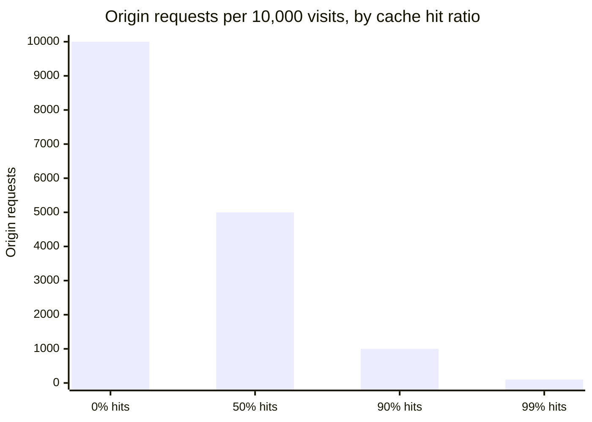

import Scenario from "../../../components/Scenario.astro";
import LevelIntro from "../../../components/LevelIntro.astro";

<Scenario label="The problem">
  <Fragment slot="facts">
    

      
🏠 <strong>Origin server</strong> — one machine, in one region

      
🌍 <strong>Launch-day traffic</strong> — millions of requests, worldwide, at once

    

    

      

        No CDN
        every request crosses an ocean, hits 1 origin
      

      

        With CDN
        most requests never leave the visitor's continent
      

    

  </Fragment>

A video-streaming startup's landing page launches worldwide on the same day. Their one origin server sits in a data center in Virginia. A visitor in Sydney requests the homepage: the request travels roughly 15,000 km round trip before a single byte comes back — and that's assuming the origin isn't already melting under a hundred thousand simultaneous requests from everywhere else on Earth.

| Visitor location | Distance to Virginia origin | Round-trip time (rough) |
| ---------------- | --------------------------- | ----------------------- |
| Washington, D.C. | ~15 km                      | ~5 ms                   |
| London           | ~5,900 km                   | ~75 ms                  |
| Sydney           | ~15,900 km                  | ~230 ms                 |

**The origin server itself did nothing wrong — it answered every request correctly. So why did most of the world still have a slow, fragile experience?**

</Scenario>

Distance and load are two separate problems, and a single origin server cannot fix either one by itself: it cannot move closer to every visitor at once, and it has a hard ceiling on how many requests it can serve per second before it falls over.

<LevelIntro
  items={[
    "What a CDN actually is",
    "The 3 layers a request can be answered from",
    "Cache hits, misses, and TTL basics",
  ]}
/>

## What is a CDN, in one sentence?

A **CDN (Content Delivery Network)** is a set of servers distributed around the world that keep copies of your content close to visitors, so most requests get answered nearby instead of crossing the planet to one origin. The nearby copy-holding servers are called **edge servers** (or **PoPs** — Points of Presence); the single "true" server that owns the original data is still called the **origin**.

- A CDN's core trick is **caching**: storing a copy of a response somewhere closer to the requester, so the same content doesn't have to be regenerated or re-fetched from scratch every time.
- Caching happens at more than one layer between a browser and an origin — not just "CDN or no CDN."
- Every cached copy has a **TTL (time to live)** — how long it's considered fresh before it must be re-validated or re-fetched from the origin.
- Key terms: origin, edge server / PoP, cache hit, cache miss, TTL, cache invalidation, `Cache-Control` header, static vs. dynamic content.

## The 3 layers a request can be answered from

A request only travels as far as it has to. If the browser already has a fresh copy, it never even leaves the device. If not, it asks the nearest edge server — and only if _that_ misses does the request finally travel all the way to the origin. Each layer that answers the request removes load from every layer behind it.

| Layer          | Where it lives                   | What it typically caches                           |
| -------------- | -------------------------------- | -------------------------------------------------- |
| Browser cache  | The visitor's device             | Assets the same visitor reuses across pages/visits |
| CDN edge cache | Nearby PoPs, worldwide           | Anything shared across many visitors near that PoP |
| Origin server  | One (or a few) real data centers | The authoritative, always-correct version          |

## Hits, misses, and freshness

- A **cache hit** means the answer was already sitting at that layer, ready to return immediately — no trip further upstream needed.
- A **cache miss** means that layer didn't have a fresh copy, so it has to ask the next layer up (and cache what comes back, so the next request might hit).
- **TTL** controls how long a cached copy is trusted without asking the origin again. A short TTL means fresher content but more origin trips; a long TTL means fewer origin trips but a higher chance of serving something stale.

The origin only has to answer the requests every other layer couldn't. A 90% cache hit ratio doesn't just make things "10x faster on average" — it means the origin itself, the single hardest thing to scale, sees ten times less traffic.

- Not everything is cacheable the same way. A blog post's HTML might be safe to cache for minutes; a logged-in user's account balance should usually not be cached for anyone but that one user, if at all.
- A CDN is not magic replication of a live database — it's a copy of a **response**, valid for a **window of time**, and correctness depends on that window being short enough (or invalidated fast enough) for the use case.
