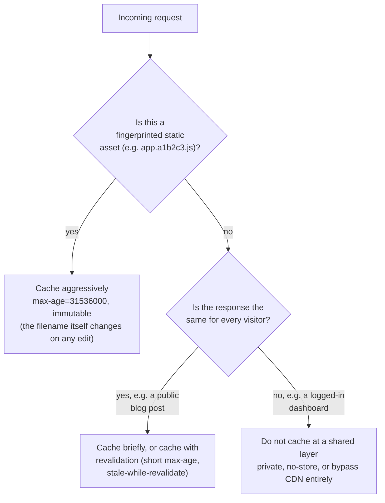

import Checkpoint from "../../../components/Checkpoint.astro";
import LevelIntro from "../../../components/LevelIntro.astro";

L1 named the three layers a request can be answered from and the basic idea of a TTL. L2 goes one level deeper: exactly which HTTP headers control those layers, why static and dynamic content need different caching strategies, and what actually happens when cached content needs to change before its TTL expires.

<LevelIntro
  items={[
    "The headers that actually control caching",
    "Static vs. dynamic content strategies",
    "Cache invalidation and the purge problem",
  ]}
/>

## Who decides what gets cached, and for how long?

The origin server decides — every cache along the way is following instructions the origin gave it in HTTP response headers, not making an independent judgment call. The main header is `Cache-Control`:

```http
HTTP/1.1 200 OK
Content-Type: text/css
Cache-Control: public, max-age=31536000, immutable
```

| Directive   | What it tells caches                                                          |
| ----------- | ----------------------------------------------------------------------------- |
| `public`    | Any cache (browser, CDN, shared proxy) may store this                         |
| `private`   | Only the requesting browser may cache it — a CDN or shared cache must not     |
| `max-age=N` | Treat as fresh for `N` seconds without re-checking the origin                 |
| `no-cache`  | May store it, but must re-validate with the origin before reusing it          |
| `no-store`  | Must not store this response anywhere, period                                 |
| `immutable` | This exact URL's content will never change — don't even re-validate on reload |

A cache is not being clever or guessing when it decides to reuse a response — it is doing exactly what `Cache-Control` told it to. A misconfigured header is not a caching bug in the abstract; it's an instruction the origin gave that turned out to be wrong.

<Checkpoint question="A response is served with Cache-Control: private, max-age=600. Should a CDN edge server store a copy of it for other visitors?">

No. `private` means only the requesting browser's own cache may store this response — a CDN or any other shared cache must not, regardless of the `max-age` value. `max-age` only controls how long a cache that's already allowed to store the response should treat it as fresh; it never overrides `private`'s restriction on _who_ may cache it. Mixing this up is exactly how one user's personalized or sensitive response ends up served to a different user from a shared edge cache.

</Checkpoint>

## Why do static and dynamic content need different strategies?

Because they change on completely different schedules, and treating them the same wastes either freshness or performance.



- **Static, fingerprinted assets** (`app.a1b2c3.js`, `logo.9f8e7d.png`) can be cached essentially forever, because the filename itself encodes the content — any change to the file produces a new filename, so there's no staleness risk to guard against. This is the strategy behind "cache-bust by renaming," not by expiring.
- **Static but not fingerprinted** (a plain `/favicon.ico` that occasionally changes) needs a real TTL, since the same URL can start pointing at different content.
- **Dynamic, but the same for everyone** (a public blog post, a product listing page) is often still cacheable — just with a shorter TTL, or a revalidation strategy like `stale-while-revalidate` (serve the cached copy immediately, but kick off a background refresh so the _next_ visitor gets the updated version).
- **Dynamic and personalized** (a shopping cart, an account dashboard) generally should not be cached at any shared layer at all — caching it risks showing user A's cart to user B.

## What happens when content needs to change before its TTL expires?

This is the **cache invalidation problem** — famously one of the two hard things in computer science, alongside naming things and off-by-one errors. A CDN edge server holding a cached copy has no way to know the origin's data changed unless something tells it. Two approaches exist:

- **Wait it out** — set a short enough TTL that staleness is bounded and acceptable (e.g. a news homepage refreshing every 30 seconds is usually fine). Simple, but every visitor in that window can see outdated content.
- **Purge on demand** — the origin explicitly tells the CDN "this URL is now stale, drop your cached copy" the moment the underlying data changes (e.g. after an admin edits a published article). This gets freshness without a short TTL, at the cost of the origin having to know exactly what to invalidate and telling every edge server, worldwide, in time.

| Strategy         | Freshness guarantee                   | Origin load                  | Complexity                       |
| ---------------- | ------------------------------------- | ---------------------------- | -------------------------------- |
| Short TTL        | Bounded staleness, no code needed     | Higher (frequent re-fetches) | Low                              |
| Long TTL + purge | Fresh immediately after a purge fires | Low (rare re-fetches)        | Higher (must track what changed) |

## Where does the origin actually save the most work?

Not from any single request being fast — from **not being asked at all**. Every request an edge server can answer from its own cache is a request the origin never sees, which is the entire reason a CDN reduces origin load, not just latency.

- **Origin shielding**: instead of every one of hundreds of edge PoPs independently asking the origin on a miss, misses are routed through one designated "shield" location first — so the origin sees at most one request per miss, not one per PoP per miss.
- **Cache key**: what a CDN considers "the same request" for caching purposes — by default usually the URL, but can be widened (include a header, a cookie, a query param) or narrowed. Get this wrong and either different content collides under one cached response (serving user A's page to user B), or the same content gets needlessly duplicated across many cache keys (crushing the hit ratio).

The origin's real workload, after a CDN is in front of it, is roughly: cold cache fills, purges, and anything explicitly marked uncacheable — not "every request from every visitor on Earth."
