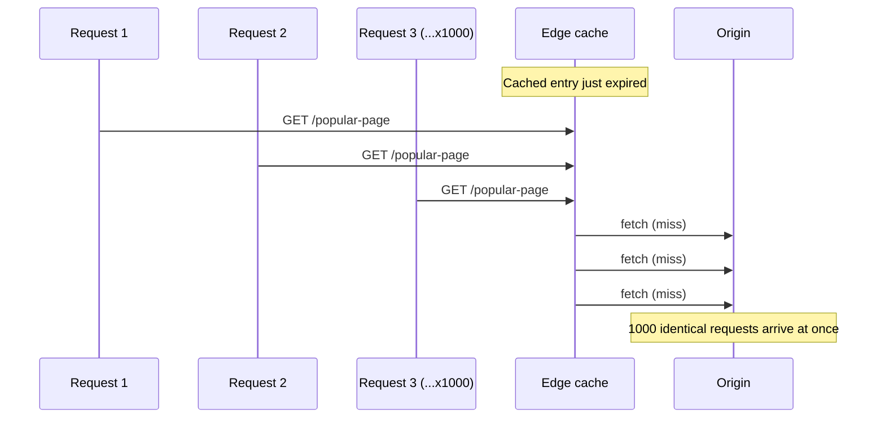

import LevelIntro from "../../../components/LevelIntro.astro";
import Checkpoint from "../../../components/Checkpoint.astro";

L1 and L2 covered the layers, the headers, and the invalidation trade-off. This level builds a real (if minimal) edge cache in code, works through the cache-key bug that leaks one user's response to another, and walks through the failure modes a real CDN has to defend against.

<LevelIntro
  items={[
    "A minimal edge cache, built from scratch",
    "The cache-key bug that leaks private data",
    "Stampedes, purge races, and stale-while-revalidate",
  ]}
/>

## What is an edge cache actually doing, underneath any vendor's dashboard?

Stripped of any specific vendor's UI, an edge cache is a key-value store in front of an origin fetch, where the key is derived from the request and the value carries both a body and its own expiry. Here's a minimal, dependency-free implementation in TypeScript that behaves like a real one:

```ts
// edge-cache.ts
interface CachedResponse {
  status: number;
  headers: Record<string, string>;
  body: string;
  storedAt: number; // epoch ms
  maxAgeMs: number;
}

interface CacheKeyParts {
  method: string;
  url: string;
  // Headers/cookies that should vary the cache key, e.g. ["accept-language"]
  varyOn?: string[];
  headers?: Record<string, string>;
}

function buildCacheKey({
  method,
  url,
  varyOn = [],
  headers = {},
}: CacheKeyParts): string {
  const varyPart = varyOn
    .map((h) => `${h}=${headers[h.toLowerCase()] ?? ""}`)
    .sort()
    .join("&");
  return `${method}:${url}${varyPart ? `?${varyPart}` : ""}`;
}

type OriginFetch = () => Promise<{
  status: number;
  headers: Record<string, string>;
  body: string;
}>;

class EdgeCache {
  private store = new Map<string, CachedResponse>();

  async get(parts: CacheKeyParts, fetchFromOrigin: OriginFetch) {
    const key = buildCacheKey(parts);
    const cached = this.store.get(key);
    const now = Date.now();

    if (cached && now - cached.storedAt < cached.maxAgeMs) {
      return { ...cached, cacheStatus: "HIT" as const };
    }

    const fresh = await fetchFromOrigin();
    const cacheControl = fresh.headers["cache-control"] ?? "";
    const isPublic = cacheControl.includes("public");
    const maxAgeMatch = cacheControl.match(/max-age=(\d+)/);
    const maxAgeMs = maxAgeMatch ? Number(maxAgeMatch[1]) * 1000 : 0;

    if (isPublic && maxAgeMs > 0) {
      this.store.set(key, { ...fresh, storedAt: now, maxAgeMs });
    }

    return { ...fresh, cacheStatus: (cached ? "MISS" : "MISS") as const };
  }

  purge(parts: CacheKeyParts) {
    this.store.delete(buildCacheKey(parts));
  }
}

export { EdgeCache, buildCacheKey };
```

This is deliberately small — no clustering, no multi-region replication, no LRU eviction — but every real CDN's edge logic is a much more sophisticated version of exactly this: derive a key, check freshness, fall through to origin on a miss, honor what the origin's headers say about storability.

<Checkpoint question="Using EdgeCache.get above, if fetchFromOrigin returns headers without a Cache-Control header at all (cacheControl is an empty string), what happens to that response?">

It's never stored. `isPublic` is `false` (the empty string doesn't include `"public"`), so the `if (isPublic && maxAgeMs > 0)` guard is skipped and `this.store.set(...)` never runs — the response is returned to the caller but the cache stays exactly as it was. This is the correct default: an origin that says nothing about caching is treated as "don't cache this," not "cache it forever," because caching something the origin never opted into is the more dangerous mistake of the two.

</Checkpoint>

## How does a wrong cache key leak one user's data to another?

This is the single most common serious bug in CDN configuration, and it's worth seeing exactly how it happens. Suppose an API returns a personalized greeting based on a session cookie, but the cache key is built from the URL alone — the `varyOn` list is empty:

```ts
// leaky-cache-key.ts — DO NOT do this for personalized responses
import { EdgeCache } from "./edge-cache";

const cache = new EdgeCache();

async function handleRequest(url: string, sessionCookie: string) {
  return cache.get(
    { method: "GET", url }, // BUG: no varyOn — cookie is ignored by the key
    async () => ({
      status: 200,
      headers: { "cache-control": "public, max-age=300" },
      body: JSON.stringify({
        greeting: `Welcome back, ${sessionForUser(sessionCookie)}!`,
      }),
    }),
  );
}

function sessionForUser(cookie: string): string {
  const users: Record<string, string> = {
    "sess-alice": "Alice",
    "sess-bob": "Bob",
  };
  return users[cookie] ?? "Guest";
}
```

The first request — Alice's, with `sess-alice` — populates the cache under the key `GET:/api/me`. The very next request to that same URL, even with Bob's `sess-bob` cookie, hits the cache and gets **Alice's name back**, because nothing about the key distinguished them. The fix is either to include the identifying header/cookie in `varyOn` (so each user gets their own cache entry — which usually defeats the purpose of caching a personalized response at all), or, more commonly, to mark personalized responses `private` or `no-store` so a shared CDN cache never stores them in the first place, as covered in L2.

```ts
// Correct: personalized responses opt out of shared caching entirely
async function handleRequestFixed(url: string, sessionCookie: string) {
  return {
    status: 200,
    headers: { "cache-control": "private, no-store" },
    body: JSON.stringify({
      greeting: `Welcome back, ${sessionForUser(sessionCookie)}!`,
    }),
  };
}
```

## What happens when a popular cache entry expires under heavy load?

This is a **cache stampede** (also called a "thundering herd"): a cached response expires, and hundreds or thousands of near-simultaneous requests all miss at once, all forwarding to the origin at the same instant — the exact overload scenario a CDN exists to prevent, briefly reintroduced by the TTL boundary itself.



A naive edge cache (like the minimal one above) does exactly this — every concurrent miss independently calls `fetchFromOrigin()`. Two real fixes:

- **Request coalescing**: the first miss for a key triggers the origin fetch; every other concurrent request for the _same_ key waits on that in-flight fetch instead of starting a new one, then all share the single result once it resolves.
- **`stale-while-revalidate`**: serve the (now slightly stale) cached copy immediately to every request, while exactly one background fetch refreshes the cache for the _next_ request — visitors never wait on the origin at all, they just occasionally get a response that's a few seconds old.

```ts
// coalescing-cache.ts — collapses concurrent misses into one origin fetch
class CoalescingEdgeCache extends EdgeCache {
  private inFlight = new Map<string, Promise<unknown>>();

  async getCoalesced(key: string, fetchFromOrigin: () => Promise<unknown>) {
    const existing = this.inFlight.get(key);
    if (existing) return existing; // ride the same in-flight fetch

    const promise = fetchFromOrigin().finally(() => {
      this.inFlight.delete(key);
    });
    this.inFlight.set(key, promise);
    return promise;
  }
}

export { CoalescingEdgeCache };
```

## What can still go wrong with purge-based invalidation?

A **purge race**: the origin's data changes, a purge request goes out to invalidate the stale cached copy — but purges to hundreds of globally distributed edge PoPs are not instantaneous or atomic. A request landing at a PoP that hasn't received the purge yet still gets served the old, now-incorrect content, for however long propagation takes (often sub-second, but not zero).

```js
// purge-then-verify.mjs — a defensive pattern for content that must be
// correct immediately after a purge (e.g. a security-sensitive update)
async function purgeAndVerify(
  cdnClient,
  url,
  expectedVersion,
  maxAttempts = 5,
) {
  await cdnClient.purge(url);

  for (let attempt = 0; attempt < maxAttempts; attempt++) {
    const response = await fetch(url, {
      headers: { "cache-control": "no-cache" },
    });
    const body = await response.json();

    if (body.version === expectedVersion) {
      return { verified: true, attempts: attempt + 1 };
    }

    await new Promise((resolve) => setTimeout(resolve, 200 * (attempt + 1)));
  }

  return { verified: false, attempts: maxAttempts };
}

export { purgeAndVerify };
```

This is a real trade-off, not a bug to "just fix": purge propagation delay is a property of running caches on machines physically distributed around the world, communicating over a real network with real latency. Content that truly cannot tolerate any propagation window at all (an emergency takedown, a leaked-secret redaction) generally needs a different mechanism than cache purge — for example, routing that URL through an "always ask origin" rule until the purge is confirmed everywhere.

Which of these failure modes matters most depends heavily on what's being served: a cache stampede on a static marketing page is mostly a performance annoyance, but the same stampede hitting an origin that also handles checkout writes can take down purchasing entirely — and a purge race on a paywalled article is a minor embarrassment, while the same race on a just-revoked API key or a takedown notice is a real incident. Worth sitting with before moving on: for a CDN in front of a genuinely high-stakes origin (payments, auth tokens, legal takedowns) rather than the read-mostly content examples above, which of these three failure modes would you defend against first, and what would change about the `Cache-Control` and purge strategy to do it?
