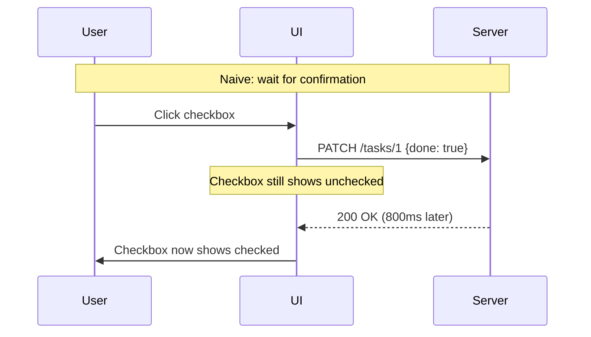
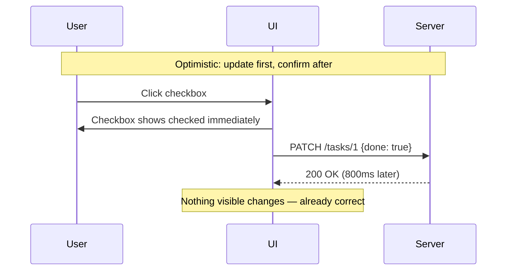
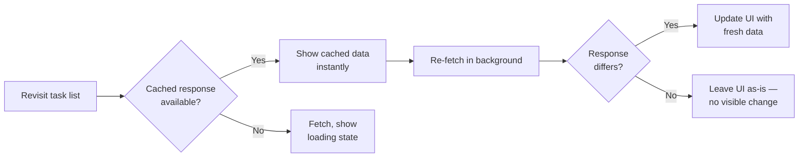
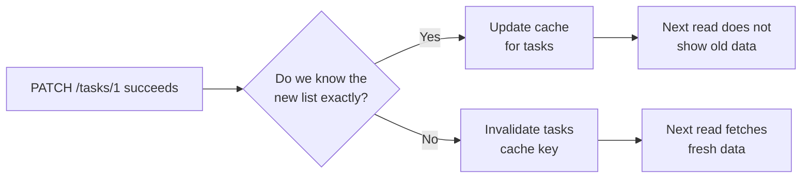

import LevelIntro from "../../../components/LevelIntro.astro";
import Checkpoint from "../../../components/Checkpoint.astro";

L1 named the four places that can drift out of sync and split the problem into
two fixes — caching for reads, optimistic updates for writes. L2 walks the
actual timeline the user sees in both directions, and what a rollback has to
do to be honest rather than just quiet.

<LevelIntro
  items={[
    "The request timeline with and without optimistic updates",
    "Caching vs. optimistic updates as opposite data directions",
    "What a rollback needs to actually be honest",
  ]}
/>

## The timeline the user actually experiences

**If the click handler and the server endpoint are both "working
correctly," why does the checkbox still feel broken?** Because
"working correctly" and "feels instant" are different requirements —
a sequence diagram of the naive version shows exactly where the
800ms goes:

The server still takes exactly 800ms in both versions — nothing
about the network changed. **What changed is when the UI shows the
result of the click relative to when the server confirms it.** The
optimistic version isn't faster; it's honest about something the
naive version isn't: the user's intent is already known the instant
they click, and the UI can reflect that intent immediately while the
confirmation catches up in the background.

## Two different problems, two different fixes

**Is "the list re-fetches every time I revisit it" the same bug as
"the checkbox takes 800ms to update"?** No — they look similar
("the UI feels slow") but they're opposite directions of data flow:

|                            | Client-side caching                  | Optimistic updates                                     |
| -------------------------- | ------------------------------------ | ------------------------------------------------------ |
| Direction                  | Reading data (GET)                   | Writing data (PATCH/POST/DELETE)                       |
| Problem it solves          | Re-fetching data that hasn't changed | Waiting for a write to confirm before showing anything |
| What's shown while waiting | The previously cached response       | The assumed post-write state                           |
| Risk if wrong              | Cached data is stale                 | Optimistic state has to be rolled back                 |

In plain language:

| Story                      | What the app is doing            | Main sync question                                                   |
| -------------------------- | -------------------------------- | -------------------------------------------------------------------- |
| "Open the task list again" | Reading data it may already have | Can we show remembered data while checking for freshness?            |
| "Check off Buy milk"       | Changing data the server owns    | Can we show the user's intent now and undo it if the server says no? |

**Stale-while-revalidate**, the most common caching pattern, resolves
the "reading" side: show the cached response immediately (even if
it's a few seconds old), then quietly re-fetch in the background and
update the UI if the fresh response actually differs.

After a write succeeds, the app must also decide what cached reads became
untrustworthy. If checking a task changes the `tasks` list, the cached `tasks`
answer is no longer safely reusable as-is. The app can either update that cache
with the confirmed task list or mark it stale so the next read fetches fresh
data instead of resurrecting the old unchecked version.

<Checkpoint question="A team ships client-side caching for the task list but forgets to invalidate or update the tasks cache key after a successful PATCH. The checkbox itself updates fine. What will the user see the next time they revisit the task list from a different screen?">

The old, pre-write task list — the checkbox change was real on the server, but
the cached `tasks` entry never learned about it, so the next read serves the
stale cached answer instead of fetching fresh data. This is a caching bug, not
an optimistic-update bug: the write itself succeeded and even reflected
correctly in the UI at the moment of the click, but caching and writing are
two separate mechanisms that have to agree on when data goes stale, and
nothing here made them agree. The fix isn't to stop caching — it's to make the
write path update or invalidate the same cache key the read path uses.

</Checkpoint>

## What has to be true for a rollback to be honest

**If an optimistic update assumes success, what happens the moment it
turns out to be wrong — does simply refreshing the page count as
"handling" that case?** No — a rollback that isn't deliberately built
either leaves the UI showing a false "checked" state indefinitely, or
only gets corrected the next time the user happens to reload. A
correct optimistic update needs three pieces, not just the first one:

1. **Snapshot the prior state** before applying the optimistic change,
   so there's something exact to restore.
2. **Apply the optimistic change** immediately, so the UI reflects
   the user's intent without waiting.
3. **On failure, restore the snapshot and surface the failure** — silently
   leaving the optimistic (wrong) state in place is worse than the
   original 800ms wait, because now the UI is actively lying about
   what the server actually has stored.

<Checkpoint question="An optimistic update snapshots the prior state, applies the change, and on failure calls onRollback(snapshot) — but the catch block that calls onRollback does not re-throw the error afterward. From the caller's point of view, does this count as a correctly handled failure?">

No. The UI is now visually correct again — the checkbox is back to unchecked
— but swallowing the error there means whatever called the toggle never
learns the write actually failed. Nothing surfaces to the user beyond the
checkbox quietly reverting, and any calling code that wanted to show an error
message, log the failure, or retry has no way to know one happened. A rollback
that only fixes the pixels but hides the failure from the rest of the program
recreates the same "UI is lying" problem in a subtler form — this time about
whether anything went wrong at all, not about what state the data is in.

</Checkpoint>

## Failure modes at this level

- **Treating optimistic updates as "just don't wait for the
  response."** Without the rollback path, a failed write leaves the
  UI permanently wrong until something else (a reload, a re-fetch)
  happens to correct it.
- **Caching without any invalidation.** A cache that's never
  invalidated after a write becomes actively misleading — the whole
  point of caching is to skip _redundant_ work, not to serve data
  that's known to be outdated.
- **Assuming stale-while-revalidate means the user never sees stale
  data.** It means they see stale data _briefly and are corrected
  automatically_ — for data where even a few seconds of staleness is
  unacceptable (a live balance, a real-time price), this pattern is
  the wrong choice.
