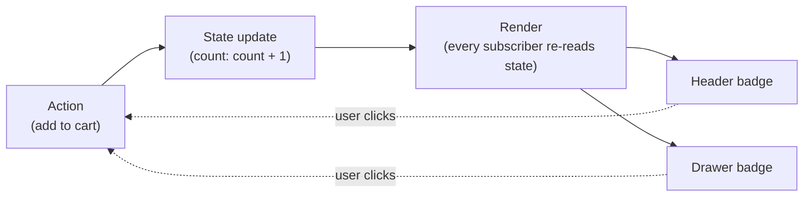

## Why scattered updates drift apart

**If the header badge and the drawer badge are both "just" DOM
elements showing a count, why is keeping them in sync so easy to get
wrong?** Because in the naive approach, there's no single count that
both badges read from — each badge is updated by whichever event
handler happens to touch it. The product-page button's handler was
written to update both badges. The quick-buy button's handler was
written later, by someone who only tested the drawer, and updating the
header badge simply wasn't part of what that handler does. Nothing in
the structure of the code forces every handler to update every display.

## The unidirectional loop

**What structure would make forgetting a display impossible, instead
of just asking developers to remember harder?** Route every change
through one shared piece of state, and make every display a function
of that state rather than something handlers poke directly.

The loop only goes one direction: actions update state, state updates
trigger render, render updates every display. No arrow goes directly
from an action to a specific display — which is exactly the shortcut
that let the quick-buy handler skip the header badge in the buggy
version.

## Scattered updates vs. a single store, side by side

|                                   | Scattered direct updates                                  | Single store, unidirectional flow                                              |
| --------------------------------- | --------------------------------------------------------- | ------------------------------------------------------------------------------ |
| Where the current count lives     | Nowhere authoritative — each badge holds its own copy     | One `state` object, read by every display                                      |
| How a badge gets updated          | Whichever handler happens to touch it, individually       | Every display subscribes once; updates arrive automatically                    |
| Adding a new display of the count | Requires updating every existing handler to also touch it | Just subscribe the new display — no existing code changes                      |
| Forgetting to update one display  | Easy — it's just a missed line in one specific handler    | Structurally hard — the display wasn't wired to the state, not a missed update |

## Why "just be more careful" doesn't scale

**Could the bug from L1 have been avoided by writing better tests for
the quick-buy handler?** A test would have caught this specific case,
but the underlying problem — a new handler has to remember every
existing display — doesn't go away. Every new feature that reads the
same state is another place a future handler can independently forget.
Unidirectional flow doesn't make developers more careful; it removes
the category of mistake by making "update state, then let render
handle every display" the only path that exists.

## The generalizable lesson

**Does this only apply to cart badges?** No — the same shape shows up
anywhere the same piece of state is displayed in more than one place:
a "logged in as" name in a header and a settings page, a notification
count in a tab title and a bell icon, a form's validity shown both
inline and in a disabled submit button. Any time two displays are
supposed to agree and don't, the question to ask is the same one this
unit answers: is there one source of truth, and does every display
derive from it through the same path?
