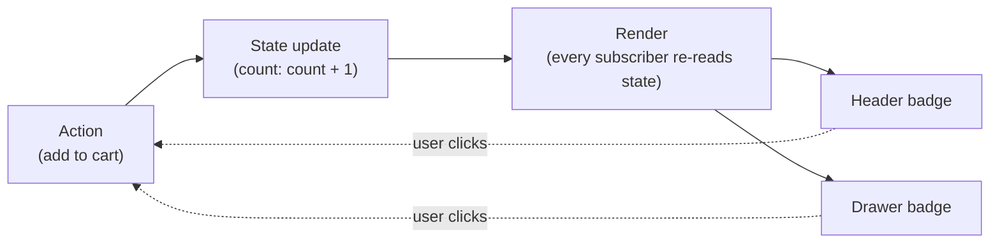

import LevelIntro from "../../../components/LevelIntro.astro";
import Checkpoint from "../../../components/Checkpoint.astro";

L1 named the bug shape — two displays of the same value drifting apart
because nothing forces every state change to reach every display. L2
works out the structural fix: a loop that makes forgetting a display
impossible instead of just asking developers to remember harder.

<LevelIntro
  items={[
    "Why scattered direct updates drift apart",
    "The action → state update → render loop",
    "Where a given piece of state should live",
  ]}
/>

## Why scattered updates drift apart

**If the header badge and the drawer badge are both "just" DOM
elements showing a count, why is keeping them in sync so easy to get
wrong?** Because in the naive approach, there's no single count that
both badges read from — each badge is updated by whichever event
handler happens to touch it. The product-page button's handler was
written to update both badges. The quick-buy button's handler was
written later, by someone who only tested the drawer, and updating the
header badge simply wasn't part of what that handler does. Nothing in
the structure of the code forces every handler to update every display.

<Checkpoint question="A teammate proposes fixing the two-badge bug by adding a code review checklist item: 'remember to update all badges when you touch cart count.' Does that actually fix the structural problem?">

No. A checklist reduces the odds of this specific mistake on this
specific review, but it doesn't remove the underlying condition: every
new handler that touches the count still has to independently know
about every existing display and remember to update it by hand. The
next handler, written by someone who never read the checklist or
missed the review comment, reintroduces the exact same bug. The fix
that actually holds is structural — make it impossible for a display to
exist without being wired to the state, rather than relying on anyone
remembering anything.

</Checkpoint>

## The unidirectional loop

**What structure would make forgetting a display impossible, instead
of just asking developers to remember harder?** Route every change
through one shared piece of state, and make every display a function
of that state rather than something handlers poke directly.

The loop only goes one direction: actions update state, state updates
trigger render, render updates every display. No arrow goes directly
from an action to a specific display — which is exactly the shortcut
that let the quick-buy handler skip the header badge in the buggy
version.

## Where should the state live?

The goal is not "make everything global." The goal is "put each piece of
state in the smallest place that can still serve everyone who needs it."

| Situation                                                  | Good owner                      | Why                                                                |
| ---------------------------------------------------------- | ------------------------------- | ------------------------------------------------------------------ |
| Only one component reads and changes it                    | Local component state           | No other part needs to coordinate with it                          |
| Two nearby components show the same value                  | Their common parent             | Both can read one value without a global store                     |
| Distant areas like header, drawer, and sidebar need it     | A focused store for that domain | The shared value has one owner without mixing unrelated state      |
| Unrelated values like cart count, theme, and draft comment | Separate owners/stores          | One global object for everything recreates chaos at a larger scale |

## Scattered updates vs. a single store, side by side

|                                   | Scattered direct updates                                  | Single store, unidirectional flow                                              |
| --------------------------------- | --------------------------------------------------------- | ------------------------------------------------------------------------------ |
| Where the current count lives     | Nowhere authoritative — each badge holds its own copy     | One `state` object, read by every display                                      |
| How a badge gets updated          | Whichever handler happens to touch it, individually       | Every display subscribes once; updates arrive automatically                    |
| Adding a new display of the count | Requires updating every existing handler to also touch it | Just subscribe the new display — no existing code changes                      |
| Forgetting to update one display  | Easy — it's just a missed line in one specific handler    | Structurally hard — the display wasn't wired to the state, not a missed update |

## Why "just be more careful" doesn't scale

**Could the bug from L1 have been avoided by writing better tests for
the quick-buy handler?** A test would have caught this specific case,
but the underlying problem — a new handler has to remember every
existing display — doesn't go away. Every new feature that reads the
same state is another place a future handler can independently forget.
Unidirectional flow doesn't make developers more careful; it removes
the category of mistake by making "update state, then let render
handle every display" the only path that exists.

## The generalizable lesson

**Does this only apply to cart badges?** No — the same shape shows up
anywhere the same piece of state is displayed in more than one place:
a "logged in as" name in a header and a settings page, a notification
count in a tab title and a bell icon, a form's validity shown both
inline and in a disabled submit button. Any time two displays are
supposed to agree and don't, the question to ask is the same one this
unit answers: is there one source of truth, and does every display
derive from it through the same path?

<Checkpoint question="A form shows validity two ways: an inline red border on the invalid field, and a disabled submit button. Using the table above, where should 'is this form valid' actually live, and why?">

It should live in one shared piece of form state — not duplicated
separately inside the field's border logic and the submit button's
disabled logic. Both the border and the button are just two renders of
the same underlying value ("is this form valid"), so they belong on the
same loop: an action (the user edits a field) updates the shared
validity state once, and both displays re-derive from that single
update. If the border and the button each computed validity
independently, they could disagree in exactly the way the header and
drawer badges did — one showing an error while the other lets the user
submit anyway.

</Checkpoint>
