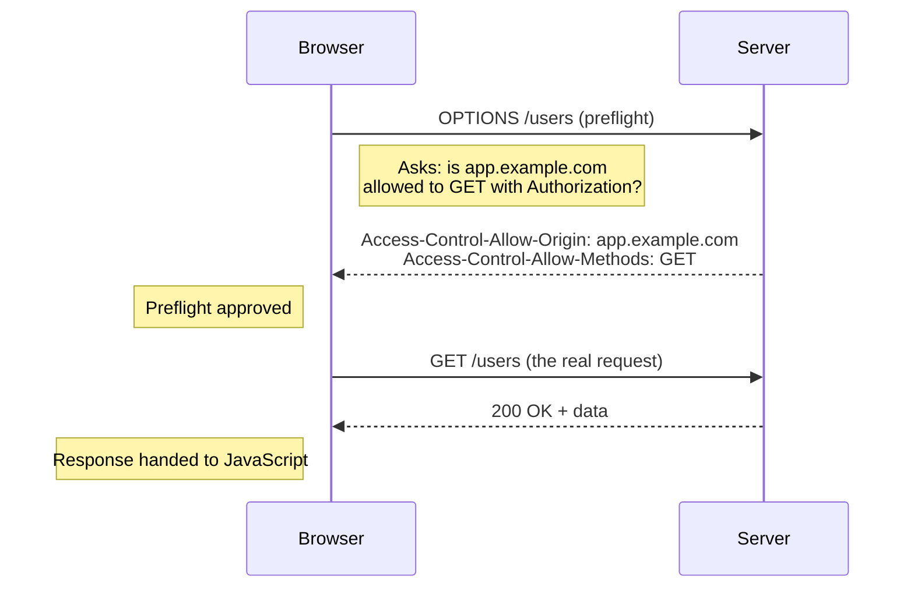

## What makes a request "simple" versus one that needs a preflight

**If every cross-origin request triggered an extra round-trip before
the real one, every API call would be twice as slow — so why doesn't
that happen?** Because most cross-origin requests don't need a
preflight at all. A request only needs one if it falls outside a
narrow "simple request" definition:

| Request property                               | Counts as "simple" (no preflight)                                        | Triggers a preflight                          |
| ---------------------------------------------- | ------------------------------------------------------------------------ | --------------------------------------------- |
| Method                                         | `GET`, `HEAD`, `POST`                                                    | `PUT`, `DELETE`, `PATCH`, or any other method |
| Headers                                        | Only `Accept`, `Accept-Language`, `Content-Language`, `Content-Type`     | Anything else — including `Authorization`     |
| `Content-Type` (for requests that have a body) | `application/x-www-form-urlencoded`, `multipart/form-data`, `text/plain` | `application/json`, or any other value        |

A plain `GET` with no custom headers is simple — it goes straight to
the server. A `GET` with an `Authorization` header is _not_ simple,
even though `GET` itself is a simple method, because the header alone
is enough to require a preflight.

## The preflight round-trip, step by step

**For a non-simple request, what does the browser actually send before
the real one?** An automatic `OPTIONS` request, asking the server
whether the real request would be allowed:

If the server's preflight response doesn't include the calling
origin in `Access-Control-Allow-Origin`, the browser stops right
there — the real `GET /users` is never even sent, and the page's
JavaScript sees a network-level error with no response at all.

## Even "simple" requests can be blocked — just later

**If a simple request skips the preflight, does that mean it always
succeeds?** No — the browser still sends the request, and the server
still processes it (which is why server logs show success), but the
browser checks `Access-Control-Allow-Origin` on the _actual_ response
before deciding whether to let the page's JavaScript read it. If the
origin isn't allowed, the request still reached the server and got a
real response — the browser just refuses to hand it over.

## A separate, easily-confused problem: what actually makes `fetch()` reject?

**If a CORS block causes `fetch()`'s promise to reject, does a normal
404 or 500 response reject it too?** No — this is the part that trips
up a lot of `try/catch` code:

| What happened                                             | Does `fetch()`'s promise reject?                                   |
| --------------------------------------------------------- | ------------------------------------------------------------------ |
| Network failure (DNS, offline, connection refused)        | Yes — `fetch()` rejects                                            |
| Blocked by CORS (preflight failed, or origin not allowed) | Yes — `fetch()` rejects, indistinguishable from a network failure  |
| Server responds with `404 Not Found`                      | **No** — `fetch()` resolves normally, with `response.ok === false` |
| Server responds with `500 Internal Server Error`          | **No** — `fetch()` resolves normally, with `response.ok === false` |

A `try/catch` around `await fetch(...)` only catches the top two
rows. An HTTP error status resolves the promise just like a
successful response does — checking `response.ok` (or `response.status`)
explicitly is the only way to detect it, which is exactly the gap L3's
code demonstrates directly.
