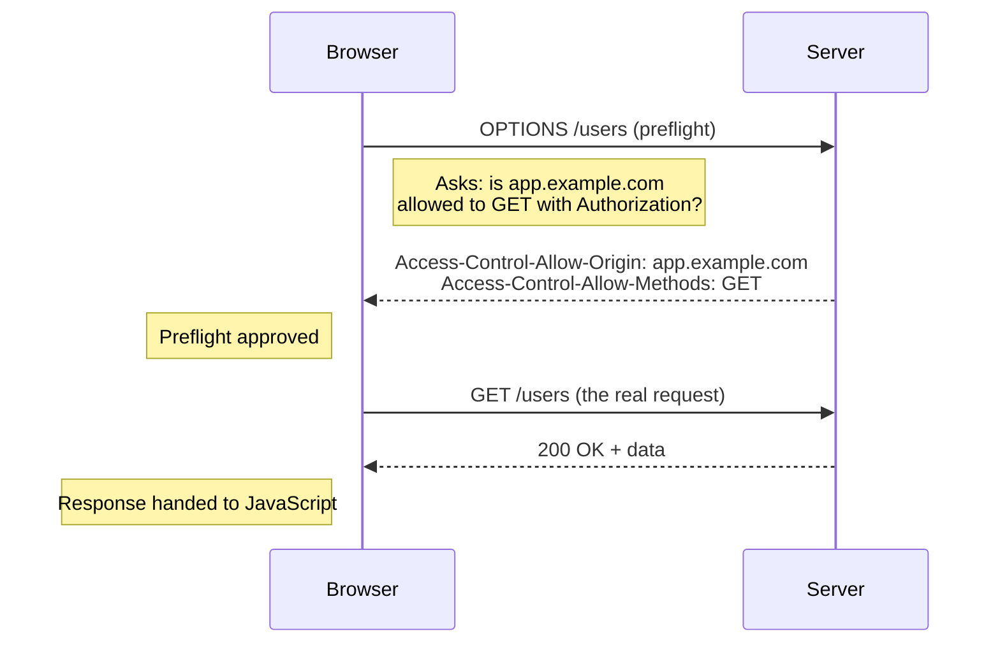

import LevelIntro from "../../../components/LevelIntro.astro";
import Checkpoint from "../../../components/Checkpoint.astro";

L1 established that CORS is a browser-side decision, separate from whether
the server actually handled the request. L2 works out exactly when that
decision involves an extra round-trip first, and untangles the separate
`fetch()` gotcha that hides behind the same symptom.

<LevelIntro
  items={[
    "What makes a request 'simple' vs. preflighted",
    "The preflight round-trip, step by step",
    "Why fetch() rejects for CORS but resolves for a 404",
  ]}
/>

## What makes a request "simple" versus one that needs a preflight

**If every cross-origin request triggered an extra round-trip before
the real one, every API call would be twice as slow — so why doesn't
that happen?** Because most cross-origin requests don't need a
preflight at all. A request only needs one if it falls outside a
narrow "simple request" definition:

| Request property                               | Counts as "simple" (no preflight)                                        | Triggers a preflight                          |
| ---------------------------------------------- | ------------------------------------------------------------------------ | --------------------------------------------- |
| Method                                         | `GET`, `HEAD`, `POST`                                                    | `PUT`, `DELETE`, `PATCH`, or any other method |
| Headers                                        | Only `Accept`, `Accept-Language`, `Content-Language`, `Content-Type`     | Anything else — including `Authorization`     |
| `Content-Type` (for requests that have a body) | `application/x-www-form-urlencoded`, `multipart/form-data`, `text/plain` | `application/json`, or any other value        |

A plain `GET` with no custom headers is simple — it goes straight to
the server. A `GET` with an `Authorization` header is _not_ simple,
even though `GET` itself is a simple method, because the header alone
is enough to require a preflight.

<Checkpoint question="A page sends a GET request to a different origin with no custom headers at all, and separately a PUT request to that same origin also with no custom headers. Do both require a preflight, given neither request has an 'unusual' header?">

No — only the `PUT` does. The method itself is one of the three axes that
decides "simple" independently of headers: `GET`, `HEAD`, and `POST` are the
only simple methods, so `PUT` triggers a preflight purely by virtue of being
`PUT`, even with zero custom headers. The `GET`, having a simple method and no
non-simple headers, stays simple and skips the preflight entirely. The three
conditions in the table — method, headers, and content type — are each
independently sufficient to force a preflight; a request only stays simple if
it clears all three at once.

</Checkpoint>

## Same symptom, different causes

| Evidence                                                   | What likely happened                | Did the real request reach the server? | What JavaScript sees                       |
| ---------------------------------------------------------- | ----------------------------------- | -------------------------------------- | ------------------------------------------ |
| Server logs show no `GET`, console says CORS/preflight     | Preflight failed                    | No                                     | `fetch()` rejects like a network failure   |
| Server logs show successful `GET`, console says CORS       | Simple request response was blocked | Yes                                    | `fetch()` rejects like a network failure   |
| Server logs show `404` or `500`, no CORS console error     | HTTP error response                 | Yes                                    | `fetch()` resolves; `response.ok` is false |
| No server logs, no CORS details, network offline/DNS fails | Network failure                     | No                                     | `fetch()` rejects                          |

## The preflight round-trip, step by step

**For a non-simple request, what does the browser actually send before
the real one?** An automatic `OPTIONS` request, asking the server
whether the real request would be allowed:

If the server's preflight response doesn't include the calling
origin in `Access-Control-Allow-Origin`, the browser stops right
there — the real `GET /users` is never even sent, and the page's
JavaScript sees a network-level error with no response at all.

## Even "simple" requests can be blocked — just later

**If a simple request skips the preflight, does that mean it always
succeeds?** No — the browser still sends the request, and the server
still processes it (which is why server logs show success), but the
browser checks `Access-Control-Allow-Origin` on the _actual_ response
before deciding whether to let the page's JavaScript read it. If the
origin isn't allowed, the request still reached the server and got a
real response — the browser just refuses to hand it over.

## A separate, easily-confused problem: what actually makes `fetch()` reject?

**If a CORS block causes `fetch()`'s promise to reject, does a normal
404 or 500 response reject it too?** No — this is the part that trips
up a lot of `try/catch` code:

| What happened                                             | Does `fetch()`'s promise reject?                                   |
| --------------------------------------------------------- | ------------------------------------------------------------------ |
| Network failure (DNS, offline, connection refused)        | Yes — `fetch()` rejects                                            |
| Blocked by CORS (preflight failed, or origin not allowed) | Yes — `fetch()` rejects, indistinguishable from a network failure  |
| Server responds with `404 Not Found`                      | **No** — `fetch()` resolves normally, with `response.ok === false` |
| Server responds with `500 Internal Server Error`          | **No** — `fetch()` resolves normally, with `response.ok === false` |

A `try/catch` around `await fetch(...)` only catches the top two
rows. An HTTP error status resolves the promise just like a
successful response does — checking `response.ok` (or `response.status`)
explicitly is the only way to detect it, which is exactly the gap L3's
code demonstrates directly.

<Checkpoint question="A frontend wraps its fetch() call in try/catch, deploys, and the console shows no thrown errors at all — yet the page displays no data for a request that actually returned a 500. Does 'no thrown error' mean the request succeeded?">

No. The absence of a caught exception only tells you `fetch()`'s promise
resolved — it says nothing about whether the response itself was successful.
A `500` response resolves the promise exactly like a `200` does; the only
difference is `response.ok` being `false` and `response.status` being `500`.
Because the code never checks either of those, the failure is silent: the
promise resolved, `try/catch` had nothing to catch, and the missing data is
the only visible symptom. This is precisely the gap the table above shows —
`try/catch` alone only guards against network failures and CORS blocks, not
against HTTP error statuses.

</Checkpoint>
