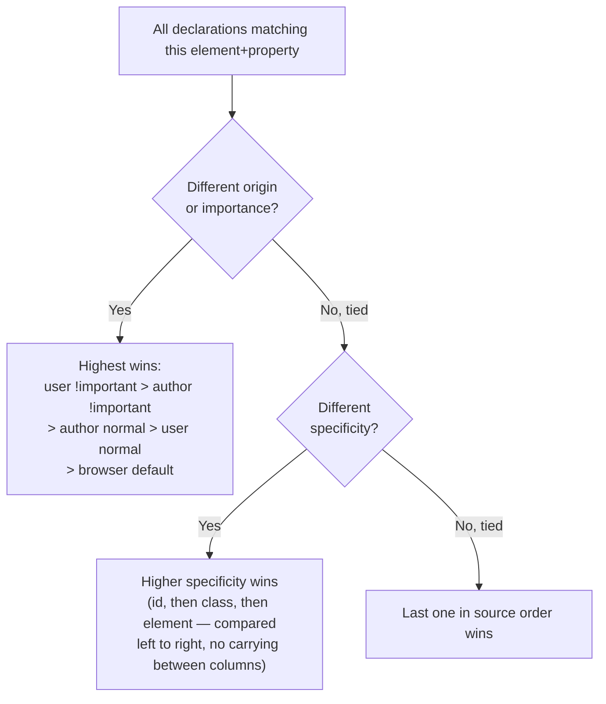
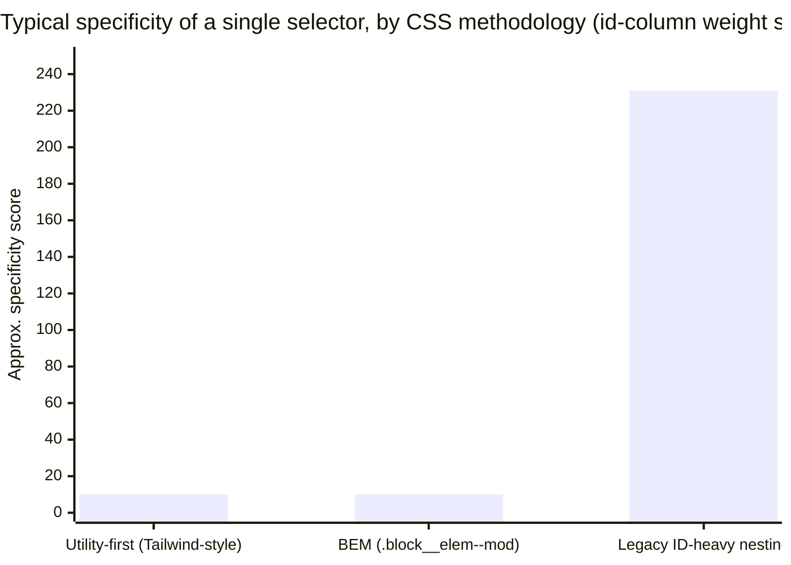

import LevelIntro from "../../../components/LevelIntro.astro";
import Checkpoint from "../../../components/Checkpoint.astro";

L1 named specificity as a score computed from a selector's ids, classes, and elements, and showed that it — not source order — decided the outcome of the gray-button example. This level makes that score precise: the exact four-step algorithm the browser runs, why specificity is a tuple rather than a sum, and the two modern tools (`:where()` and `@layer`) built specifically to stop specificity fights before they start.

<LevelIntro
  items={[
    "The exact four-step cascade algorithm, in priority order",
    "Specificity as a tuple, compared column by column",
    "`:where()` and `@layer` as deliberate escape valves",
  ]}
/>

## The four-step sort the browser actually runs

**When two or more declarations target the same property on the same element, how does the browser pick a winner?** Not by "last one wins" — that's only the last of four tiebreakers, and it only gets consulted if every earlier one is a dead tie.



Every CSS conflict resolves by walking down this exact chain and stopping at the first step that isn't a tie. Most day-to-day "why didn't my CSS apply" confusion comes from stopping the mental model at step 4 (source order) without checking whether step 2 or step 3 already decided it.

## Specificity as a tuple, not a sum

**If specificity worked by adding up points (id = 100, class = 10, element = 1), what would go wrong?** Nothing, usually — that's the mental shortcut most developers use, and it produces the right ordering almost all the time. But it's not literally how browsers compare: specificity is a **three-part tuple** `(ids, classes, elements)`, compared component by component, left to right, with **no carrying between columns**. 11 classes never add up to "worth more than 1 id" — the comparison stops at the id column and a single id already wins, no matter how many classes the other selector has.

| Selector                 | Tuple `(id, class, element)` |
| ------------------------ | ---------------------------- |
| `#page .toolbar .btn`    | `(1, 2, 0)`                  |
| `.btn-primary`           | `(0, 1, 0)`                  |
| `button.btn`             | `(0, 1, 1)`                  |
| `div p a:hover`          | `(0, 1, 3)`                  |
| `*` (universal selector) | `(0, 0, 0)`                  |

Comparing `(1, 2, 0)` vs. `(0, 1, 0)`: the id column differs (1 vs. 0) — the id column alone decides it, the class and element columns are never even inspected. Comparing `(0, 1, 1)` vs. `(0, 1, 0)`: id ties at 0, class ties at 1, so the element column finally breaks the tie.

<Checkpoint question="A selector with 1 id and 0 classes is being compared against a selector with 0 ids and 40 classes. Which one wins, and why doesn't the second selector's class count matter here?">

The selector with 1 id wins, and the 40 classes never come into consideration at all. Specificity compares the tuple `(ids, classes, elements)` one column at a time, left to right, and stops as soon as a column differs — it never sums the columns into a single combined score. Since the id column is 1 vs. 0, that column alone settles the comparison; the class column isn't inspected once a difference has already been found further left. This is exactly why piling on more classes to "out-specificity" an id-based legacy selector doesn't work — no number of classes can climb back into a column comparison an id selector already won.

</Checkpoint>

## Why some codebases fight this constantly and others never do



**Why would two methodologies that both use only classes end up equally low, while a third one written with ids and deep nesting sits far above both?** Utility-first and BEM both target elements with a single class almost every time — `(0,1,0)` regardless of how the markup nests, so two utility/BEM rules on the same element are nearly always a source-order tiebreak, which is predictable and cheap to reason about. Legacy nesting like `#page .toolbar .btn` accumulates an id plus several classes just from following the DOM structure — its specificity keeps climbing the deeper the nesting goes, which is exactly why older large codebases develop "specificity wars" that force ever-more-specific overrides, each one making the next override harder.

## Two modern escape valves that don't just re-fight the war

**If `!important` escalates the fight instead of ending it, what actually lets you override something safely?**

```css
/* :where() — only the part inside :where(...) contributes zero specificity */
:where(.legacy-toolbar) .btn {
  background: gray; /* specificity: (0, 1, 0) — only .btn outside counts */
}

/* @layer — controls PRIORITY BY LAYER ORDER, before specificity is even compared */
@layer legacy, components;

@layer legacy {
  #page .toolbar .btn {
    background: gray; /* high specificity, but LOWER layer priority */
  }
}

@layer components {
  .btn-primary {
    background: blue; /* low specificity, but HIGHER layer priority — wins */
  }
}
```

`:where()` lets the selector _inside the parentheses_ match normally while contributing nothing to the specificity tuple — useful for wrapping the legacy part you don't want to keep out-competing new rules. Anything outside `:where(...)` still counts, so `:where(.legacy-toolbar) .btn` is `(0, 1, 0)` because `.btn` remains outside. `@layer` inserts a brand-new step _before_ specificity comparison in the cascade: declarations in a later-declared layer beat declarations in an earlier layer, **regardless of specificity**, as long as neither uses `!important`. This is why a legacy stylesheet's `#page .toolbar .btn` can be made to lose to a new `.btn-primary` without touching the legacy selector at all — put the legacy CSS in an earlier layer.

<Checkpoint question="A legacy rule `#page .toolbar .btn` sits in a layer named `legacy`, and a new rule `.btn-primary` sits in a layer named `components`, declared after `legacy` in the `@layer legacy, components;` statement. Neither rule uses `!important`. Does the legacy rule's higher specificity tuple, (1, 2, 0), let it still win?">

No — the legacy rule loses despite its higher specificity tuple. `@layer` inserts layer priority as a comparison step that runs before specificity is ever consulted, and `components` was declared after `legacy`, so it has the higher layer priority. The cascade never gets far enough to compare `(1, 2, 0)` against `(0, 1, 0)`, because the layer-priority step already produced a winner. This is exactly why `@layer` is a stronger fix than lowering a selector's specificity by hand: it makes the outcome independent of how specific either selector happens to be, now or after a future edit adds more ids or classes to either rule.

</Checkpoint>

## The reusable-style pattern to aim for

| Goal                             | Stable pattern                                           | Fragile pattern                                      |
| -------------------------------- | -------------------------------------------------------- | ---------------------------------------------------- |
| Base button shared everywhere    | `.btn { ... }` on every button-like element              | `#page .toolbar button { ... }` tied to one location |
| Variant of that button           | `.btn-primary { ... }` or `.btn[data-variant="primary"]` | `#checkout .sidebar .toolbar .btn.primary`           |
| Card title reused in many cards  | `.card-title { ... }`                                    | `.dashboard main section div h2`                     |
| Priority between families of CSS | `@layer reset, base, components, utilities`              | More ids, deeper nesting, then `!important`          |

The positive recipe is: give repeated UI ideas a reusable class, keep that
class's specificity low, and use layer/order deliberately. If a new class has
to become more and more specific just to work, the old CSS is setting the
terms of the fight.

## The decision rule, restated precisely

Before adding a CSS rule and expecting it to apply: check origin/importance first (is anything `!important`, or from a different source like a browser default), then compute both selectors' specificity tuples component-by-component, and only fall back to "whichever is later in the file/layer order" once the first two are confirmed tied. Reaching for `!important` or piling on extra classes to "win" is treating symptom, not cause — the actual fix is almost always either lowering the old rule's specificity (`:where()`) or controlling priority directly (`@layer`).
