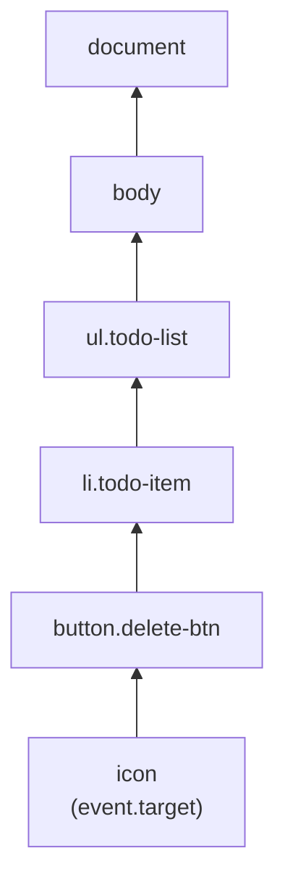

## The bubbling phase, concretely

**When a click fires on the icon, does the button ever find out about
it?** Yes — by default, after an event fires on its exact target, it
fires again on every ancestor, one level at a time, all the way up to the
document:



A listener attached to `button.delete-btn`, `ul.todo-list`, or even
`document` will all eventually see this same click event — the event
doesn't stop at the icon just because the icon is what was technically
clicked. This bubbling is what makes delegation possible at all: a
listener doesn't have to live on the exact element clicked.

The smallest possible listener looks like this:

```js
const button = document.querySelector(".delete-btn");

button.addEventListener("click", (event) => {
  console.log("The browser sent this click event:", event);
});
```

`addEventListener("click", ...)` is the moment JavaScript asks the browser:
"when this kind of event happens on this element, run this function." The
function receives an event object, and that object is where `target`,
`currentTarget`, bubbling information, and default behavior become visible.

Some elements also have built-in default actions. A link with `href` navigates
to another URL. A form submit can send data and reload/navigate the page. If
JavaScript wants to handle that interaction in place, the listener must call
`event.preventDefault()` and then update the DOM or state itself. That is the
difference between "the browser navigated away" and "this page reacted without
reloading."

## target vs. currentTarget: two different, easily confused values

**If a listener is attached to `ul.todo-list` but the click happened on
the icon, what does the event object actually report?**

```text
event.target        → the icon (the innermost element the click actually landed on)
event.currentTarget  → ul.todo-list (the element the listener is attached to)
```

These are almost always different when using delegation, and mixing them
up is a common source of bugs: checking `event.target.className` for the
delegated element's class fails for exactly the reason in the incident —
`event.target` is the icon, not the button. The fix isn't switching to
`event.currentTarget` either (that would just always be `ul.todo-list`,
never the specific button that was clicked) — it's asking a different
question entirely: **starting from `event.target`, is there an ancestor
matching what I'm looking for?**

## `closest()`: walking up from the actual target to find the intended one

**Is there a direct way to ask "does the clicked element, or one of its
ancestors, match this selector"?** Yes — `element.closest(selector)`
starts at the element itself and walks up through ancestors, returning
the first one that matches, or `null` if none do:

```text
icon.closest('.delete-btn')
  → checks icon itself: no match
  → checks icon.parent (the button): matches 'delete-btn'
  → returns the button element
```

This is exactly the tool for the incident's bug: instead of checking
`event.target.classList.contains('delete-btn')` (which fails whenever the
click lands on a descendant of the button), checking
`event.target.closest('.delete-btn')` correctly finds the button
regardless of which specific descendant was actually clicked.

## Delegation covers elements that don't exist yet

**Beyond fixing the icon-click bug, why does delegating to a parent
element also solve "new items' delete buttons don't work"?** Because a
delegated listener doesn't care, at the moment it's attached, which
children currently exist — it only inspects `event.target` (and walks up
via `closest()`) at the moment a click actually happens. A button added
to the list five minutes after the listener was attached still bubbles
its click up to the same parent, and `closest()` still finds it, because
the check happens live, not at setup time:

| Approach                                      | Listener attached to   | Covers buttons added later?                                    |
| --------------------------------------------- | ---------------------- | -------------------------------------------------------------- |
| One listener per button, added at render time | Each individual button | No — a button that didn't exist yet got no listener            |
| One delegated listener                        | The stable parent list | Yes — checked live via `event.target.closest()` on every click |

## The generalizable lesson

**Is the fix "always use delegation, never attach listeners directly to
individual elements"?** Not universally — delegation adds a small amount
of indirection (the closest() check on every click) and depends on the
event actually bubbling, which not all events do. The generalizable skill
is recognizing _when_ elements are added/removed dynamically or numerous
enough that per-element listeners become wasteful or unreliable, and
choosing delegation specifically for that situation — while still asking,
for any click handler, "what does `event.target` actually resolve to
here, and is that the element I meant to check."
