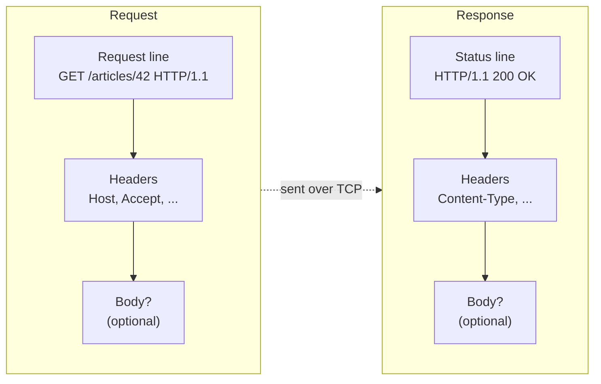

import Scenario from "../../../components/Scenario.astro";

<Scenario label="The problem">
  <Fragment slot="facts">
    

      
🔴 <strong>Team A</strong> — alert checks status code only — outage found via a user complaint

      
🟢 <strong>Team B</strong> — alert checks status code AND body shape — outage found automatically

    

    

      

        
Team A

        ~6 hours to detect
      

      

        
Team B

        ~40 seconds to detect
      

    

  </Fragment>

A backend crashes at 2am. Its process is dead, but the load balancer in front
of it still answers every request with `200 OK` and an empty body — a stale
health-check quirk nobody remembers configuring. Team A's monitoring only
checks `if (response.status === 200)`. Team B's monitoring checks the status
code _and_ validates that the body actually looks like a healthy response.

| Team | What the alert checks     | How the outage was found                         |
| ---- | ------------------------- | ------------------------------------------------ |
| A    | `response.status === 200` | A user complained on Twitter, ~6 hours later     |
| B    | status code + body shape  | The alert fired automatically within ~40 seconds |

**Both teams received the exact same `200 OK`. Why did only Team B's system know something was wrong?**

</Scenario>

Team A trusted the status code as if it were a fact about the world. It's
only a claim the server made — and nothing forced that claim to match what
was actually in the body.

- The web runs on a strict **request → response** contract: a client sends one request, the server sends back exactly one response. No response arrives unprompted.
- Every request has three parts: a **request line** (method + path + HTTP version), **headers** (metadata as key/value pairs), and an optional **body**.
- Every response mirrors that shape: a **status line** (HTTP version + status code + reason phrase), **headers**, and an optional **body**.

- **Methods** describe intent: `GET` (fetch, no side effects expected), `POST` (create/submit), `PUT`/`PATCH` (replace/update), `DELETE` (remove). This is a convention, not something the network enforces.
- **Status codes** are grouped by their first digit: `2xx` success, `3xx` redirect, `4xx` client made a mistake, `5xx` server made a mistake — but as Team A learned, the number is only ever the server's own claim.
- HTTP is **stateless** by default — the server treats every request as if it's never seen the client before, unless something (a cookie, a token) carries state across requests explicitly.
- HTTP itself is just **text sent over a TCP connection** — there's no magic underneath it, which is exactly why it's readable with nothing but `curl` or `nc`.
- Key terms: request line, status line, header, body, method, status code, statelessness, connection (TCP), `Host` header, `Content-Type`, `Content-Length`.

## Status code ranges at a glance

| Range | Meaning                                                | Typical example                                        |
| ----- | ------------------------------------------------------ | ------------------------------------------------------ |
| `1xx` | Informational — request received, still processing     | `100 Continue`                                         |
| `2xx` | Success — the request worked                           | `200 OK`, `201 Created`                                |
| `3xx` | Redirection — go look somewhere else                   | `301 Moved Permanently`, `304 Not Modified`            |
| `4xx` | Client error — the request itself was the problem      | `404 Not Found`, `401 Unauthorized`                    |
| `5xx` | Server error — the request was fine, the server failed | `500 Internal Server Error`, `503 Service Unavailable` |
