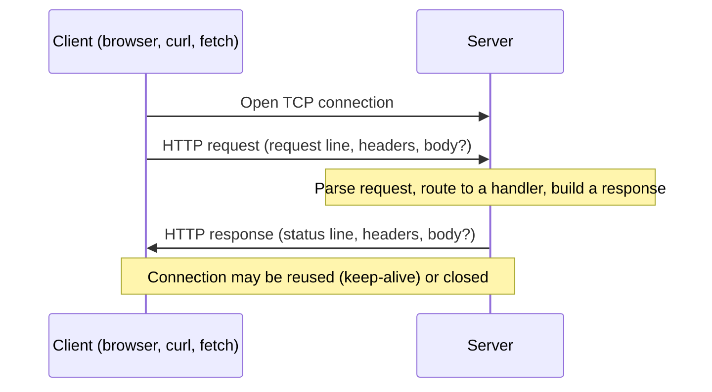

## The shape of one exchange



A request and a response are both just structured text. A request literally looks like this on the wire:

```
GET /articles/42 HTTP/1.1
Host: example.com
Accept: application/json
User-Agent: curl/8.4.0

```

And the response:

```
HTTP/1.1 200 OK
Content-Type: application/json
Content-Length: 27

{"id":42,"title":"Hello"}
```

The blank line is not decoration — it's the field separator between headers and body. Miss it and the parser can't tell where headers end.

## The architecture this implies

Because a request carries everything the server needs to answer it (method, path, headers, body) and the server carries everything the client needs to interpret the answer (status, headers, body), **neither side has to remember the other exists** between requests. That single property — statelessness — is why:

- A load balancer can send request #1 to server A and request #2 to server B with no coordination between A and B.
- You can `curl` an endpoint in isolation and get a meaningful answer, without "logging in" to a session first, unless the _application_ layers state on top (cookies, `Authorization` headers, tokens).
- Caching works: a response to `GET /articles/42` can be cached and replayed for anyone, because the request alone determines the response (in principle — real APIs vary by auth, but that's the app opting back into statefulness).

## Handling a request: the mental model

Pseudocode for what a server is conceptually doing for every connection — this is the shape underneath every framework you'll ever use, from a raw socket server to Express to a CDN edge function:

```python
loop forever:
    connection = accept_next_tcp_connection()

    raw_request = read_until_blank_line(connection)
    request_line, headers = parse(raw_request)
    method, path, version = split(request_line)

    if headers contains "Content-Length":
        body = read_exactly(connection, headers["Content-Length"])
    else:
        body = None

    handler = route(method, path)          # e.g. GET /articles/:id -> get_article
    response = handler(method, path, headers, body)

    write(connection, response.status_line)
    write(connection, response.headers)
    write(connection, "\r\n")
    write(connection, response.body)

    if headers["Connection"] == "keep-alive":
        continue on same connection
    else:
        close(connection)
```

Every real HTTP server — Node's `http` module, nginx, a Go `net/http` handler — is a more sophisticated, more concurrent version of exactly this loop. Nothing about `async`, routers, or middleware changes the underlying contract; they just make the "parse → route → handle → write" pipeline easier to compose.

## Semantics worth internalizing now

- **Idempotency is a promise, not a guarantee.** `GET`, `PUT`, and `DELETE` are supposed to be idempotent (calling them twice has the same effect as once) — but nothing stops a poorly written server from making `GET /delete-everything` destructive. The convention exists so _callers_ (browsers, proxies, retry logic) can safely retry idempotent methods without asking.
- **A status code is a claim, not a fact.** A `200 OK` with a broken JSON body is still, technically, a `200`. Client code that only checks the status code and never validates the body is trusting the server's word for it.
- **`Content-Length` (or chunked encoding) is how the receiver knows where the body ends.** TCP is a byte stream with no built-in message boundaries — HTTP has to tell you the body's length explicitly, or stream it in labeled chunks (`Transfer-Encoding: chunked`), or the reader would have no way to know when to stop reading.
