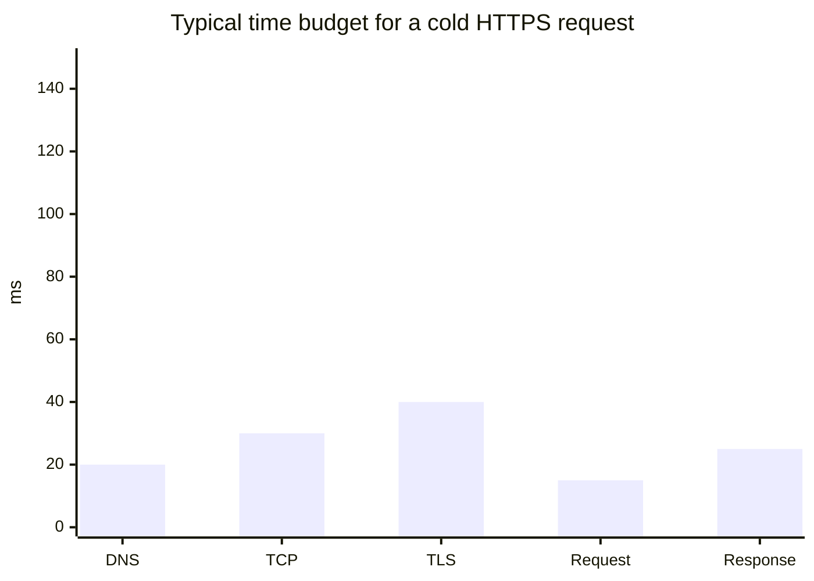

L1 and L2 established the shape of an HTTP exchange and the mental model behind it. This level proves it by building both sides — a raw request over a TCP socket, and a server that parses one without any HTTP library — and then walks through the failure modes that a real server has to defend against.

## Where the time actually goes

Before writing a single byte of parser code, it's worth knowing what a "slow request" is even competing against. A cold HTTPS request (no cached DNS, no existing connection) spends its time roughly like this before your server logic even runs:



TLS is usually the single biggest fixed cost on a cold connection — more than DNS and the TCP handshake combined. This is exactly why HTTP/1.1 keep-alive (and connection pooling in general) matters so much in practice: paying the DNS+TCP+TLS setup cost once and reusing the connection for many requests amortizes that ~90ms of setup across all of them, instead of paying it again every time.

## Is "HTTP is just text over TCP" actually true, or just a simplification for beginners?

It's literally true — provable with eleven lines of code and no framework, no `fetch`, no `http` module. Just a TCP socket and a string built by hand, using Node's `net` module (works identically under `bun run`):

```js
// raw-request.mjs
import { createConnection } from "node:net";

const request =
  "GET /get HTTP/1.1\r\n" +
  "Host: httpbin.org\r\n" +
  "User-Agent: raw-tcp-demo/1.0\r\n" +
  "Connection: close\r\n" +
  "\r\n";

const socket = createConnection({ host: "httpbin.org", port: 80 }, () => {
  socket.write(request);
});

let raw = "";
socket.on("data", (chunk) => {
  raw += chunk.toString("utf8");
});

socket.on("end", () => {
  const [head] = raw.split("\r\n\r\n");
  console.log(head);
});
```

Run it with `bun run raw-request.mjs`. The output is the response's status line and headers, printed exactly as they arrived on the wire — proof that a browser, `curl`, and this eleven-line script are all doing the same thing at the protocol level: opening a TCP connection and exchanging text that follows a specific grammar.

Every header line matters. `Host` isn't optional in HTTP/1.1 — a single server process often answers for many domains (virtual hosting), and `Host` is the only thing in the request that says which one. Drop it and compliant servers must respond `400 Bad Request`.

## If frameworks hide all this parsing, what exactly are they hiding?

Frameworks hide the parsing, but the parsing is where the interesting edge cases live — and hiding it doesn't make the edge cases go away, it just moves them somewhere you can't see. Here's a minimal server built directly on `net.Server`, handling exactly the pieces from the L2 pseudocode:

```js
// raw-server.mjs
import { createServer } from "node:net";

function parseRequestHead(rawHead) {
  const [requestLine, ...headerLines] = rawHead.split("\r\n");
  const [method, path, version] = requestLine.split(" ");

  const headers = {};
  for (const line of headerLines) {
    const colon = line.indexOf(":");
    if (colon === -1) continue; // malformed header line — skip, don't crash
    const name = line.slice(0, colon).trim().toLowerCase();
    const value = line.slice(colon + 1).trim();
    headers[name] = value;
  }

  return { method, path, version, headers };
}

function buildResponse(status, reason, bodyObj) {
  const body = JSON.stringify(bodyObj);
  const headers =
    `HTTP/1.1 ${status} ${reason}\r\n` +
    `Content-Type: application/json\r\n` +
    `Content-Length: ${Buffer.byteLength(body)}\r\n` +
    `Connection: close\r\n` +
    `\r\n`;
  return headers + body;
}

const server = createServer((socket) => {
  let buffer = "";

  socket.on("data", (chunk) => {
    buffer += chunk.toString("utf8");

    const headerEnd = buffer.indexOf("\r\n\r\n");
    if (headerEnd === -1) return; // haven't received full headers yet — wait for more data

    const rawHead = buffer.slice(0, headerEnd);
    const { method, path, headers } = parseRequestHead(rawHead);

    // We only handle bodyless GET here; a real parser would now check
    // Content-Length (or Transfer-Encoding: chunked) and keep buffering
    // until the full body has arrived before dispatching.
    void headers;

    let response;
    if (method === "GET" && path === "/time") {
      response = buildResponse(200, "OK", { now: new Date().toISOString() });
    } else if (method === "GET") {
      response = buildResponse(404, "Not Found", { error: "no such route" });
    } else {
      response = buildResponse(405, "Method Not Allowed", {
        error: "unsupported method",
      });
    }

    socket.write(response);
    socket.end();
  });
});

server.listen(8080, () => console.log("listening on http://localhost:8080"));
```

Run it with `bun run raw-server.mjs`, then in another terminal: `curl http://localhost:8080/time`. It answers exactly like a "real" HTTP server, because — at this layer — that's all a real HTTP server is: parse the head, decide what `Content-Length` to promise, write it, keep the promise.

## Which of these four mistakes would still pass a quick smoke test on localhost?

All of them, which is exactly what makes them dangerous — a naive parser that works perfectly against `curl http://localhost` in a demo can still walk straight into every one of these under real network conditions or real attacker input:

**1. Trusting `Content-Length` without validating it against what's actually written.** If `buildResponse` computed `Content-Length` from the wrong string (say, the object before `JSON.stringify` instead of after), clients reading exactly that many bytes would either truncate the JSON or hang waiting for bytes that never arrive, because the receiver stops reading once it has read `Content-Length` bytes — it has no other way to know the message ended. This is why `Buffer.byteLength(body)` — not `body.length`, which counts UTF-16 code units, not bytes — is used above; a body with multi-byte UTF-8 characters would otherwise get a wrong count and every response with non-ASCII content would be silently truncated for the client.

**2. Header injection via unsanitized values.** If a handler ever does something like:

```js
// DON'T DO THIS
headers += `Location: ${userSuppliedRedirectUrl}\r\n`;
```

and `userSuppliedRedirectUrl` contains a literal `\r\n`, an attacker can inject arbitrary extra headers — or an entire second response — into the stream. This is CRLF injection / HTTP response splitting. The fix is never string-concatenating untrusted input into a raw header block; use a library (or, as here, values that are never attacker-controlled) that rejects or strips `\r`/`\n` from header values before they're written.

**3. Not handling partial reads.** TCP makes no promise that one `write()` on the client arrives as one `data` event on the server — a request can arrive split across multiple chunks, or multiple pipelined requests can arrive in a single chunk. The `buffer +=` / `indexOf("\r\n\r\n")` pattern above exists specifically to handle this: it keeps accumulating until it has seen a complete head, rather than assuming the first `data` event is the whole request. A parser that assumes one `data` event equals one full request will intermittently — and only under real network conditions, never in a fast localhost test — truncate requests.

**4. Not bounding how much you'll buffer.** The server above will happily keep appending to `buffer` forever if a client sends headers but never sends the terminating `\r\n\r\n`. A production server needs a maximum header size and a timeout, or a single slow/malicious client can exhaust memory (this is the shape of a "slowloris" attack: open many connections, send headers one byte at a time, never finish).

| #   | Failure mode                            | Real symptom                                      | Fix                                                           |
| --- | --------------------------------------- | ------------------------------------------------- | ------------------------------------------------------------- |
| 1   | Wrong `Content-Length`                  | Truncated or hung response for non-ASCII bodies   | Compute length from the real UTF-8 bytes, after serialization |
| 2   | Unsanitized header values               | CRLF injection / response splitting               | Strip or reject `\r`/`\n` before writing any header value     |
| 3   | Assuming one `data` event = one request | Intermittent truncation under real network jitter | Buffer and re-check for a complete head on every chunk        |
| 4   | Unbounded header buffering              | Memory exhaustion (slowloris-style)               | Cap header size, enforce a read timeout                       |

## Worked example: keep-alive changes the loop

The examples above use `Connection: close` — one request per connection, then the socket closes. HTTP/1.1 defaults to keep-alive instead: the server must go back to _waiting for another request line_ on the same socket rather than closing, and must now track where one request's body ends and the next request's line begins in the same byte stream. Sketching the change to the server loop:

```js
socket.on("data", (chunk) => {
  buffer += chunk.toString("utf8");

  let headerEnd;
  while ((headerEnd = buffer.indexOf("\r\n\r\n")) !== -1) {
    const rawHead = buffer.slice(0, headerEnd);
    // ... parse, handle, write response as before ...

    // Critical: consume only this request's bytes, then loop again in case
    // a second request already arrived in the same chunk (pipelining).
    buffer = buffer.slice(headerEnd + 4);
  }
  // any leftover partial request stays in `buffer` for the next `data` event
});
```

This is the detail that trips up most from-scratch HTTP parsers: keep-alive turns "one request per connection" into "an unbounded stream of requests per connection," and the parser has to re-synchronize on request boundaries itself instead of relying on the connection closing to mark the end.

The raw server above is one worked example — a GET-only, JSON-only toy — not the whole territory. **What would you need to add to `parseRequestHead` and the dispatch logic if a route needed to accept a request body** (say, a `POST /articles` that creates a resource from a JSON payload)? At minimum: check for `Content-Length` on the parsed headers, keep buffering past `headerEnd + 4` until that many body bytes have arrived, and only then parse and dispatch — the same "don't assume one `data` event is the whole message" discipline this unit already applied to headers, extended to the body.

## Where HTTP stops and rendering begins

This unit's boundary is deliberately narrow: HTTP explains how a browser and a
server exchange messages. It covers the request line, headers, body, status
line, connection reuse, and the failure modes that appear when bytes are parsed
incorrectly. It does not, by itself, explain why a `<button>` is accessible,
why one CSS rule wins over another, why a click bubbles, why JavaScript gets
bundled, or why changing the DOM can still be slow.

The bridge is this: HTTP can deliver `index.html`, `styles.css`, `app.js`,
images, and fonts. After those responses arrive, the browser takes over:
semantic HTML shapes the DOM and accessibility tree, CSS cascade rules decide
computed styles, JavaScript listens to DOM events, bundled assets determine how
many files and bytes must be requested, and render performance depends on what
DOM/CSS changes force the browser to recalculate before it can paint.

For the next internal steps, connect this unit to
[TLS/HTTPS](/security/tls-https/) for the encrypted layer under HTTPS,
[HTML semantics](/web/need-html-semantics-just-divs/) for what the delivered
markup means, [CSS cascade](/web/css-cascade-specificity/) for how styles are
chosen, [DOM events](/web/dom-event-model/) for browser-side interaction,
[bundling](/web/bundling/) for how many resource requests modern apps produce,
and [render performance](/web/render-performance/) for the layout/repaint work
that turns parsed resources into visible pixels.
