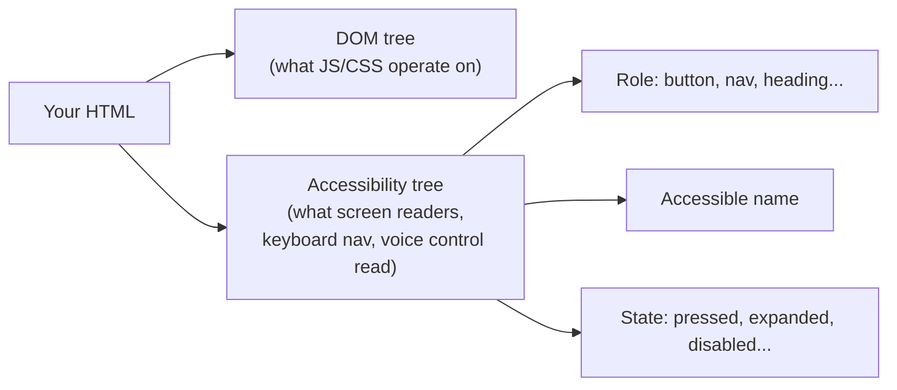
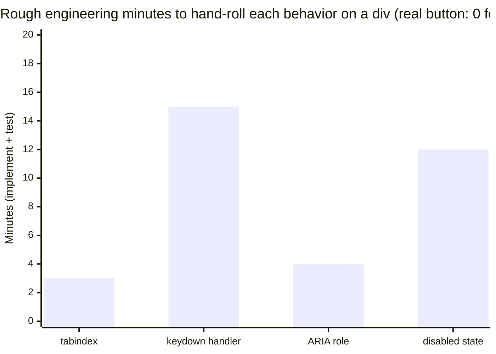

## Two trees built from the same markup



The DOM tree is what most web development directly manipulates. The accessibility tree is a second structure the browser derives from the same markup, and it's what every non-visual way of using a page (screen readers, switch devices, voice control, browser "reader mode") actually reads. Semantic elements populate every branch of it correctly by default; a generic `<div>` populates none of it, because a `<div>` has no inherent role — its accessibility-tree entry is just "generic," carrying no information about what it does.

The simplest way to hear the difference:

```html
<div>Sign up</div>
<button type="button">Sign up</button>
```

A sighted mouse user may see the same words either way if CSS makes them look
alike. A screen reader user hears the first as plain content, roughly "Sign
up." The second is announced with its role, roughly "Sign up, button," and the
keyboard behavior is already attached. The words are identical; the meaning
and behavior are not.

## What a real `<button>` gives you, that a styled `<div>` doesn't

| Behavior                | `<button>`                            | `<div onclick>` styled to look like a button                                                     |
| ----------------------- | ------------------------------------- | ------------------------------------------------------------------------------------------------ |
| Keyboard focusable      | Yes, by default                       | No — needs manual `tabindex="0"`                                                                 |
| Responds to Enter/Space | Yes, by default                       | No — needs manual keydown handlers for both                                                      |
| Announced role          | "button" (accessibility tree)         | "text" or nothing — no role, no announcement                                                     |
| Disabled state          | `disabled` attribute, fully handled   | Requires manually blocking clicks, styling, and updating the accessibility tree's disabled state |
| Form submission         | Works inside a `<form>` automatically | Requires manual JS to replicate                                                                  |

Every row in the right column is real, non-trivial work a developer has to reproduce by hand, get right across browsers, and maintain — and it's exactly the work the browser already does for a real `<button>`. This is the concrete shape of "semantics give you behavior for free."

## Landmarks: navigation for people who can't scan visually

```html
<!-- No landmarks — a screen reader user has to tab through everything -->
<div class="top-bar">...</div>
<div class="side-menu">...</div>
<div class="content">...</div>

<!-- With landmarks — jump directly to a region -->
<header>...</header>
<nav>...</nav>
<main>...</main>
```

A sighted user visually scans a page in an instant to find the main content, skipping the header and nav — that's a real cognitive shortcut. `<header>`, `<nav>`, and `<main>` give a screen reader user the equivalent shortcut: most screen readers offer a "jump to landmark" command that lets them skip straight to `<main>` without tabbing through every link in the header and nav first. A `<div>`-only page structurally cannot offer this, no matter how it's visually styled — the shortcut depends on the tag, not the appearance.

## How much work does hand-rolling a `<button>` actually take?



None of these four bars is optional — skipping any one leaves the div broken for some class of user, which is why "I added `tabindex` so it's fine now" (one bar out of four) is a common, incomplete fix rather than a full one. A real `<button>` starts at zero on every bar.

## The decision rule, restated precisely

Semantic HTML isn't "use fancy tag names for style points" — it's "let the browser's built-in behavior do work you'd otherwise have to reimplement, and let assistive technology understand structure it otherwise couldn't infer." The `<div>`/`<span>` pair exists specifically for the remaining case: a piece of markup with no inherent semantic role, needed purely for styling or JS hooks — which is a real, legitimate case, just a narrower one than how `<div>` usually gets used in practice.
