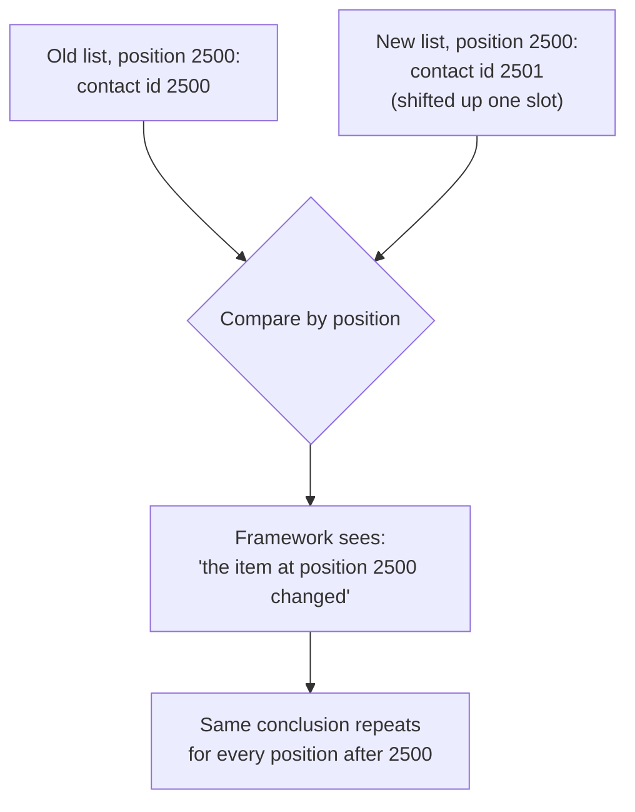

import LevelIntro from "../../../components/LevelIntro.astro";
import Checkpoint from "../../../components/Checkpoint.astro";

L1 named the two pieces of the problem — diffing by position instead
of identity, and the reflow/repaint work that follows a DOM change.
L2 works through the actual mechanics of why position-based diffing
turns one deletion into thousands of changes, and what the browser's
rendering pipeline does with each resulting operation.

<LevelIntro
  items={[
    "Why position-based diffing cascades after a deletion",
    "How a stable key restores identity-based matching",
    "What reflow, repaint, and composite each actually cost",
  ]}
/>

## Why comparing by position turns one deletion into thousands of changes

**If contact #2500 is deleted from a list of 5,000, and every other
contact is unchanged, why would the framework think contact #2501
also changed?** Because without a stable identity to match against,
the only thing left to compare is _position_ — and once one item is
removed, every item after it shifts into a different position:

At position 2500, the old list had contact 2500 and the new list has
contact 2501 — from a purely positional view, that _looks_ like the
content at that slot changed, even though contact 2501 didn't change
at all; it just moved. This repeats for every position from 2500 to
4999, producing thousands of "this changed" signals for a single
actual deletion.

**Would giving each row a stable key fix this, and how?** Yes — a key
lets the diffing algorithm ask "where did the item with id 2501 end
up?" instead of "did the item at this position change?" With keys,
deleting contact 2500 produces exactly one real change: remove the
row with key 2500. Every other row is recognized as the same row it
already was, just possibly shifted, which most frameworks can handle
far more cheaply than recreating content.

<Checkpoint question="A teammate 'fixes' the contact list by adding key={index} to each row, where index is the row's position in the array. Does this restore identity-based matching the way a key={contact.id} would?">

No. The array index is just the position again, wearing a different
name — it still shifts by one for every row after the deleted contact,
exactly the way the un-keyed position comparison did. The diffing
algorithm still can't tell "this row's content actually changed" apart
from "this row is a different item that happens to now sit in the same
slot," because the value it's matching on (the index) changes for
almost every row on every update, same as before. A key only restores
identity-based matching when it's a value that stays attached to the
same logical item regardless of where that item sits — something like
the contact's own id, which never changes just because a sibling above
it was deleted.

</Checkpoint>

## What actually costs time once the DOM changes

**If the diff is small, does that guarantee the visible update is
fast?** Usually, but the diff result still has to go through the
browser's actual rendering pipeline, and not every kind of DOM change
costs the same:

Think of it like changing a room. **Reflow** is moving furniture and
measuring where everything now fits. **Repaint** is keeping the layout
but changing the visible surface, like repainting a wall. **Composite**
is placing already-painted layers together, like sliding a transparent
sheet over the room without moving the furniture underneath.

| Stage           | What happens                                                     | Triggered by                                                                |
| --------------- | ---------------------------------------------------------------- | --------------------------------------------------------------------------- |
| Reflow (layout) | Browser recalculates the position and size of affected elements  | Adding/removing elements, changing dimensions, changing text content length |
| Repaint         | Browser redraws the pixels for elements whose appearance changed | Changing colors, visibility, or anything reflow already affected            |
| Composite       | Browser combines already-painted layers onto the screen          | Purely visual layer changes (transforms, opacity) that don't need re-layout |

**Is reflow always worse than repaint?** Generally yes for
performance purposes — reflow can cascade (recalculating one
element's layout can force recalculating its neighbors and ancestors
too), while a change that only needs a repaint or composite step
affects a more limited, predictable scope. This is why removing one
row from a 5,000-row list (an unavoidable reflow, but ideally scoped
to just that row) is much cheaper than an unkeyed diff that touches
thousands of rows' content, forcing reflow work across all of them.

<Checkpoint question="Two updates each change one row's text in a 5,000-row list: update A uses a stable key and only touches the one changed row; update B is unkeyed and, per the section above, produces update operations for every row after the changed one. Both eventually trigger reflow. Which one costs more, and why?">

Update B costs far more, even though both trigger reflow in principle.
Reflow's cost scales with how many elements the browser has to
recalculate, not with how many elements logically changed in the data.
Update A's reflow is scoped to one row, so the browser only has to
re-measure that row (and whatever depends on it). Update B's unkeyed
diff hands the browser thousands of "this row changed" operations, so
it has to re-measure and repaint across that entire shifted range —
the same underlying data change, but a dramatically larger amount of
actual rendering work, because the diff itself failed to recognize
that most of those rows didn't really change at all.

</Checkpoint>

## Failure modes at this level

- **Assuming the virtual DOM diff itself is the expensive part.**
  Computing the diff is usually fast — the actual cost is applying a
  larger-than-necessary set of real DOM changes and the reflow/repaint
  work that follows.
- **Using array index as a key.** This looks like a fix (every item
  technically has a "key" now) but doesn't solve the identity problem
  at all — the index-as-key still shifts along with position, so it's
  functionally the same as no key.
- **Only testing render performance with small lists.** Like this
  unit's Scenario, a diffing inefficiency can be invisible at 5 items
  and severe at 5,000 — the underlying algorithmic behavior doesn't
  change, only whether its cost is noticeable.
- **Optimizing before measuring.** A slow page can be waiting on the
  network, running too much JavaScript, recalculating layout, painting
  too many pixels, or rendering too many nodes. Guessing the category
  first often leads to fixing the wrong layer.
