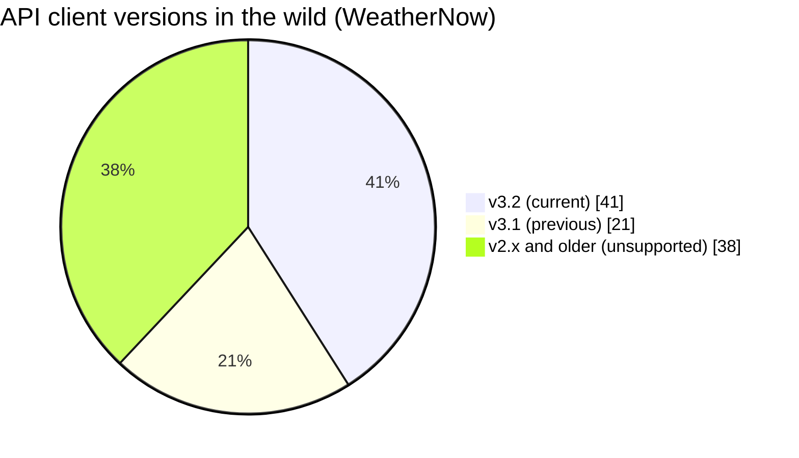

import Scenario from "../../../components/Scenario.astro";
import LevelIntro from "../../../components/LevelIntro.astro";

<Scenario label="The problem">
  <Fragment slot="facts">
    

      
📱 <strong>WeatherNow API v1</strong> — <code>temperature</code> is a plain number, e.g. <code>72</code>

      
🛠️ <strong>Server team ships v2</strong> — renames the field to <code>tempF</code> and adds <code>tempC</code>

      
💥 <strong>38% of installs</strong> are still on an old app build that reads <code>temperature</code> — they can't auto-update overnight

    

    

      

        
App v3.2

        41% of installs
      

      

        
App v3.1

        21% of installs
      

      

        
App v2.x and older

        38% of installs
      

    

  </Fragment>

The WeatherNow mobile app has been out for two years. Its server team wants
to ship a cleaner API: split the ambiguous `temperature` field into `tempF`
and `tempC`, and drop the old field to keep the response tidy. They deploy
it Friday afternoon. By Friday evening, crash reports flood in — not from
new installs, but from the 38% of users still running an app build from six
months ago that reads `response.temperature` and gets `undefined`.

Nobody shipped bad code. The server team's new response was, by itself,
perfectly correct JSON. **The break happened because the server changed what
it promised, and some clients were still relying on the old promise —
with no way to know it had changed.**

</Scenario>

<LevelIntro
  items={[
    "What an API contract actually is",
    "REST vs. GraphQL as two ways to shape that contract",
    "Breaking vs. non-breaking changes, and how versioning buys time",
  ]}
/>

## What is an "API contract," concretely?

An API contract is every promise a server makes about the shape of a
request and response that a client is allowed to depend on: which fields
exist, their types, which are optional, which endpoints/operations exist,
and what status/error behavior to expect. Once a client ships against that
contract, every future server change has to either honor it or explicitly
version around it — the contract doesn't live in a design doc, it lives in
whatever the currently-deployed clients actually assume.

- **REST** expresses the contract as a set of **resources** (nouns, usually
  URLs like `/users/42/orders`) manipulated with a small, fixed set of HTTP
  verbs (`GET`, `POST`, `PUT`, `PATCH`, `DELETE`). The contract is "this URL
  - this verb returns/accepts this JSON shape."
- **GraphQL** expresses the contract as a single **schema** — a typed graph
  of everything queryable — and clients ask for exactly the fields they
  need in one query. The contract is the schema's types and fields, not a
  list of URLs.

Both are just different answers to the same underlying question: what
exactly is a client allowed to count on, and for how long?

## Breaking vs. non-breaking changes

The WeatherNow incident was a breaking change disguised as a cleanup. The
distinction that matters is whether an **existing, unmodified client**
keeps working after the deploy.

| Change                                             | Breaking? | Why                                                    |
| -------------------------------------------------- | --------- | ------------------------------------------------------ |
| Adding a new optional field to a response          | No        | Old clients ignore fields they don't read              |
| Adding a new endpoint or query                     | No        | Nothing existing depended on it                        |
| Renaming or removing a field a client reads        | **Yes**   | Old client code dereferences `undefined`               |
| Changing a field's type (number → string)          | **Yes**   | Old parsing/validation logic breaks silently           |
| Making a previously-optional field required        | **Yes**   | Old clients that omit it now get rejected              |
| Changing default behavior of an existing parameter | **Yes**   | Old clients relying on the old default get new results |

The safe half of that table — additive, optional, ignorable — is sometimes
called **evolving the contract without versioning**: most day-to-day API
growth can stay in that half indefinitely. Versioning exists specifically
for the unsafe half, when a breaking change is unavoidable.

## Versioning: buying old clients time, not avoiding change forever

Versioning doesn't prevent breaking changes — it lets the server run an old
and a new contract **at the same time**, so existing clients keep working
on the old contract while new clients (or an eventual forced upgrade) move
to the new one.

Common places a version lives in the contract:

- **In the URL path** — `/v1/users`, `/v2/users` (most common for REST).
- **In a request header** — `Accept: application/vnd.weathernow.v2+json`.
- **Inside the GraphQL schema itself** — GraphQL has no `/v1`/`/v2` URLs at
  all; it evolves the single schema additively and marks retiring fields
  `@deprecated`, covered in L2 and L3.

A version is a promise with an expiration date, not a permanent fork: every
supported version is a contract someone still has to keep working, tested,
and documented — which is why L2 and L3 spend real time on **how many
versions to support at once**, not just how to add one.

**Could the WeatherNow team have avoided the incident just by adding
`tempF` and `tempC` as new fields, without touching or removing
`temperature`?** Yes. That change falls entirely in the "non-breaking"
half of the table above — it only adds an optional field the old client
never reads. Old clients would keep reading `temperature` exactly as
before, completely unaware two new fields showed up alongside it. The
incident wasn't caused by adding new data; it was caused by
removing/renaming a field that a deployed client still depended on. Most
of what feels like "the API needs a new version" is actually a change
that could have stayed additive instead.

Versioning is the fallback for the changes that truly can't stay additive —
a field whose meaning has to change, a resource shape that has to be
restructured. L2 covers how REST and GraphQL each handle that fallback
differently, and L3 works through real, runnable code for both.
