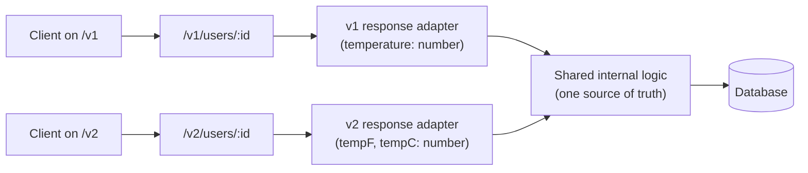
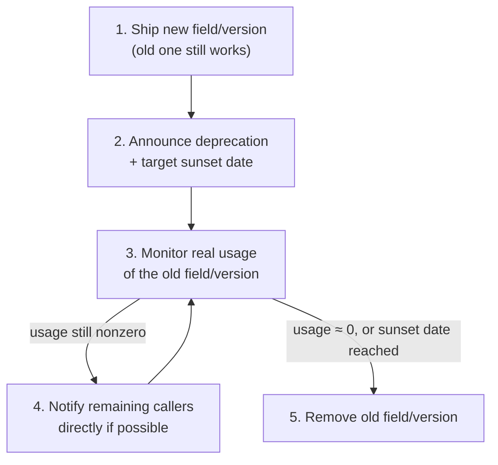

import Scenario from "../../../components/Scenario.astro";
import LevelIntro from "../../../components/LevelIntro.astro";
import Checkpoint from "../../../components/Checkpoint.astro";

<Scenario label="The problem">
  <Fragment slot="facts">
    <div class="not-prose flex flex-col gap-2 text-sm text-slate-700 dark:text-slate-300">
      <div class="flex items-center gap-1.5"><span>📲</span> Screen needs: <strong>user</strong> + their <strong>orders</strong> + each order's <strong>line items</strong></div>
      <div class="flex items-center gap-1.5"><span>🔴</span> <strong>REST, naive:</strong> 1 + N + M round trips — one per user, one per order, one per line-item set</div>
      <div class="flex items-center gap-1.5"><span>🟢</span> <strong>GraphQL:</strong> 1 round trip, client names exactly the fields it needs</div>
    </div>
  </Fragment>

A mobile screen needs a user's profile, their last 5 orders, and each
order's line items. Built naively against a REST API, that's a request for
the user, then a loop firing one request per order, then a loop inside that
firing one request per order's line items — a classic N+1 waterfall that
gets slower as the user places more orders. The same screen against a
GraphQL API is one request, naming exactly the fields the screen needs,
nested to whatever depth is required.

**This isn't just a performance difference — it's a difference in how the
contract itself is shaped, and that shape decides how painful future
changes to it will be.**

</Scenario>

<LevelIntro
  items={[
    "REST: URL-versioned resources + an adapter layer",
    "GraphQL: one evolving schema, no URL versions",
    "Deprecation as a managed process, not a one-time flag",
  ]}
/>

## How does REST keep old and new contracts running side by side?

REST ties a version to the URL, then routes both versions through the
**same internal logic** via a thin adapter — the alternative, maintaining
two entirely separate codebases, doubles every future bug fix.



The adapters are intentionally thin: all the real logic — validation,
business rules, persistence — lives once, in `CORE`. Each version's adapter
only reshapes the input/output at the edge. This is the pattern L3's code
builds directly: a `/v1` handler and a `/v2` handler that both call one
shared function and differ only in how they map its result to JSON.

<Checkpoint question="If a bug is found in the order-total calculation, and both /v1 and /v2 route through the same CORE logic in the diagram above, how many places does the fix need to be applied?">

One. That's the entire point of routing every version through shared
`CORE` logic instead of forking the codebase per version — the adapters at
the edges only reshape data, they don't duplicate business logic. A
version-per-codebase approach would need the same fix applied, tested, and
deployed separately for every still-supported version, and it's exactly
the kind of drift that causes v1 and v2 to quietly disagree over time.

</Checkpoint>

## How does GraphQL avoid URL versioning entirely?

GraphQL has no `/v1` or `/v2` in its usual design — there's one schema,
and it evolves by **adding** new fields/types and marking retiring ones
`@deprecated`, rather than by standing up a parallel contract.

```graphql
type Weather {
  # Old field — still resolves, still works for old clients.
  temperature: Float @deprecated(reason: "Use tempF or tempC instead.")

  # New fields, added without touching the old one.
  tempF: Float
  tempC: Float
}
```

An old client's query `{ weather { temperature } }` keeps working
unmodified — the field still resolves, just with a deprecation notice
attached that shows up in schema-introspection tooling (GraphQL IDEs,
codegen, linting), not as a runtime error. A new client can query
`{ weather { tempF tempC } }` against the exact same schema, same
deployment, same endpoint. There is no second version of the server to
run — deprecation is a piece of schema metadata, not a fork.

| Concern                           | REST                                                         | GraphQL                                                          |
| --------------------------------- | ------------------------------------------------------------ | ---------------------------------------------------------------- |
| Where a version lives             | URL path or header (`/v2`, `Accept: ...v2+json`)             | Nowhere — one schema, evolved additively                         |
| Removing a field safely           | Ship a new version; old version keeps old shape              | Mark `@deprecated`; field still resolves until sunset            |
| Over/under-fetching               | Fixed shape per endpoint — client gets everything or nothing | Client selects exact fields, any nesting depth in one call       |
| Cost of adding a new field        | Free if additive (see L1's table)                            | Free if additive — same principle, just no version to bump       |
| Cost of a true breaking change    | New version + adapter layer to maintain                      | New field(s) + old field lingers, deprecated, until removed      |
| Tooling for "who's still using X" | Custom logging per version/endpoint                          | Schema usage metrics per field (built into most GraphQL servers) |

Note what doesn't change between the two columns: **the additive-first
instinct from L1 still applies to GraphQL.** GraphQL doesn't make breaking
changes safe — it just replaces "stand up `/v2`" with "add a field and
deprecate the old one," which is cheaper for additive-shaped changes but
still requires the same discipline for anything that truly changes meaning
(a field's type, not just its name).

## Deprecation is a process, not a single flag flip

Marking something `@deprecated`, or shipping `/v2`, is the start of a
process with a clear end state — not a permanent parallel-track
arrangement. Skipping the monitoring step is how a "temporary" v1 ends up
supported for years with nobody sure who still needs it.



<Checkpoint question="Step 3 in the diagram above is 'monitor real usage of the old field/version.' Why is that step necessary at all — why not just remove the old version on the announced sunset date regardless?">

Because the announced date is a plan, not a guarantee that every caller
acted on it — some clients are unattended scripts, abandoned integrations,
or apps stuck in app-store review, and their owners may never see the
deprecation notice. Monitoring turns "we announced a date" into "we
verified nothing is depending on this anymore" before the removal actually
happens. It's the same lesson as L1's WeatherNow incident, generalized:
assuming a change is safe because it _should_ be safe is exactly what
caused that outage — checking real traffic is what prevents a repeat of it.

</Checkpoint>

L3 turns both of these into real, runnable code: a REST `/v1`/`/v2` adapter
pair in TypeScript, a GraphQL schema with a deprecated field and its
resolver, and a small contract-compatibility check that catches a breaking
change before it ships.
