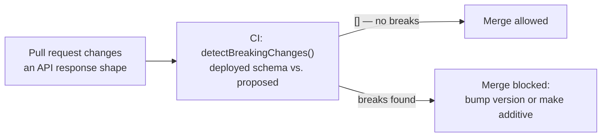

import Scenario from "../../../components/Scenario.astro";
import LevelIntro from "../../../components/LevelIntro.astro";
import Checkpoint from "../../../components/Checkpoint.astro";

<Scenario label="The problem">
  <Fragment slot="facts">
    <div class="not-prose flex flex-col gap-2 text-sm text-slate-700 dark:text-slate-300">
      <div class="flex items-center gap-1.5"><span>🔧</span> A PR renames <code>temperature</code> to <code>tempF</code> on the existing v1 route — no version bump</div>
      <div class="flex items-center gap-1.5"><span>🤖</span> CI runs a contract-diff check against the last deployed schema before merge</div>
      <div class="flex items-center gap-1.5"><span>🛑</span> Check fails: <strong>"field 'temperature' was removed"</strong> — the PR is blocked, not the users</div>
    </div>
  </Fragment>

L1 and L2 established the rules: additive changes are free, breaking ones
need a version or a managed deprecation. Rules that live only in a
teammate's memory get forgotten under deadline pressure — the same kind of
oversight that caused the WeatherNow incident in the first place. What
turns "we know the rule" into "the rule actually holds" is code that
enforces it automatically, before a breaking change ever reaches a
deployed client.

This level builds that end to end: a REST API with a real `/v1`/`/v2`
adapter pair sharing one core, a GraphQL schema with a genuinely working
deprecated field, and a contract-diff function you could drop into a CI
pipeline tomorrow.

</Scenario>

<LevelIntro
  items={[
    "REST versioning with a shared core and thin adapters",
    "A GraphQL deprecated field that still resolves correctly",
    "A real breaking-change detector to run in CI",
  ]}
/>

## The shared core, and two REST adapters on top of it

The trap in REST versioning is duplicating business logic per version.
Here, `getWeatherReading` is the only place that touches the database —
`/v1` and `/v2` are both thin shape-adapters over it, matching L2's
`CORE`-plus-adapters diagram:

```typescript
// core/weather-service.ts — the one source of truth, version-agnostic.
interface WeatherReading {
  cityId: string;
  celsius: number;
  recordedAt: Date;
}

// Stands in for a real DB/sensor lookup.
function getWeatherReading(cityId: string): WeatherReading {
  return { cityId, celsius: 22.2, recordedAt: new Date() };
}

function celsiusToFahrenheit(celsius: number): number {
  return Math.round(celsius * (9 / 5) + 32);
}

// routes/v1.ts — old shape: a single ambiguous "temperature" field in °F.
function handleV1Weather(cityId: string): { temperature: number } {
  const reading = getWeatherReading(cityId);
  return { temperature: celsiusToFahrenheit(reading.celsius) };
}

// routes/v2.ts — new shape: explicit units, no ambiguity.
function handleV2Weather(cityId: string): { tempF: number; tempC: number } {
  const reading = getWeatherReading(cityId);
  return {
    tempF: celsiusToFahrenheit(reading.celsius),
    tempC: Math.round(reading.celsius * 10) / 10,
  };
}
```

If a bug is ever found in how a reading is fetched or rounded, it's fixed
once in `core/weather-service.ts` — both adapters pick up the fix
automatically the next time they're called, because they hold no logic of
their own beyond reshaping the output.

## A GraphQL field that's deprecated but still fully functional

`@deprecated` is schema metadata for tooling — it does **not** stop the
field from resolving. The resolver for a deprecated field keeps doing real
work for as long as any client still queries it:

```typescript
// schema.graphql
const typeDefs = `
  type Weather {
    temperature: Float @deprecated(reason: "Use tempF or tempC instead.")
    tempF: Float!
    tempC: Float!
  }

  type Query {
    weather(cityId: ID!): Weather!
  }
`;

// resolvers.ts
const resolvers = {
  Query: {
    weather: (_parent: unknown, args: { cityId: string }) =>
      getWeatherReading(args.cityId),
  },
  Weather: {
    // Deprecated, but still computed correctly — old clients keep working.
    temperature: (reading: WeatherReading) =>
      celsiusToFahrenheit(reading.celsius),
    tempF: (reading: WeatherReading) => celsiusToFahrenheit(reading.celsius),
    tempC: (reading: WeatherReading) => Math.round(reading.celsius * 10) / 10,
  },
};
```

<Checkpoint question="A teammate suggests deleting the temperature resolver function now, since @deprecated already 'marks it as gone' in the schema docs. What actually happens to an old client's query the moment that resolver is deleted?">

It breaks immediately, in production, for every client still querying
`temperature` — `@deprecated` is a documentation and tooling hint (it shows
up in schema introspection, IDE warnings, and codegen output), not a
runtime behavior change. The field keeps resolving exactly like any other
field until someone removes the resolver or the field itself. Deleting the
resolver "because it's marked deprecated" skips L2's monitoring step
entirely — it treats the _announcement_ of deprecation as if it were the
_completion_ of it.

</Checkpoint>

## Catching a breaking change automatically, before it merges

This is the function the scenario above ran in CI. It compares a
previously-deployed contract schema against the one a PR is proposing, and
flags exactly the unsafe changes from L1's table — a removed field, a
changed type, or a field that became required:

```typescript
type FieldType = "string" | "number" | "boolean" | "object";

interface FieldSchema {
  type: FieldType;
  required: boolean;
}

type ContractSchema = Record<string, FieldSchema>;

interface BreakingChange {
  field: string;
  reason: string;
}

function detectBreakingChanges(
  deployedSchema: ContractSchema,
  proposedSchema: ContractSchema,
): BreakingChange[] {
  const breaks: BreakingChange[] = [];

  for (const [field, deployedField] of Object.entries(deployedSchema)) {
    const proposedField = proposedSchema[field];

    if (!proposedField) {
      breaks.push({ field, reason: "Field was removed" });
      continue;
    }

    if (proposedField.type !== deployedField.type) {
      breaks.push({
        field,
        reason: `Type changed from "${deployedField.type}" to "${proposedField.type}"`,
      });
    }

    if (!deployedField.required && proposedField.required) {
      breaks.push({ field, reason: "Field became required" });
    }
  }

  return breaks;
}

// The exact incident from the scenario above:
const deployedV1: ContractSchema = {
  temperature: { type: "number", required: true },
  cityId: { type: "string", required: true },
};

const proposedV1: ContractSchema = {
  tempF: { type: "number", required: true }, // renamed, not added
  cityId: { type: "string", required: true },
};

detectBreakingChanges(deployedV1, proposedV1);
// => [{ field: "temperature", reason: "Field was removed" }]
```



Notice what the function does _not_ flag: a genuinely new optional field,
or a new field added anywhere in `proposedSchema` that wasn't in
`deployedSchema`. Those loop iterations never even happen, because the
function only walks fields that exist in `deployedSchema` — exactly L1's
additive-is-safe rule, expressed as code instead of a policy.

<Checkpoint question="Suppose proposedV1 kept the field named temperature (no rename) but changed cityId from required: true to required: false. Would detectBreakingChanges flag that, and should it?">

No, and it shouldn't — that particular direction (required to optional) is
loosening a constraint, not tightening one. An old client that always sent
`cityId` keeps working fine, since the field is still accepted; the
function only flags the opposite direction (`!deployedField.required &&
proposedField.required`, optional becoming required), because that's the
direction that rejects requests an old client used to be able to make. It's
the same asymmetry as L1's table: relaxing a promise is safe, tightening
one isn't.

</Checkpoint>

## Naming the version itself: semantic versioning for an API surface

Once a contract-diff check exists, its output maps directly onto how the
version number should move — the same MAJOR.MINOR.PATCH convention used
for library versioning, applied to an API surface instead of a package:

| Bump      | Trigger                                             | Example from this unit                           |
| --------- | --------------------------------------------------- | ------------------------------------------------ |
| **MAJOR** | `detectBreakingChanges` returns any breaking change | `temperature` renamed/removed → ship as `/v2`    |
| **MINOR** | A new optional field, endpoint, or query is added   | Adding `tempC` alongside `temperature` in `/v1`  |
| **PATCH** | Internal fix with no observable contract change     | Fixing a rounding bug inside `getWeatherReading` |

A CI check that only distinguishes "breaking or not" is enough to gate
merges safely — but tying its output to a version number is what turns
"we didn't break anything today" into a contract clients can plan around
release over release, which is the whole goal this unit opened with.

Every worked example above used a weather reading with one numeric field
worth renaming. The same `detectBreakingChanges` function, unchanged,
applies just as well to a schema with twenty fields across nested objects,
or to an endpoint that's removing an entire deprecated resource rather than
a single field — the exercises below push on exactly that: bigger schemas,
array fields, and nested objects the simple version above doesn't yet
handle correctly.
