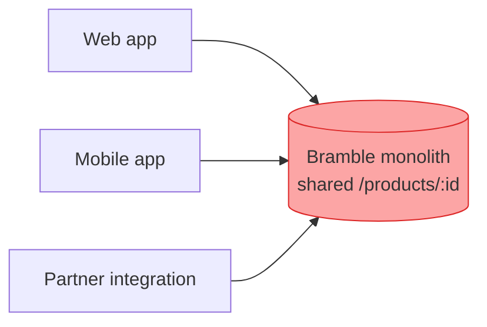
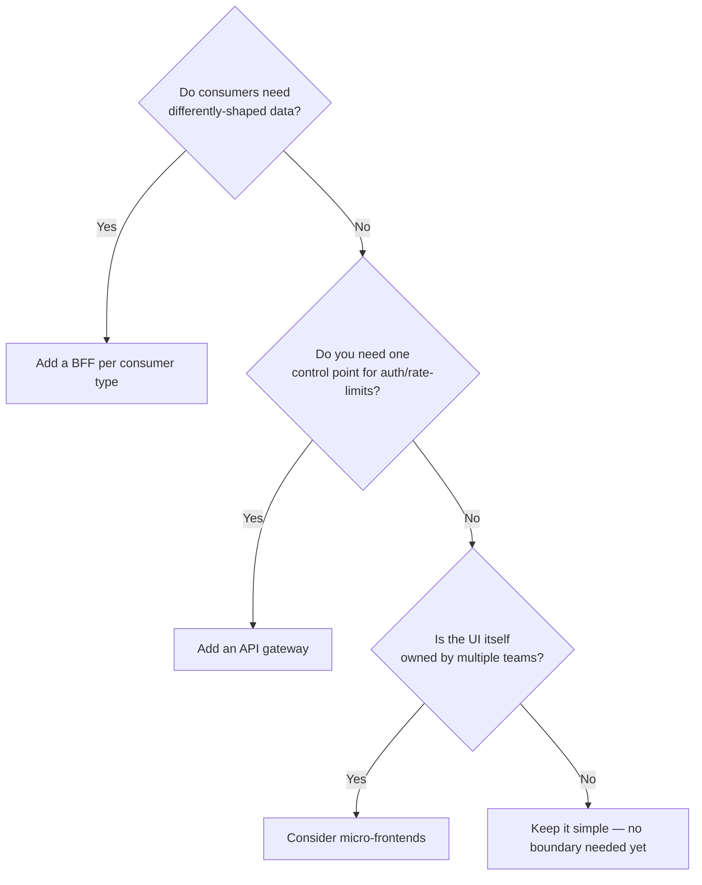

import Scenario from "../../../components/Scenario.astro";
import LevelIntro from "../../../components/LevelIntro.astro";

<Scenario label="The problem">
  <Fragment slot="facts">
    

      
🌐 <strong>Web team</strong> — adds a marketing field to `/products/:id` — homepage ships fine

      
📱 <strong>Mobile team</strong> — old app version can't parse the new shape — crash on launch

      
🤝 <strong>Partner integration</strong> — strict schema parser rejects the unrecognized field — orders silently stop

    

    

      
One endpoint, one deploy, three different outages

    

  </Fragment>

Bramble's storefront started as one backend with one API. `GET /products/:id`
served the web app fine for two years. Then Bramble shipped a mobile app, and
later signed a partner marketplace that resells Bramble's inventory — both
just pointed at the same endpoint, because it already existed and already
worked.

Then the web team added a `promoBadge` field to the product response, to
support a homepage banner. Nothing about the web app's own release changed
otherwise. That same night: the mobile app's older, still-widely-installed
version started crash-looping on the product screen, because its parser
assumed a fixed, closed set of fields. The partner integration's strict
schema validator rejected every response outright, because its contract
declared exactly which fields it accepted — and stopped forwarding orders
until someone noticed.

| Consumer   | What it needed from `/products/:id`  | What broke                     |
| ---------- | ------------------------------------ | ------------------------------ |
| Web app    | Rich, evolving product data          | Nothing — it made the change   |
| Mobile app | A small, stable, low-bandwidth shape | Crash on an unrecognized field |
| Partner    | An exact, versioned contract         | Orders silently stopped        |

**All three consumers hit the exact same endpoint, on the exact same day. Why did only one of them survive the change unscathed?**

</Scenario>

The web team never touched mobile's code or the partner's code. They only
changed a response shape that three unrelated consumers happened to share.
That's not a coding mistake — it's a missing **boundary**: nothing marked
where "this backend's internal concerns" ended and "a promise made to
someone else" began.

<LevelIntro
  items={[
    "Why one shared backend starts to collapse",
    "The core boundary patterns: BFF, gateway, contracts",
    "How micro-frontends extend the same idea to the UI",
  ]}
/>

## What is a "service boundary," and why does it matter here?

A service boundary is the line around a piece of a system where you promise
something stable to whoever depends on it, and everything inside that line
is free to change without asking permission. Bramble had no such line: web,
mobile, and the partner were all reaching straight into the same internal
data model, so a change made for one consumer's convenience was, in
practice, a change to everyone's contract.

Every arrow into that single box is a hidden coupling. Nobody decided that
mobile and the partner should be affected by a web-only feature — it just
fell out of all three sharing one undifferentiated surface.

## The core moves

- **Backend for Frontend (BFF)** — give each consumer type (web, mobile,
  partner) its own thin backend layer, shaped exactly for that consumer's
  needs, sitting in front of shared internal services. The web BFF can
  return a rich payload; the mobile BFF can return a lean one; neither
  affects the other.
- **API gateway** — a single entry point that routes, authenticates, rate-limits,
  and versions requests before they reach any backend — useful when you need
  one control point for cross-cutting concerns rather than per-consumer shaping.
- **Contracts and versioning** — an explicit, published shape (a schema, an
  API version, a changelog) that a consumer can rely on until it's
  deliberately deprecated — the opposite of "whatever the database currently
  returns."
- **Micro-frontends** — the same boundary idea applied to the UI layer: each
  product surface (web storefront, partner-embedded widget) is built and
  deployed by the team that owns it, instead of one frontend team owning
  every surface.
- **Bounded context** — the underlying idea borrowed from domain-driven
  design: a boundary isn't drawn around a technology, it's drawn around a
  meaning. "Product" can mean something different to checkout than it does
  to search, and boundaries let each mean the right thing locally.

## A quick decision map

- Key terms: service boundary, bounded context, Backend for Frontend (BFF),
  API gateway, contract, API versioning, breaking vs. non-breaking change,
  micro-frontend, shared kernel, coupling, blast radius.
- The underlying failure mode is always the same shape: a change made for
  one consumer's benefit leaks into another consumer's failure, because
  nothing marked where one consumer's concerns stopped and another's began.
- Boundaries are not free — a BFF or gateway is another service to run, on
  call for, and keep in sync. The point of L2 and L3 is deciding _when_
  that cost is worth paying, and how to build it without it becoming its
  own tangled mess.
