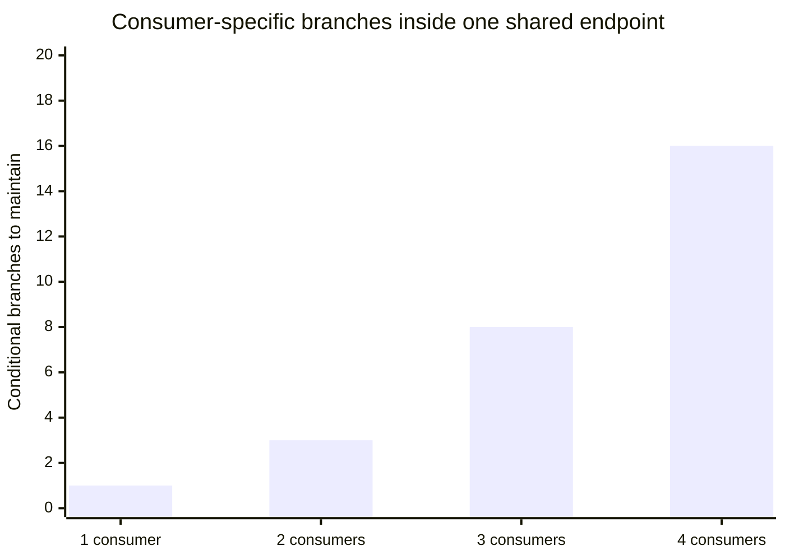
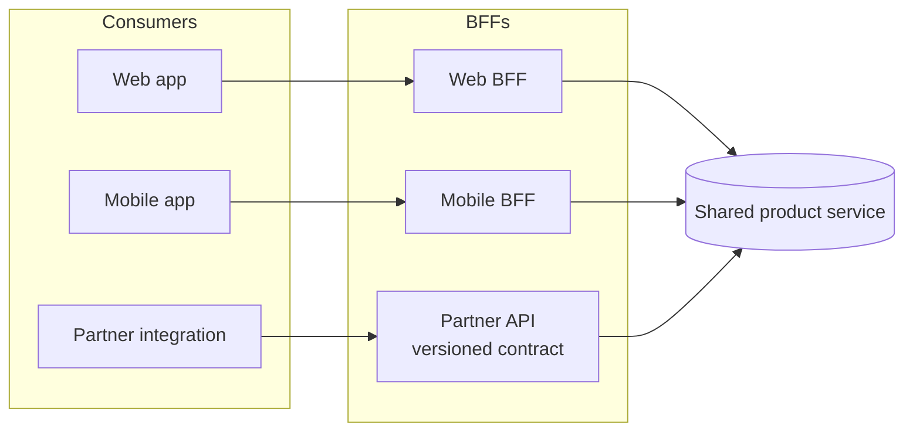

import Scenario from "../../../components/Scenario.astro";
import LevelIntro from "../../../components/LevelIntro.astro";
import Checkpoint from "../../../components/Checkpoint.astro";

<Scenario label="The problem">
  <Fragment slot="facts">
    

      
🌐 Web wants a <strong>rich</strong> payload — full description, reviews, related items

      
📱 Mobile wants a <strong>lean</strong> payload — small, stable, cellular-friendly

      
🤝 Partner wants a <strong>frozen</strong> payload — exact fields, versioned, no surprises

    

    

      
These three requirements actively conflict — no single response shape satisfies all three at once

    

  </Fragment>

After the `promoBadge` incident, Bramble's team tried the obvious fix: make
the shared endpoint smarter. Add an optional-field convention, tell mobile to
"just ignore unknown fields," ask the partner to relax their schema. Three
sprints later, the endpoint had seventeen optional fields, four of them
mobile-only, two of them partner-only, and a comment block explaining which
combinations were safe for which consumer. The fix for coupling had become a
second, harder-to-read form of coupling — one file now had to hold three
consumers' incompatible mental models at once.

**If "make the shared endpoint handle every case" makes things worse the more
consumers you add, what's the alternative that doesn't?**

</Scenario>

L1 named the symptom: one shared surface, three consumers, one consumer's
change breaks another. L2 works through _why_ patching the shared endpoint
doesn't scale, and what actually does.

<LevelIntro
  items={[
    "Why one smart endpoint doesn't scale with consumers",
    "The BFF and gateway patterns, and when each fits",
    "How micro-frontends carry the same idea to the UI",
  ]}
/>

## Why doesn't "just add more conditionals" scale?

Every consumer added to a single shared endpoint multiplies the number of
states that endpoint has to reason about, because consumer-specific logic
compounds instead of staying separate. With 1 consumer there's 1 shape to
maintain. With 3 consumers, each with a few consumer-specific fields, you
don't get 3 shapes — you get every _combination_ of which fields are
present, because nothing enforces that they stay independent.

That's the same shape as any other tightly-coupled system: the cost isn't
linear in the number of consumers, it's closer to combinatorial, because a
shared surface with per-consumer logic means every consumer's assumptions
have to coexist inside one codebase, one deploy, one on-call rotation.

<Checkpoint question="Bramble's team tried fixing the shared-endpoint problem by adding an 'ignore unknown fields' convention and a few consumer-specific optional fields. Why did this make the endpoint harder to maintain instead of easier, even though no single change looked wrong on its own?">

Each individual addition was small and reasonable in isolation, but none of
them removed the underlying cause: three consumers with incompatible needs
were still being served by one file, one team's review process, and one
deploy. The "ignore unknown fields" convention didn't stop unknown fields
from existing — it just meant nobody was forced to notice when a new field
quietly created a fourth case to reason about. The endpoint's complexity
kept climbing because the fix patched a symptom (crashes on unrecognized
fields) without touching the actual cause (no boundary separating what each
consumer is promised). Complexity that isn't drawn into a boundary doesn't
go away — it just spreads across whichever file is easiest to edit next.

</Checkpoint>

## The Backend for Frontend (BFF) pattern

A BFF is a thin backend service owned by (or built for) one consumer type,
sitting between that consumer and the shared internal services. Instead of
mobile, web, and the partner all calling the same `/products/:id`, each gets
its own tailored entry point that calls into the same underlying product
service and shapes the response for exactly its own needs.

Now a change made for web — like adding `promoBadge` — happens inside the
**web BFF's** response shaping, not inside the shared product service. Mobile
and the partner never see it unless their own BFF chooses to expose it. The
shared core service still holds one source of truth for what a product _is_;
the BFFs each hold their own answer to what a product _looks like from here_.

| Pattern                   | What it solves                                                | What it costs                                                         |
| ------------------------- | ------------------------------------------------------------- | --------------------------------------------------------------------- |
| BFF per consumer          | Each consumer gets exactly the shape it needs, independently  | One more service per consumer type to run, deploy, and staff          |
| API gateway               | One control point for auth, rate limits, routing, versioning  | A single choke point — its outage affects everyone routed through it  |
| Explicit contract/version | Consumers can rely on a shape until it's deliberately retired | Someone has to maintain old versions until consumers migrate off them |

An API gateway is a related but distinct move: instead of shaping data
per-consumer, it centralizes cross-cutting concerns — who's allowed in, how
many requests per minute, which version of the API a request is targeting —
in front of whatever backends (including BFFs) sit behind it. A gateway and
BFFs are not competitors; a mature setup often has both: the gateway handles
auth/rate-limiting/routing, and the BFFs behind it handle per-consumer
shaping.

## Contracts: the part that actually stopped the outage

A BFF only isolates _where_ consumer-specific logic lives — it doesn't by
itself stop a breaking change from reaching a consumer. That's the job of an
explicit **contract**: a published, versioned description of exactly what a
consumer can expect, changed only through a deliberate process (a new
version, a deprecation window), never silently.

- **Non-breaking change**: adding a new optional field, adding a new
  endpoint, loosening a validation rule. Existing consumers are unaffected
  if they ignore fields they don't recognize.
- **Breaking change**: removing or renaming a field, changing a field's
  type or meaning, tightening validation. These require a new version, a
  migration window, or both.
- The partner's contract in the earlier incident was strict specifically
  _because_ a partner integration usually can't be redeployed on your
  schedule — treat any external, slow-to-update consumer's contract as if
  breaking it will hurt for months, not minutes.

## Micro-frontends: the same idea, one layer up

Once the backend is split along consumer boundaries, the UI often faces the
same pressure: one frontend team owning the web storefront, the partner's
embeddable widget, and an internal admin tool all in one frontend codebase
hits the same combinatorial cost as one shared backend endpoint did. A
**micro-frontend** architecture lets each UI surface be owned, built, and
deployed independently, then composed together at runtime or build time.

| Integration style                  | How it composes                                               | Trade-off                                                                     |
| ---------------------------------- | ------------------------------------------------------------- | ----------------------------------------------------------------------------- |
| Build-time (npm package)           | Consuming app imports a published component library           | Simple, but every consumer redeploys to pick up a change                      |
| Runtime — iframe                   | Embed another team's page/app in an isolated frame            | Strong isolation, but styling/communication across the frame is awkward       |
| Runtime — module federation        | Independently deployed bundles loaded and composed at runtime | Independent deploys with shared runtime, but a bad remote can affect the host |
| Server-side composition (edge/SSI) | Assemble the page from fragments at the edge or server        | No client-side coordination needed, but adds a server hop                     |

None of these is universally "right" — the same decision-map instinct from
L1 applies: pick the integration style based on how independently the
owning teams need to deploy, and how much isolation a bad deploy on one side
needs to have from the rest of the page.

- Boundaries trade coupling for coordination cost — a BFF, a gateway, and a
  micro-frontend are all "add a service/build/deploy" decisions, never free.
- The right boundary line follows _who needs to change independently of
  whom_ — not team org chart, not technology choice.
- A contract is what actually protects a consumer from a breaking change;
  a BFF or gateway just decides _where_ that contract is enforced.
