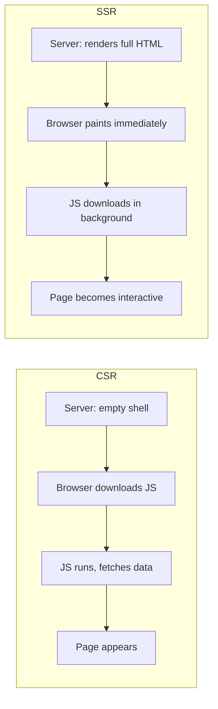
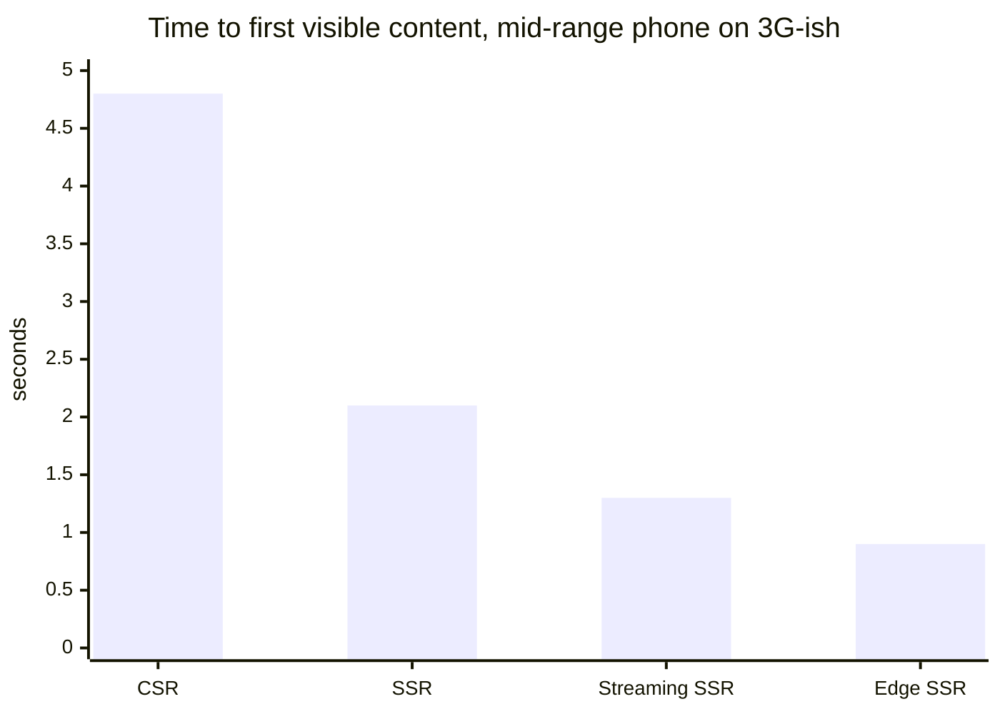

import Scenario from "../../../components/Scenario.astro";
import LevelIntro from "../../../components/LevelIntro.astro";

<Scenario label="The problem">
  <Fragment slot="facts">
    

      
📱 <strong>Device</strong> — a mid-range phone on a 3G-ish connection

      
📦 <strong>Store A</strong> — client-rendered: ships an empty `
` plus a JS bundle

      
📄 <strong>Store B</strong> — server-rendered: ships full HTML for the product page

    

    

      

        
Store A

        ~4.8s blank screen, then page
      

      

        
Store B

        ~1.1s to visible product
      

    

  </Fragment>

Two online stores sell the same sneakers. Store A is a single-page app: the
server sends `

` and a 400KB JavaScript bundle, and
nothing shows up until that bundle downloads, parses, executes, and fetches
the product data itself. Store B renders the product page's HTML on the
server and sends it already filled in.

| Store | What the server sends first | What the phone sees at 2 seconds  |
| ----- | --------------------------- | --------------------------------- |
| A     | Empty shell + JS bundle     | Still blank                       |
| B     | Fully rendered HTML         | Product, price, and photo visible |

**Both stores use the exact same framework and the exact same product data. Why does one make the shopper wait almost 4 seconds longer to see anything at all?**

</Scenario>

Store A made the browser do all the work before showing anything — download
code, run code, then ask for data. Store B did the heavy lifting once, on a
server with a fast connection and a fast CPU, and handed the phone a
finished page.

<LevelIntro
  items={[
    "CSR vs. SSR: where rendering happens",
    "Streaming and hydration, in one sentence each",
    "Why slow networks and devices make this matter more",
  ]}
/>

## Where does "rendering" actually happen?

- **Client-side rendering (CSR)**: the server sends a nearly empty HTML shell. The browser downloads JavaScript, runs it, and _that_ JavaScript builds the page — fetching data and creating DOM nodes only after it finishes executing.
- **Server-side rendering (SSR)**: the server runs the same component code ahead of time and sends back real, populated HTML. The browser can paint it immediately, before any JavaScript has even downloaded.
- **Static generation (SSG)**: a special case of SSR where the HTML is rendered once at build time instead of per-request — fastest possible response, but the content is only as fresh as the last build.
- **Edge rendering**: SSR, but the rendering server runs in a point-of-presence geographically close to the visitor instead of one central region — cuts the network round-trip that dominates "time to first byte" on a slow connection.

- **Time to first byte (TTFB)**: how long until the first byte of the response arrives — dominated by network round-trips and server work.
- **First contentful paint (FCP)**: when _something_ real appears on screen — this is what SSR mainly improves, since HTML paints without waiting for JS.
- **Time to interactive (TTI)**: when the page actually responds to clicks and taps — this needs JavaScript to have run, no matter how the HTML got there.
- Key terms: CSR, SSR, SSG, edge rendering, streaming, hydration, TTFB, FCP, TTI, waterfall.

## Streaming and hydration, in plain terms

Two techniques attack the "still had to wait" gap that plain SSR leaves behind:

- **Streaming SSR**: instead of waiting for the _entire_ page to finish rendering on the server before sending anything, the server sends HTML in chunks as each piece finishes — the header and above-the-fold content can reach the browser while a slow database query for a lower section is still running.
- **Hydration**: the process of attaching JavaScript event handlers and component state to server-rendered HTML that's already on the page, so `onClick` and friends start working. The HTML was already visible; hydration is what makes it _interactive_.

| Technique     | Solves                                             | Costs                                             |
| ------------- | -------------------------------------------------- | ------------------------------------------------- |
| Streaming SSR | Slow server-side data doesn't block the whole page | More complex server/framework support             |
| Hydration     | Turns static server HTML into an interactive app   | A window where the page looks ready but isn't yet |

## Why this matters more on slow networks and cheap devices

A fast office laptop on fiber barely notices the difference between CSR and
SSR — bundles download and CPUs parse JavaScript in a blink. The gap widens
enormously on a mid-range phone over a spotty connection, which is most of
the world's actual traffic: every extra round-trip and every megabyte of
JavaScript is paid for twice — once downloading it, once running it on a
slower CPU.

