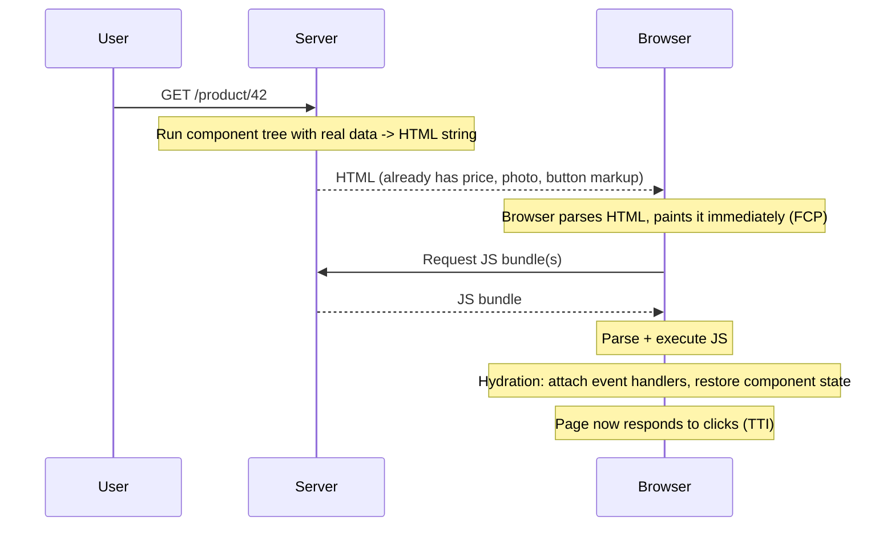
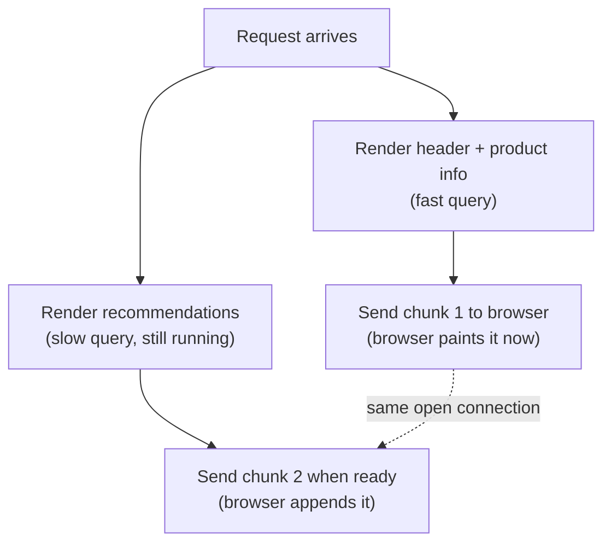

import Scenario from "../../../components/Scenario.astro";
import LevelIntro from "../../../components/LevelIntro.astro";
import Checkpoint from "../../../components/Checkpoint.astro";

<Scenario label="The problem">
  <Fragment slot="facts">
    

      
👀 Page looks fully loaded — text, buttons, price, all visible

      
👆 User taps "Add to cart" immediately

      
🚫 Nothing happens — handler not attached yet

    

    

      This gap is called the <strong>uncanny valley of hydration</strong>.
    

  </Fragment>

A shopper on a server-rendered page sees the full product page — photo,
price, an "Add to cart" button — at 1.1 seconds. They tap the button at 1.3
seconds, since it _looks_ ready. Nothing happens. The click is silently
dropped, because the JavaScript that would attach the click handler to that
button hasn't finished downloading and running yet.

**If the HTML was already on screen and correct, why didn't the click work?**

</Scenario>

L1 named CSR, SSR, streaming, and hydration as separate pieces. L2 connects
them into one pipeline and explains exactly why a page can look done before
it _is_ done.

<LevelIntro
  items={[
    "The full request-to-interactive pipeline",
    "Why HTML-visible and JS-interactive are different moments",
    "Streaming, islands, and resumability as different fixes for the same gap",
  ]}
/>

## What actually happens between request and "fully working page"?

The gap between "HTML painted" and "hydration finished" is exactly the
window where Store B's button looked clickable but wasn't. It isn't a bug in
any single piece — it's a structural consequence of doing rendering and
interactivity-wiring as two separate steps that can't both finish at time
zero.

<Checkpoint question="A page shows a fully-styled 'Add to cart' button 1 second after the request. A tap on it does nothing until 1.4 seconds. What actually happened in that 0.4-second gap, in terms of the pipeline above?">

The server had already sent complete HTML — the button's markup, styling,
and text were all real and already painted, which is why it looked
finished. What hadn't happened yet was hydration: the browser was still
downloading and executing the JavaScript bundle that attaches the actual
`onClick` handler and restores whatever component state that handler
depends on. The button existed as a DOM node the whole time; it just had no
event listener wired to it until hydration completed at 1.4 seconds. This is
the uncanny valley of hydration in miniature — visually done, functionally
not.

</Checkpoint>

## Why not just skip SSR and stay 100% client-rendered?

Because the render-heavy, slow-network case in this unit's problem statement
is exactly where CSR loses the most. If a page's _first_ paint requires
downloading and running JavaScript before any content exists, every extra
kilobyte of bundle and every extra millisecond of network latency directly
delays the moment a user sees anything. SSR moves that first paint earlier
by doing the rendering work once, server-side, on hardware and a connection
the visitor doesn't have to supply.

But SSR alone reintroduces a different problem: a slow _database query_ on
the server now blocks the _entire_ HTML response, because a traditional SSR
implementation renders the whole page as one string and can't send any of
it until every piece — including the slowest one — is ready.

| Approach      | First paint blocked by                    | Interactivity blocked by                   |
| ------------- | ----------------------------------------- | ------------------------------------------ |
| CSR           | JS bundle download + execute + data fetch | Same as first paint — they happen together |
| Plain SSR     | Slowest data dependency on the whole page | JS bundle download + execute (hydration)   |
| Streaming SSR | Only the slowest _above-the-fold_ piece   | JS bundle download + execute (hydration)   |

## Streaming: sending HTML before the whole page is ready

Streaming SSR changes the server from "render everything, then send one
response" to "send finished chunks as they finish, keep the connection
open." A page with a fast header and a slow recommendations section can ship
the header immediately and backfill the recommendations a moment later —
using a real HTTP mechanism (chunked transfer encoding, or the ordering a
framework like React's `renderToPipeableStream` provides) rather than a
second round-trip.

## Hydration strategies: not every page needs the same fix

Full hydration re-runs the entire component tree client-side to attach
every handler, even for parts of the page that are pure static content and
never change. Two alternative strategies target this waste directly:

- **Partial hydration / islands architecture**: only the components that are actually interactive (a cart button, a carousel) ship JS and get hydrated; static content (an article body, a footer) stays as plain HTML forever, with zero JS cost.
- **Resumability** (the model Qwik popularized): instead of _re-running_ component logic client-side to rebuild state and attach listeners, the server serializes exactly what would be needed to resume — event listeners are attached lazily, only when a user actually interacts with that specific element, so there's no big up-front hydration pass at all.

<Checkpoint question="An article page has one interactive 'like' button and 3,000 words of static text. Under full hydration vs. an islands architecture, what's different about the JavaScript sent to the browser?">

Under full hydration, the framework treats the entire page as one component
tree that must be hydrated together — so the 3,000 words of static text get
wrapped in the same client-side rendering logic as the like button, and all
of it ships JavaScript and gets walked during hydration even though the
text never changes and has no event handlers of its own. Under an islands
architecture, the build step identifies the like button as the only
genuinely interactive "island" on the page; the surrounding article text is
emitted as plain static HTML with no client-side component wrapping at all.
The browser downloads and hydrates only the button's small chunk of JS,
not a JavaScript representation of the entire article. The visible result
looks identical — same text, same button — but the islands version ships
and executes a small fraction of the JavaScript.

</Checkpoint>

## Edge rendering: attacking the network leg, not the render leg

Everything above assumes the rendering server and the browser are talking
over some network distance. Edge rendering doesn't change _how_ rendering
works — it changes _where_ the SSR server physically runs, deploying it to
many points-of-presence close to users instead of one central region, so
the round-trip that dominates TTFB on a slow or geographically distant
connection shrinks from hundreds of milliseconds to tens.

- Edge rendering pairs naturally with streaming (send the fast first chunk from a nearby edge node immediately) and with SSG (serve a cached static page from the edge with zero render cost at all, falling back to on-demand SSR only for pages that changed).
- It doesn't help hydration cost at all — a smaller round-trip to fetch a large JS bundle is still a large JS bundle to parse and execute on a slow CPU. Edge rendering and partial hydration solve two different halves of the same problem statement (network _and_ device).
