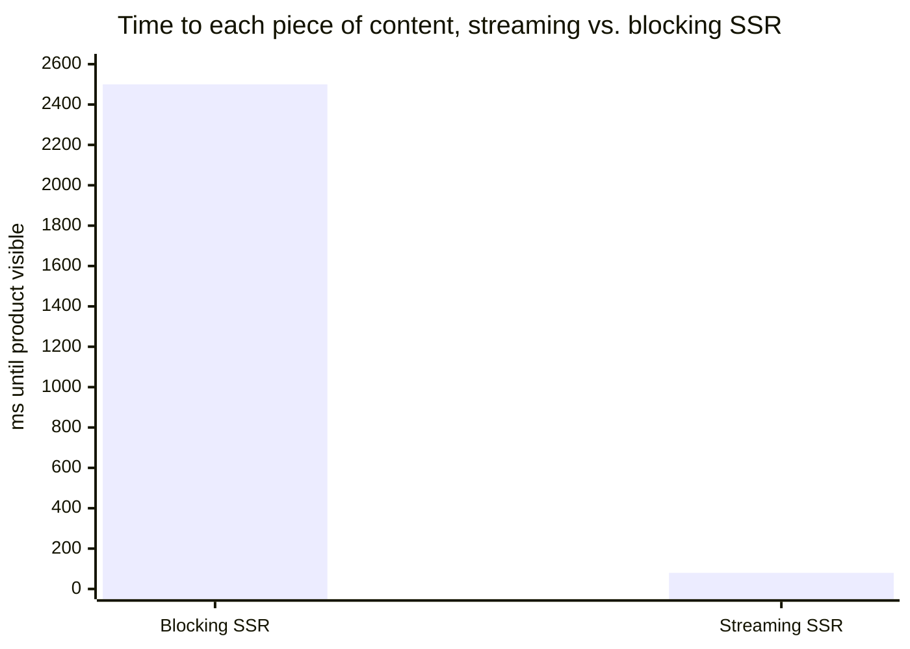

import Scenario from "../../../components/Scenario.astro";
import LevelIntro from "../../../components/LevelIntro.astro";
import Checkpoint from "../../../components/Checkpoint.astro";

<Scenario label="The problem">
  <Fragment slot="facts">
    <div class="not-prose flex flex-col gap-2 text-sm text-slate-700 dark:text-slate-300">
      <div class="flex items-center gap-1.5"><span>🐢</span> Recommendations query takes 2.5s (personalization lookup)</div>
      <div class="flex items-center gap-1.5"><span>⚡</span> Product info query takes 80ms</div>
      <div class="flex items-center gap-1.5"><span>❓</span> A plain SSR server renders one HTML string, then sends it</div>
    </div>
    <div class="not-prose mt-3 rounded border border-rose-300 bg-rose-50 p-2 text-xs dark:border-rose-800 dark:bg-rose-950">
      Result: every visitor waits <strong>2.5s</strong> for a page that was 80% ready in 80ms.
    </div>

  </Fragment>

A reviewer on your team pushes back on a PR: "this SSR handler awaits every
data dependency before calling `res.end()` — so the fast 80ms product query
gets held hostage by the slow 2.5s recommendations query, and the whole page
is exactly as slow as its slowest part." They're right, and the fix isn't
"make the query faster" — the query is inherently slow (an ML personalization
service). **How do you architect the response itself so a slow dependency
doesn't block a fast one, without an extra round-trip?**

</Scenario>

<LevelIntro
  items={[
    "A raw streaming SSR server, no framework",
    "A minimal islands-hydration runtime, from scratch",
    "Four real failure modes: waterfalls, mismatches, backpressure, and over-hydration",
  ]}
/>

## Building streaming SSR with nothing but Node's `http` module

Before reaching for a framework's `renderToPipeableStream`, it's worth
proving the mechanism is just HTTP chunked transfer encoding — no special
magic, just writing to the response multiple times instead of once:

```js
// stream-ssr.mjs — run with `bun run stream-ssr.mjs` or `node stream-ssr.mjs`
import { createServer } from "node:http";

function renderHeader() {
  return `<html><head><title>Sneakers</title></head><body>`;
}

function renderFooter() {
  return `</body></html>`;
}

// Simulates a fast query (product info) and a slow one (recommendations).
function fetchProduct() {
  return Promise.resolve({ name: "Trail Runner 3", price: 129 });
}

function fetchRecommendations() {
  return new Promise((resolve) =>
    setTimeout(() => resolve(["Trail Runner 2", "Wool Socks"]), 2500),
  );
}

const server = createServer(async (req, res) => {
  res.writeHead(200, {
    "Content-Type": "text/html; charset=utf-8",
    // Chunked transfer is the default for HTTP/1.1 once Content-Length is
    // omitted — the browser starts rendering each chunk as it arrives.
  });

  // Chunk 1: shell + fast data, flushed immediately.
  res.write(renderHeader());
  const product = await fetchProduct();
  res.write(`<h1>${product.name}</h1><p>$${product.price}</p>`);
  res.write(`<section id="recs">Loading recommendations…</section>`);

  // Chunk 2: slow data, sent whenever it's actually ready — the connection
  // stays open the whole time, so this is one response, not two requests.
  const recs = await fetchRecommendations();
  res.write(
    `<script>document.getElementById("recs").outerHTML =
      ${JSON.stringify(`<section id="recs"><ul>${recs.map((r) => `<li>${r}</li>`).join("")}</ul></section>`)};
    </script>`,
  );

  res.write(renderFooter());
  res.end();
});

server.listen(3000);
```

The visitor's browser paints the header, product name, and price within
~80ms of the response starting — well before `res.end()` is ever called.
The `<script>` chunk that backfills the recommendations arrives 2.5 seconds
later over the _same_ connection, and the browser executes it as it streams
in. No polling, no second request, no client-side loading spinner wired up
by hand — the server pushed the update itself.



<Checkpoint question="In the streaming server above, what would happen to the product name and price's paint time if `fetchProduct()` were changed to also take 2.5 seconds, while `fetchRecommendations()` stayed fast?">

Streaming SSR only helps a piece of content whose _own_ chunk isn't blocked
on something slow — it doesn't make an individual dependency faster, it
just stops one slow dependency from blocking chunks that don't depend on
it. In this rewritten scenario, the product name and price chunk is written
right after `await fetchProduct()`, so if that call now takes 2.5 seconds,
the header would still flush immediately (it has no data dependency), but
the product name and price would be delayed exactly as much as they were
in the original blocking-SSR version — because the code as written still
`await`s `fetchProduct()` before writing that chunk. The general lesson: the
order dependencies are awaited and flushed in the code determines which
pieces get the streaming benefit; reordering which query happens to be slow
does not automatically reorder the flush sequence unless the code is
restructured (e.g. kicking off both fetches concurrently and flushing
whichever resolves first).

</Checkpoint>

## Building a minimal islands-hydration runtime

L2 explained islands architecture conceptually. Here's a working, dependency-free
version: the server marks interactive regions with a `data-island` attribute
and embeds their initial state as JSON; the client only hydrates those
regions, ignoring the rest of the page entirely.

```js
// islands.mjs — server-side rendering with island markers
function renderLikeButton(id, initialLikes) {
  const state = JSON.stringify({ likes: initialLikes });
  return `<button data-island="like-button" data-state='${state}' id="${id}">
    ❤️ ${initialLikes}
  </button>`;
}

function renderArticlePage() {
  // 3000 words of static prose — deliberately NOT wrapped in any island
  // marker, so the client-side runtime below never touches it.
  const staticBody = `<article><p>...long static article text...</p></article>`;
  return `<html><body>
    ${staticBody}
    ${renderLikeButton("like-1", 42)}
  </body></html>`;
}
```

```js
// hydrate.mjs — client-side runtime, ships as the ONLY JS for this page
const ISLAND_HANDLERS = {
  "like-button": (el, state) => {
    el.addEventListener("click", () => {
      state.likes += 1;
      el.textContent = `❤️ ${state.likes}`;
    });
  },
};

function hydrateIslands(root) {
  const islands = root.querySelectorAll("[data-island]");
  let hydrated = 0;
  for (const el of islands) {
    const kind = el.dataset.island;
    const handler = ISLAND_HANDLERS[kind];
    if (!handler) continue;
    const state = JSON.parse(el.dataset.state || "{}");
    handler(el, state);
    hydrated += 1;
  }
  return hydrated; // only ever equals the number of islands, never article length
}

hydrateIslands(document);
```

The article's 3,000 words never appear in `ISLAND_HANDLERS`, never get
parsed into a component tree client-side, and cost zero bytes of
hydration-time JavaScript beyond what it took to display as plain HTML.
`hydrateIslands` walks exactly as many nodes as there are `data-island`
markers — one, in this example — regardless of how long the surrounding
article is.

## Four real failure modes

**1. Waterfalls hiding inside "parallel" code.** The naive fix for the
streaming example's `Checkpoint` — awaiting two things back to back — looks
harmless but silently serializes independent work:

```js
// BAD: fetchB doesn't start until fetchA finishes, even though B doesn't need A's result
const a = await fetchA();
const b = await fetchB();

// GOOD: both requests are in flight at the same time
const [a, b] = await Promise.all([fetchA(), fetchB()]);
```

On a page with several independent data sources, this mistake alone can
turn a 300ms total wait (the slowest single call) into an 900ms one (the
sum of all three) — indistinguishable from a genuinely slow backend unless
you've profiled the actual request timeline.

**2. Hydration mismatches.** If the server-rendered HTML and the
client's first render disagree — most commonly because server code used
`Date.now()`, `Math.random()`, or a browser-only API like `window` that
doesn't exist during SSR — the framework either throws a hydration error or
silently discards the server HTML and re-renders from scratch client-side,
which erases the entire point of SSR for that subtree.

```js
// BAD: renders differently on the server (no `window`) than on the client
function Greeting() {
  const isMobile = typeof window !== "undefined" && window.innerWidth < 600;
  return isMobile ? <p>Hi!</p> : <p>Welcome!</p>;
}

// GOOD: render the same thing both times; adjust after hydration if needed
function Greeting() {
  const [isMobile, setIsMobile] = useState(false); // matches server: always false first
  useEffect(() => setIsMobile(window.innerWidth < 600), []);
  return isMobile ? <p>Hi!</p> : <p>Welcome!</p>;
}
```

**3. Backpressure on slow clients.** A streaming server that calls
`res.write()` faster than a slow client can drain the socket buffers
everything in server memory — the exact opposite of the point of streaming.
`res.write()` returns `false` when the internal buffer is full; ignoring
that return value under real traffic (many concurrent slow mobile clients)
is how a single popular page can exhaust server memory:

```js
function writeSafely(res, chunk) {
  const ok = res.write(chunk);
  if (!ok) {
    // Real code would pause upstream data production here and resume
    // on the 'drain' event — shown simplified for the failure mode itself.
    return new Promise((resolve) => res.once("drain", resolve));
  }
  return Promise.resolve();
}
```

**4. Over-hydration by default.** Most SSR frameworks hydrate the entire
tree unless a unit explicitly opts into partial hydration or islands — so a
page built with SSR alone, but no further optimization, ships and executes
just as much JavaScript as a pure CSR page. SSR fixes _first paint_; it does
nothing for _time to interactive_ unless paired with one of L2's hydration
strategies.

<Checkpoint question="A teammate says 'we migrated our whole app to SSR, so it's fast now on mobile.' Based on failure mode 4, what's the gap in that claim?">

SSR by itself only changes when the browser can _paint_ content — it moves
first contentful paint earlier because real HTML arrives instead of an
empty shell. It says nothing about _time to interactive_ unless the team
also adopted a strategy like partial hydration or islands: without that,
the exact same JavaScript bundle that a CSR version would have shipped
still has to download, parse, and execute before any button, form, or
interactive widget responds to a tap — full hydration walks the entire
component tree regardless of how the initial HTML was produced. So the
teammate's claim is half right: the page looks done sooner, but "fast on
mobile" implies clicks and taps work sooner too, and that half of the
problem is untouched by SSR alone. The honest version of the claim is "our
first paint improved; our time to interactive is exactly what it was
before, until we add islands or a similar strategy."

</Checkpoint>

## Choosing a strategy for a real page

| Situation                                                 | Reasonable default                                                                                               |
| --------------------------------------------------------- | ---------------------------------------------------------------------------------------------------------------- |
| Content rarely changes (marketing page, docs)             | SSG — render once at build time, serve from a CDN                                                                |
| Content is personalized/live but has a slow dependency    | Streaming SSR — flush fast pieces immediately                                                                    |
| Page is mostly static text with a few interactive widgets | Islands / partial hydration                                                                                      |
| Global audience, latency-sensitive TTFB                   | Edge rendering, ideally paired with streaming                                                                    |
| Highly dynamic dashboard, always logged in                | CSR may be the right trade-off — SSR's first-paint win matters less if the page requires a login redirect anyway |

These aren't mutually exclusive — a real production site typically
layers several: SSG for the marketing pages, edge-rendered streaming SSR
for the product pages, and islands for the interactive widgets embedded in
otherwise-static content. What would change about this table for a page
whose main audience is on desktop broadband instead of mobile 3G — does the
same strategy still win, or does the calculus shift toward simpler CSR
once network and device stop being the bottleneck?
