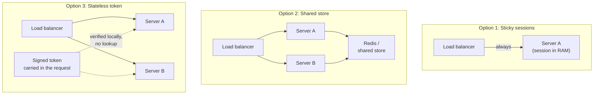
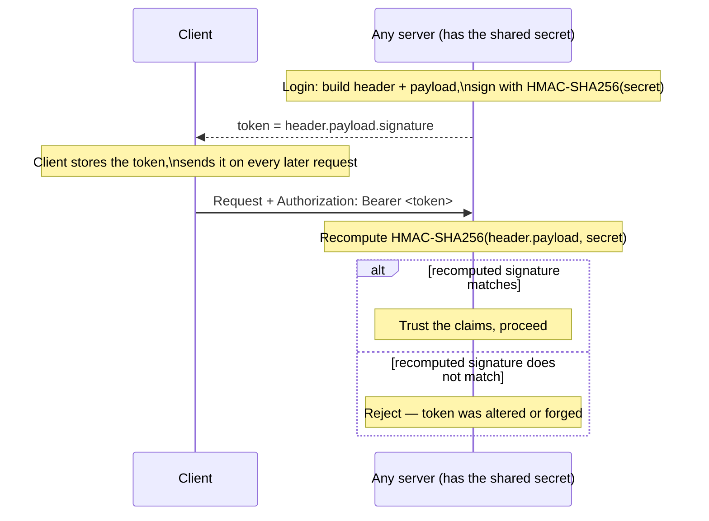

import Scenario from "../../../components/Scenario.astro";
import LevelIntro from "../../../components/LevelIntro.astro";
import Checkpoint from "../../../components/Checkpoint.astro";

<Scenario label="The problem">
  <Fragment slot="facts">
    

      
📈 Autoscaler adds/removes servers every few minutes based on traffic

      
🔒 "Sticky sessions" was proposed to pin a user to one server

    

    

      
The catch

      Every time the autoscaler removes "your" server, you're logged out anyway
    

  </Fragment>

Your team just picked up the L1 problem: login sessions break when a load
balancer sends requests to different servers. Someone proposes **sticky
sessions** — configure the load balancer to always send a given user back to
the same server. It sounds like a fix. Then someone else points out the app
autoscales aggressively, spinning servers up and down every few minutes to
match traffic.

**If the server a user is "stuck" to gets removed by the autoscaler, does sticky sessions still solve anything?**

</Scenario>

No — it just narrows the window. Sticky sessions don't make a server
remember a user any more reliably; they only make sure the _same_ fragile
server keeps getting asked. The autoscaler doesn't know or care about sticky
routing, so it can remove that server mid-session and the user is logged out
exactly as before, just less often.

<LevelIntro
  items={[
    "Three architectures for surviving multiple servers",
    "How JWT verification works without a database call",
    "Why a JWT's claims can be read but not silently changed",
  ]}
/>

## What are the actual options, mechanically?

There are exactly three shapes an auth system can take once there's more
than one server involved: pin the user to a server, centralize the session
data, or stop storing session data on the server at all.

| Approach              | Where session data lives            | Survives a server being removed? | Extra cost per request              |
| --------------------- | ----------------------------------- | -------------------------------- | ----------------------------------- |
| Sticky sessions       | One specific server's RAM           | No — dies with that server       | None, until it breaks               |
| Shared store (Redis)  | One shared, external store          | Yes                              | A network round trip to look it up  |
| Stateless token (JWT) | Nowhere — it travels in the request | Yes, by construction             | A signature check (CPU, no network) |

Only the third option removes the server-side dependency entirely — which is
exactly what "stateless" means here: no server anywhere has to remember
anything about a specific user between requests.

<Checkpoint question="A shared Redis session store also lets any server recognize any user, same as a JWT. So why is Redis-backed auth still called 'stateful' while JWT auth is called 'stateless'?">

Statelessness is about where the state _lives_, not about whether multiple
servers can access it. A Redis-backed session still keeps the session record
on a server-side system — Redis is a server, just a shared one — so the
architecture as a whole still has a stateful component that can go down, get
slow under load, or need scaling of its own. A JWT carries the state inside
the request itself; there is no server-side store to keep available at all.
That's the actual axis: "does _any_ server, anywhere, have to remember you,"
not "can more than one server recognize you."

</Checkpoint>

## How does a server verify a JWT without asking a database?

The header and payload are just base64url text — trivial to read, and just
as trivial to _edit_. The signature is the part that makes tampering
detectable, and it's computed with a secret only the issuing server(s) know.

Verification is pure computation: take the header and payload exactly as
received, recompute the signature with the same secret and algorithm, and
compare. No network call, no shared store, no coordination with any other
server — which is exactly why this scales to any number of servers with zero
added infrastructure.

<Checkpoint question="An attacker intercepts a valid JWT and edits the payload's role claim from 'user' to 'admin' before decoding — then sends the modified token. Does the server accept it?">

No. Editing the payload changes the bytes that get fed into the signature
recomputation, so the signature the server recomputes from the tampered
header+payload will not match the signature the attacker left unchanged in
the token. The verification step fails and the server rejects the token
outright — the attacker would need the signing secret itself to produce a
signature that matches their edited payload, and that secret never leaves
the server.

</Checkpoint>

## What's actually inside the claims, and who can set them?

Claims are just JSON fields the _issuing_ server chooses to put in at login
time — nothing forces any particular set. A few are conventional enough to
have reserved names:

| Claim                   | Meaning                                   | Set by                                   |
| ----------------------- | ----------------------------------------- | ---------------------------------------- |
| `sub`                   | Subject — the user ID this token is about | Server, at issue time                    |
| `iat`                   | Issued-at timestamp                       | Server, at issue time                    |
| `exp`                   | Expiry timestamp — reject after this      | Server, at issue time                    |
| `role`, `tenantId`, ... | App-specific data                         | Server, at issue time — never the client |

The client never gets to choose what goes into a token it's handed — it only
carries it. That's the load-bearing difference between "the client can read
this" (true, it's just base64) and "the client can influence this" (false,
as long as the server always verifies the signature before trusting anything
it decodes).

## Why can't a JWT just be revoked the way a session can?

A shared session store can delete a session record on demand — the very
next lookup fails, and the user is logged out immediately. A JWT has no
record to delete: the server doesn't store it anywhere, so "revoke this
token" has nothing to act on. The token stays valid, to any server that
checks it, until its own `exp` claim says otherwise. This is the real
trade-off stateless auth makes — instant logout/revocation for cheap,
zero-lookup verification — and L3 covers the two practical mitigations
(short expiry + refresh tokens, and a small denylist) in depth.
