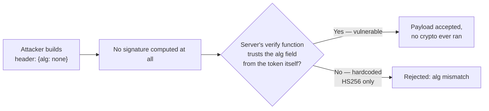
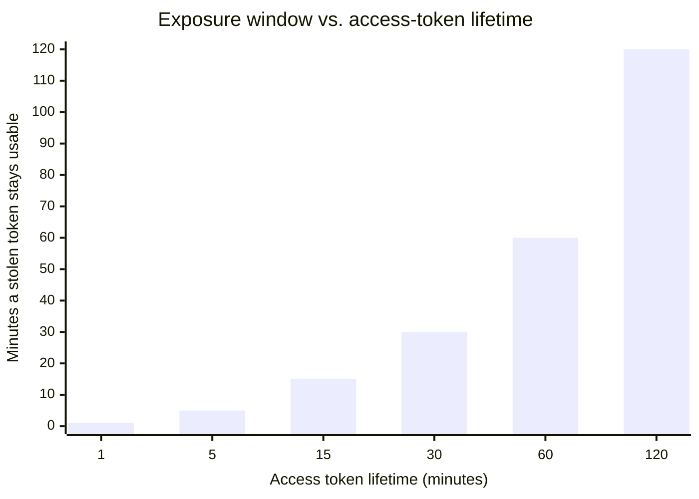

import Scenario from "../../../components/Scenario.astro";
import LevelIntro from "../../../components/LevelIntro.astro";
import Checkpoint from "../../../components/Checkpoint.astro";

<Scenario label="The problem">
  <Fragment slot="facts">
    <div class="not-prose flex flex-col gap-2 text-sm text-slate-700 dark:text-slate-300">
      <div class="flex items-center gap-1.5"><span>📝</span> PR under review: a new <code>verifyToken()</code> helper</div>
      <div class="flex items-center gap-1.5"><span>🔍</span> It calls <code>JSON.parse(atob(payload))</code> and trusts the result</div>
    </div>
    <div class="not-prose mt-3 rounded border border-rose-300 bg-rose-50 p-1.5 text-xs dark:border-rose-800 dark:bg-rose-950">
      <p class="font-semibold text-rose-600 dark:text-rose-400">What's missing</p>
      No call to any signature-checking function, anywhere in the diff
    </div>

  </Fragment>

You're reviewing a teammate's PR. It adds login via JWT, and the middleware
that protects private routes looks like this:

```js
function verifyToken(token) {
  const [, payloadB64] = token.split(".");
  const payload = JSON.parse(atob(payloadB64));
  return payload; // used directly to authorize the request
}
```

It passes every manual test the author tried — valid tokens decode and the
right user shows up. **What request would break this, and what would it let an attacker do?**

</Scenario>

Any request at all — this function never checks the signature, so it will
happily decode a token whose payload was hand-edited or entirely made up, as
long as it's valid base64url JSON. An attacker doesn't need to steal a valid
token; they can construct `header.payload.anything`, set `role: "admin"` in
the payload themselves, and this function returns it unquestioned. This
level builds a correct implementation from scratch specifically so this bug
becomes impossible to write by accident.

<LevelIntro
  items={[
    "A real HMAC-signed JWT: encode, sign, verify, from scratch",
    "The exact attacks that skipping signature verification enables",
    "Revocation, refresh tokens, and where to store a token client-side",
  ]}
/>

## Building a real, minimal JWT (HS256)

This uses the Web Crypto API's `crypto.subtle`, which is available in
browsers, Node, Bun, and — importantly for the exercises in this unit — Web
Workers. No external JWT library; the whole point is to see exactly what
"sign" and "verify" mean.

```js
// jwt.mjs — a minimal HS256 JWT implementation

function base64urlEncode(bytes) {
  let binary = "";
  for (const byte of bytes) binary += String.fromCharCode(byte);
  return btoa(binary)
    .replace(/\+/g, "-")
    .replace(/\//g, "_")
    .replace(/=+$/, "");
}

function base64urlDecode(str) {
  const padded = str.replace(/-/g, "+").replace(/_/g, "/");
  const binary = atob(padded + "===".slice((padded.length + 3) % 4));
  return Uint8Array.from(binary, (c) => c.charCodeAt(0));
}

function encodeJSON(obj) {
  return base64urlEncode(new TextEncoder().encode(JSON.stringify(obj)));
}

async function importHmacKey(secret) {
  return crypto.subtle.importKey(
    "raw",
    new TextEncoder().encode(secret),
    { name: "HMAC", hash: "SHA-256" },
    false,
    ["sign", "verify"],
  );
}

export async function signJwt(payload, secret) {
  const header = { alg: "HS256", typ: "JWT" };
  const headerPart = encodeJSON(header);
  const payloadPart = encodeJSON(payload);
  const signingInput = `${headerPart}.${payloadPart}`;

  const key = await importHmacKey(secret);
  const signatureBytes = new Uint8Array(
    await crypto.subtle.sign(
      "HMAC",
      key,
      new TextEncoder().encode(signingInput),
    ),
  );
  const signaturePart = base64urlEncode(signatureBytes);

  return `${signingInput}.${signaturePart}`;
}

export async function verifyJwt(token, secret) {
  const parts = token.split(".");
  if (parts.length !== 3) throw new Error("malformed token");
  const [headerPart, payloadPart, signaturePart] = parts;

  const key = await importHmacKey(secret);
  const signingInput = new TextEncoder().encode(`${headerPart}.${payloadPart}`);
  const signatureBytes = base64urlDecode(signaturePart);

  const valid = await crypto.subtle.verify(
    "HMAC",
    key,
    signatureBytes,
    signingInput,
  );
  if (!valid) throw new Error("invalid signature");

  const payload = JSON.parse(
    new TextDecoder().decode(base64urlDecode(payloadPart)),
  );
  if (typeof payload.exp === "number" && Date.now() / 1000 > payload.exp) {
    throw new Error("token expired");
  }
  return payload;
}
```

Two details that are easy to get wrong and both matter: `crypto.subtle.verify`
does the byte-for-byte signature comparison internally (never write your own
`===` comparison of signatures — that reintroduces timing side-channels),
and `exp` is checked only _after_ the signature is confirmed valid — checking
claims before verifying the signature means trusting attacker-controlled data.

<Checkpoint question="In verifyJwt above, what would go wrong if the exp check ran before crypto.subtle.verify instead of after?">

An attacker who forges a token with no expiry, or a far-future `exp`, would
sail through the expiry check — and if the function returned there without
ever reaching signature verification (or if a bug short-circuited on any
early success), a completely unsigned forgery could be treated as valid.
More subtly, even if verification still ran afterward, checking claims
first establishes a habit of treating unverified payload data as
meaningful before the one check that determines whether it can be trusted
at all — the fix isn't just "check exp after," it's "never branch on
anything from the payload until `crypto.subtle.verify` has returned true."

</Checkpoint>

## What does the reviewer's buggy version actually let an attacker do?

Run both versions against the same forged token to see the gap directly:

```js
import { signJwt, verifyJwt } from "./jwt.mjs";

function buggyVerifyToken(token) {
  const [, payloadB64] = token.split(".");
  return JSON.parse(atob(payloadB64.replace(/-/g, "+").replace(/_/g, "/")));
}

const secret = "server-only-secret";
const legit = await signJwt({ sub: "user_42", role: "user" }, secret);

// Attacker builds their own token — no secret required, since nothing
// downstream is checking the signature.
const forgedPayload = btoa(JSON.stringify({ sub: "user_42", role: "admin" }))
  .replace(/\+/g, "-")
  .replace(/\//g, "_")
  .replace(/=+$/, "");
const forged = `eyJhbGciOiJIUzI1NiJ9.${forgedPayload}.anything`;

console.log("buggy accepts forged token:", buggyVerifyToken(forged)); // { sub: "user_42", role: "admin" }
await verifyJwt(forged, secret).catch((e) =>
  console.log("correct version rejects it:", e.message),
);
```

`buggyVerifyToken` returns `{ role: "admin" }` from a token the server never
issued and never signed — privilege escalation with zero access to the
secret. `verifyJwt` throws `invalid signature`, because recomputing the HMAC
over the forged header+payload with the real secret produces a signature
that doesn't match the attacker's made-up `anything`.

## What about `alg: none`?

A second, subtler variant of the same bug: some JWT libraries historically
trusted the `alg` field _inside the token_ to decide how to verify it. If an
attacker sets `"alg": "none"` in the header and strips the signature
entirely, a library that blindly honors the token's own claimed algorithm
will skip verification altogether.



The fix is structural, not a patch: never let the token choose its own
verification algorithm. `verifyJwt` above hardcodes `"HMAC"` and `"SHA-256"`
in `importHmacKey` and the `crypto.subtle.verify` call — the token's header
is decoded for display/debugging only, never fed into a decision about which
algorithm to use.

## The trade-off L2 flagged: revocation

A signed token stays valid until `exp`, full stop — there's no server-side
record to delete. Two mitigations are standard, and most real systems use
both together:

| Strategy                                 | Mechanism                                                                                                                                                       | What it costs                                                                                              |
| ---------------------------------------- | --------------------------------------------------------------------------------------------------------------------------------------------------------------- | ---------------------------------------------------------------------------------------------------------- |
| Short-lived access token + refresh token | Access token expires in minutes; a longer-lived refresh token (stored more carefully, checked against a server-side record) is exchanged for a new access token | Reintroduces one server-side lookup, but only on refresh, not every request                                |
| Denylist                                 | Server keeps a small, short-lived list of revoked token IDs (`jti` claim), checked on verify                                                                    | A lookup returns on every request — smaller and shorter-lived than a full session store, but not zero-cost |



A shorter access-token lifetime shrinks the window a stolen token is useful
for — at the cost of more frequent refresh calls. This exact relationship is
explorable below.

## Where should the token live in the browser?

The last practical decision: `localStorage` or an `httpOnly` cookie.

| Storage           | Reachable by JavaScript (XSS risk)?                  | Sent automatically on every request (CSRF risk)?                                |
| ----------------- | ---------------------------------------------------- | ------------------------------------------------------------------------------- |
| `localStorage`    | Yes — any injected script can read and exfiltrate it | No — code must attach it explicitly, e.g. `Authorization` header                |
| `httpOnly` cookie | No — invisible to JavaScript entirely                | Yes — needs CSRF defenses (`SameSite`, CSRF tokens) if the app is browser-based |

Neither option is free of risk; they trade one class of attack for another.
An `httpOnly` cookie is generally preferred for browser-based apps because
XSS (a single injected `<script>` tag) is a more common real-world failure
than a well-defended CSRF setup, but a public API consumed by non-browser
clients (mobile apps, other services) has no cookies to send at all and
uses the `Authorization: Bearer <token>` header with `localStorage` or
secure native storage instead. The right choice depends on who the client
is, not a universal rule.

The interactive demo below lets you explore the size side of this: every
claim added to the payload grows the token, and a bigger token is a bigger
cookie or header to send on _every single request_ — worth knowing before
reflexively stuffing a user's full profile into the claims just because
it's convenient. What would the byte cost look like if, instead of adding
individual role claims, you added an array of twenty permission strings
in one shot?
