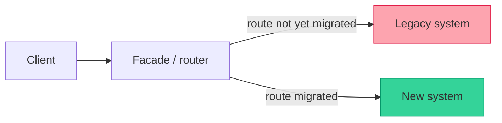
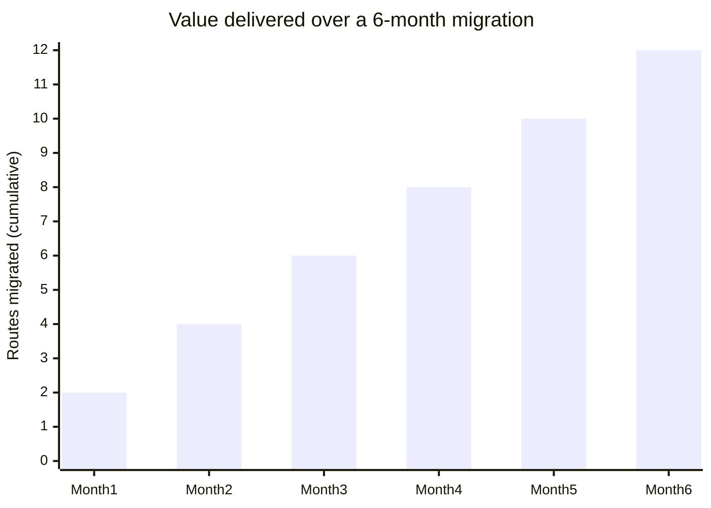

import Scenario from "../../../components/Scenario.astro";
import LevelIntro from "../../../components/LevelIntro.astro";

<Scenario label="The problem">
  <Fragment slot="facts">
    

      
🔴 <strong>Rewrite plan</strong> — 14 months, feature freeze, one big cutover night

      
🟢 <strong>Strangler fig plan</strong> — ships in week 1, old system keeps running the whole time

    

    

      

        
Rewrite

        0% shipped until month 14
      

      

        
Strangler fig

        1 route migrated per week, live
      

    

  </Fragment>

A checkout system built a decade ago still processes real orders every day.
It's slow to change, nobody fully understands its billing edge cases, and
the team wants it gone. Someone proposes the obvious fix: freeze new
features, spend 14 months building a clean replacement from scratch, then
cut over on one big night. Someone else points out that the last team who
tried that spent 18 months, never finished, and shipped zero improvements
to actual customers the entire time — the rewrite became its own multi-year
legacy system before it ever launched.

| Approach         | When customers see improvement | Risk if the plan stalls                        |
| ---------------- | ------------------------------ | ---------------------------------------------- |
| Big-bang rewrite | Month 14 (if it ships at all)  | 14 months of zero value, then one huge cutover |
| Strangler fig    | Week 1                         | One small route, one small rollback            |

**Both teams want the same end state — a new system, old one retired. Why does only one of them survive contact with reality?**

</Scenario>

The big-bang rewrite fails for a structural reason, not a discipline one:
it bets the entire investment on a single cutover event, made by people who
no longer remember every rule the old system quietly encodes. The strangler
fig pattern avoids that bet by never making it — it grows the new system
around the edges of the old one, route by route, while both stay live and
real traffic proves each migrated piece before the next one starts.

<LevelIntro
  items={[
    "What a strangler fig migration actually is",
    "The facade that makes gradual cutover possible",
    "Why it beats a big-bang rewrite on risk",
  ]}
/>

## What is the strangler fig pattern?

The name comes from a real plant: a strangler fig seed germinates in the
canopy of a host tree, sends roots down around the host's trunk, and slowly
grows into a fully independent tree — by the time the original host dies
and rots away, the fig has already replaced its structural role. Nothing
ever "goes down" for the forest; the replacement matures around the
original before the original is removed.

The same shape applies to software: instead of replacing a system in one
shot, you build a **routing facade** in front of it, then migrate one
capability (a route, an endpoint, a page, a workflow) at a time behind that
facade — sending real traffic to the new implementation, keeping the old
one as a fallback, and removing the old code path only once the new one has
proven itself.

## The three moving pieces

| Piece         | Role                                                               |
| ------------- | ------------------------------------------------------------------ |
| Facade        | Intercepts every request; decides old system or new, per route     |
| Legacy system | Keeps running unmodified (or nearly so) until its last route moves |
| New system    | Grows one capability at a time, only reachable through the facade  |

A facade is not a rewrite of the old system's logic — it's a thin routing
layer sitting in front of both systems, invisible to the client. The client
never knows or cares whether a given request landed on the 10-year-old
codebase or the brand-new one; the facade's job is exactly that decision,
made per-route, and changeable without the client noticing.

## Why gradual beats big-bang on risk

Each bar is a small, reversible bet: if migrating one route exposes a bug,
only that route's traffic is affected, and the facade can route it straight
back to the legacy system in seconds. A big-bang rewrite has no equivalent
move — the only rollback for "the whole new system has a bug" is reverting
the whole cutover, usually under time pressure, at 2am, in front of
everyone.

## What this unit does not cover

The strangler fig pattern is about the **shape of the migration** — how
traffic moves between old and new over time. It assumes you've already
decided a rewrite (rather than fixing the old system in place) is worth
doing at all; that decision is a separate trade-off (see
`architecture/build-vs-buy` for the general "is a rewrite worth it" muscle).
This unit is entirely about the "given we're doing it, how do we do it
without betting the whole thing on one night" question.
