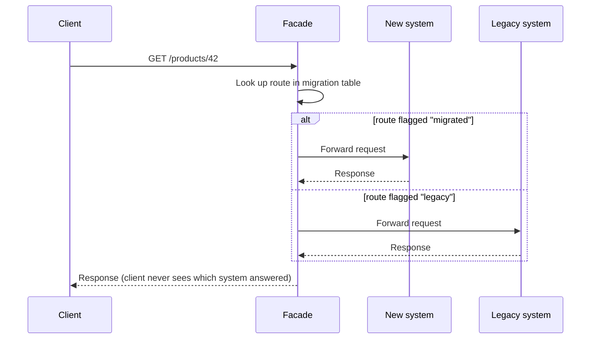
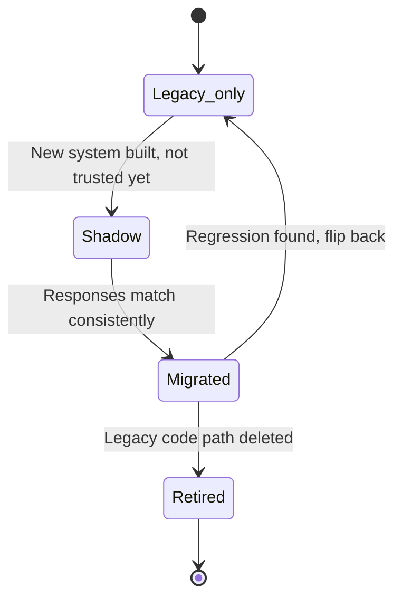

import Scenario from "../../../components/Scenario.astro";
import LevelIntro from "../../../components/LevelIntro.astro";
import Checkpoint from "../../../components/Checkpoint.astro";

<Scenario label="The problem">
  <Fragment slot="facts">
    <div class="not-prose flex flex-col gap-2 text-sm text-slate-700 dark:text-slate-300">
      <div class="flex items-center gap-1.5"><span>🧭</span> <strong>Facade decides</strong> — per request, old or new system</div>
      <div class="flex items-center gap-1.5"><span>💰</span> <strong>Checkout ($) POST /orders</strong> — migrated last, highest blast radius</div>
      <div class="flex items-center gap-1.5"><span>📄</span> <strong>Catalog (read-only) GET /products</strong> — migrated first, lowest risk</div>
    </div>
  </Fragment>

A team migrating an e-commerce monolith has to decide the order to move
things in. They list every route: `GET /products` (read-only, no money
involved, high traffic), `POST /orders` (writes money, touches billing,
lower traffic but catastrophic if wrong), and a dozen more in between.
Someone suggests migrating alphabetically. Someone else points out that
alphabetical order has no relationship to risk, blast radius, or how much
confidence the new system has earned yet — and that migrating `POST
/orders` before the facade itself has been proven on read-only traffic is
how you turn a routine migration into an incident.

**If order doesn't come from the alphabet, where does it come from — and
what exactly decides, on a live request, which system answers it?**

</Scenario>

L1 established the pattern's shape: a facade in front of two systems,
routes moving one at a time. L2 goes one level deeper — the mechanics of
the facade itself, and the reasoning behind migration order.

<LevelIntro
  items={[
    "How the facade routes a single request",
    "Ordering migration by risk, not alphabet",
    "The states a route passes through during cutover",
  ]}
/>

## How does the facade decide, per request, which system answers?



The facade's core data structure is small on purpose: a lookup table
mapping route (or route pattern) to a target. That table is the single
source of truth for "who owns this traffic right now," and flipping one
entry is the entire mechanism of migrating a route — no client-side change,
no DNS change, no deploy of the legacy system required.

```ts
type RouteTarget = "legacy" | "new";

const routingTable: Record<string, RouteTarget> = {
  "GET /products": "new", // migrated — proven on read traffic
  "GET /products/:id": "new",
  "POST /cart": "legacy", // not migrated yet
  "POST /orders": "legacy", // highest blast radius — migrated last
};
```

A request for `GET /products` and a request for `POST /orders` can be
served by two completely different systems in the same second, and neither
the client nor the rest of the codebase needs to know that — that's the
entire point of putting the decision behind a facade instead of scattering
`if (useNewSystem)` checks through client code or, worse, through the
legacy system's own internals.

<Checkpoint question="A route is flagged 'new' in the routing table and the new system has a bug on it. What's the actual fix, right now, at 2am?">

Flip that one routing table entry back to `"legacy"`. That's the whole
incident response — it's a config change to one line, not a code revert,
not a redeploy of either system, and not a rollback of every other
already-migrated route. This is the direct payoff of routing per-route
instead of per-deploy: the blast radius of "the new system has a bug" is
exactly the routes currently pointed at it, and un-pointing one route takes
seconds. Compare this to a big-bang rewrite, where the only available
rollback is reverting the entire cutover.

</Checkpoint>

## Why migrate by risk instead of alphabetically (or by convenience)?

| Signal                | Low risk to migrate early   | High risk — migrate late            |
| --------------------- | --------------------------- | ----------------------------------- |
| Does it write data?   | Read-only (`GET /products`) | Writes money/state (`POST /orders`) |
| Traffic volume        | High, but errors are cheap  | Low, but errors are catastrophic    |
| Reversibility         | Trivial to flip back        | May need compensating transactions  |
| Blast radius if wrong | One page looks stale        | Customer is charged incorrectly     |

Migrating `GET /products` first isn't arbitrary — it's the cheapest way to
prove the facade itself works (DNS/routing/auth pass-through, latency,
observability) against real production traffic, with a failure mode that's
merely embarrassing rather than financially damaging. Every route migrated
after that one benefits from a facade that's already been exercised at
scale, on the safest possible traffic.

## The states a single route moves through

A route doesn't jump straight from "100% legacy" to "100% new" — production
practice usually adds a verification state in between, where both systems
run and only the legacy answer is actually returned to the client:



**Shadowing** means the facade forwards the request to _both_ systems,
returns the legacy response to the client (so nothing user-facing depends
on unproven code), and logs whether the new system's response matched. This
is how a route earns its way to `"migrated"` with evidence instead of
hope — by the time a route is flipped in the routing table, its shadow logs
already show the new system agreeing with the old one on real traffic, not
just on a test suite.

<Checkpoint question="Why return the legacy response during shadowing instead of the new system's response, if you're already computing both?">

Because shadowing's whole purpose is gathering evidence about the new
system's correctness _before_ any customer depends on it — the moment the
new system's response reaches a real client, a bug in it becomes a real
incident instead of a line in a comparison log. Returning the legacy
response keeps the blast radius at zero while still answering the real
question: does the new system agree with the old one on real, unfiltered
production traffic, not just on whatever cases the test suite anticipated.
Only after that evidence accumulates does flipping the routing table to
`"new"` become a low-risk move rather than a leap of faith.

</Checkpoint>

## Retiring the legacy code path

`Retired` is not automatic once every route shows `"new"` in the table — a
route can be fully migrated in traffic while its legacy implementation
still exists as an untested rollback target. Retirement is a deliberate,
separate step: delete the legacy code path only after enough migrated time
has passed that a regression on the new system would rather be fixed
forward than rolled back to code nobody has touched in months. Keeping dead
legacy code around indefinitely defeats the entire purpose of doing a
migration at all — it just relocates the "does anyone still understand
this" problem instead of resolving it.
