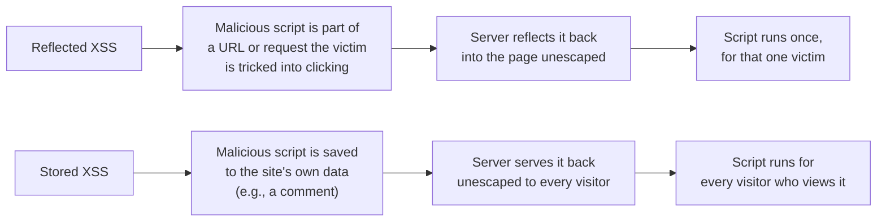

import LevelIntro from "../../../components/LevelIntro.astro";
import Checkpoint from "../../../components/Checkpoint.astro";

L1 named XSS, CSRF, sanitization, and CSP as separate ideas without yet
showing why they need genuinely different defenses. L2 works through the
mechanism each attack actually exploits, and how sanitization and CSP stack
as independent layers rather than substitutes for each other.

<LevelIntro
  items={[
    "Why XSS and CSRF need different fixes",
    "Reflected vs. stored XSS",
    "Sanitization and CSP as stacked, independent layers",
  ]}
/>

## Two different attacks that both involve a victim's browser

**If both XSS and CSRF exploit a logged-in user's browser, why do
they need different fixes?** Because they exploit fundamentally
different mechanisms, even though both end up abusing a victim's
existing session:

| Attack | What actually happens                                                                                                | What it needs from the victim                                                                    |
| ------ | -------------------------------------------------------------------------------------------------------------------- | ------------------------------------------------------------------------------------------------ |
| XSS    | Attacker-controlled script executes inside the victim's browser, on the vulnerable site, in the victim's own session | The victim just has to view a page containing the injected script                                |
| CSRF   | The victim's browser is tricked into sending a legitimate, authenticated request the victim never intended           | The victim has to be logged in, and interact with (or just load) something the attacker controls |

**Would sanitizing user input fix a CSRF vulnerability?**
No — sanitization stops attacker-controlled _code_ from executing on
the vulnerable page, but CSRF doesn't involve injecting any code onto
that page at all. It exploits the browser automatically attaching the
victim's cookies to a request sent from somewhere else entirely (a
malicious page, or an email link) — the fix for CSRF is verifying the
request actually came from the site's own page (commonly via a CSRF
token), which is a completely different mechanism from sanitizing
displayed content.

A concrete CSRF shape: you are logged in to a bank, then visit another
site. That other site quietly submits a hidden transfer form to the
bank. Your browser may attach your bank cookies automatically, so the
bank needs another proof that the request came from the bank's own UI:
a CSRF token or an equivalent same-site defense the attacker page cannot
guess or read.

<Checkpoint question="A social media site adds a feature where a user's profile bio renders as raw HTML instead of plain text. A different feature lets a logged-in user click a 'donate' button on another site that quietly submits a hidden form back to the social media site. Which of these two features is an XSS risk and which is a CSRF risk, and why?">

The bio-as-raw-HTML feature is the XSS risk: whatever a user types into
their bio becomes part of the page's actual markup for everyone who
views that profile, so a `<script>` tag typed into a bio would execute
in every viewer's browser, in their own session. The hidden-form feature
is the CSRF risk: no code is being injected into the social media site
at all — the victim's own browser is just being tricked into sending a
request the victim didn't intend, relying on cookies the browser attaches
automatically. Same "attacker abuses a victim's session" theme, but one
needs sanitized output and the other needs proof the request came from
the site's own page.

</Checkpoint>

## How XSS actually gets injected: reflected vs. stored

**Does XSS always require an attacker to permanently store something
on the vulnerable site, like the Scenario's comment?** No — there are
two common patterns:

The Scenario is **stored XSS** — the malicious comment is saved once
and served to every subsequent visitor, which is generally more
severe than reflected XSS (which requires tricking one specific
victim into clicking a crafted link) because it affects everyone who
simply views the page normally.

<Checkpoint question="The Scenario's comment is saved to the database and shown to every visitor who opens that page, with no link-clicking required. Is this reflected or stored XSS, and why does that classification matter for how urgently it needs fixing compared to a reflected variant of the same missing-escaping bug?">

Stored XSS — the malicious comment lives in the site's own data and is
served back to anyone who simply views the page, no crafted link or
tricked click needed. That makes it more urgent than a reflected
variant of the same underlying bug: a reflected XSS attack only fires
against whichever specific victim gets lured into clicking a malicious
URL, but this stored comment already compromises every visitor to that
page the moment it's live, with no further action from the attacker at
all.

</Checkpoint>

## Sanitization and CSP as independent, stacked layers

**If sanitization already prevents the script from being injected,
what does CSP add on top of that?** Sanitization is the primary
defense — done correctly, it prevents the injection from happening at
all. CSP is a second, independent layer: even if a sanitization bug
somewhere lets a script through, a correctly configured CSP can still
block that script from executing or from sending data to an
attacker's server, because the browser itself enforces which sources
are allowed to run.

**Does having a CSP mean sanitization can be skipped?** No — CSP is
a safety net for when the primary defense fails, not a replacement
for it. Relying on CSP alone, without sanitizing input, still lets an
attacker inject script that runs in the page (CSP mainly restricts
_where_ scripts can load from and _what_ they can do, not whether
inline injected markup renders at all under every possible
configuration) — the two are meant to work together, not as
alternatives.

## Failure modes at this level

- **Treating XSS and CSRF as the same problem with one shared fix.**
  Sanitizing displayed content does nothing to prevent a forged
  authenticated request, and a CSRF token does nothing to stop an
  injected script from executing.
- **Assuming only stored input needs sanitizing.** Reflected XSS
  shows that even data that's never permanently saved can still be
  dangerous if it's echoed back into a page unescaped.
- **Treating CSP as a substitute for sanitizing input.** CSP reduces
  the damage an injected script can do; it doesn't reliably prevent
  the injection from happening in the first place.
